# 📊 Diagrama de Casos de Uso - Atinet Compliance Hub
**📅 Fecha:** 14 de Abril 2026  
**🎯 Objetivo:** Visualizar actores y sus interacciones con el sistema

---

## 🎭 Actores del Sistema

### **Actores Humanos:**

#### **1. SuperAdmin (Administrador Atinet)** 👨‍💼
**Organización:** Atinet (proveedor del servicio)  
**Rol:** Administración completa del sistema  
**Características:**
- Tiene acceso ilimitado a todos los servicios
- Bypass de límites y suscripciones
- Gestiona todas las notarías

#### **2. Admin Notaría** 👔
**Organización:** Notaría cliente  
**Rol:** Administrador principal de la notaría  
**Características:**
- Gestiona usuarios de su notaría
- Acceso a todos los servicios contratados
- Ve reportes y estadísticas
- Configura y usa servicios

#### **3. Usuario Notaría** 👤
**Organización:** Notaría cliente  
**Rol:** Usuario operativo  
**Características:**
- Usa servicios asignados
- Realiza búsquedas y registros
- Acceso limitado según permisos

### **Actores del Sistema (Externos):**

#### **4. API OFAC** 🌐
**Tipo:** Sistema externo  
**Proveedor:** OFAC API Service  
**Función:** Proveer datos de listas OFAC

#### **5. API SAT** 🇲🇽
**Tipo:** Sistema externo  
**Proveedor:** SAT (web scraping + Gemini)  
**Función:** Validar RFC y obtener situación fiscal

#### **6. Google Gemini Vision** 🤖
**Tipo:** Servicio IA  
**Proveedor:** Google  
**Función:** Análisis y extracción de datos de documentos

#### **7. OpenAI GPT-4o Vision** 🧠
**Tipo:** Servicio IA  
**Proveedor:** OpenAI  
**Función:** Análisis avanzado de documentos PDF

#### **8. Sistema Control Notarial (.NET Legacy)** 🏛️
**Tipo:** Sistema interno legacy  
**Función:** Gestión notarial completa (expedientes, escrituras)

---

## 📋 Diagrama de Casos de Uso (Mermaid)

```mermaid
graph TB
    %% Actores Humanos
    SA[👨‍💼 SuperAdmin<br/>Atinet]
    AN[👔 Admin Notaría]
    UN[👤 Usuario Notaría]
    
    %% Actores Sistema
    OFAC[🌐 API OFAC]
    SAT[🇲🇽 API SAT]
    GEMINI[🤖 Gemini Vision]
    OPENAI[🧠 OpenAI GPT-4o]
    LEGACY[🏛️ Control Notarial<br/>.NET Legacy]
    
    %% Sistema Principal
    subgraph SISTEMA["🏢 Atinet Compliance Hub"]
        %% Gestión Admin
        subgraph ADMIN["📊 Módulo Administración"]
            UC1[Gestionar Notarías]
            UC2[Gestionar Suscripciones]
            UC3[Gestionar Planes y Servicios]
            UC4[Asignar Servicios por Notaría]
            UC5[Gestionar Usuarios del Sistema]
            UC6[Ver Reportes Globales]
            UC7[Exportar Reportes Excel]
            UC8[Dashboard SuperAdmin]
        end
        
        %% Servicios Core
        subgraph SERVICIOS["⚙️ Servicios Principales"]
            UC10[Búsquedas OFAC]
            UC11[Búsquedas SAT]
            UC12[Búsquedas Combinadas]
            UC13[Escáner Inteligente IA]
            UC14[Registro Web]
            UC15[Agenda Web]
        end
        
        %% Dashboard y Reportes
        subgraph DASHBOARD["📈 Dashboard y Reportes"]
            UC20[Ver Dashboard Notaría]
            UC21[Ver Uso de Servicios]
            UC22[Ver Historial Búsquedas]
            UC23[Generar Reportes]
            UC24[Exportar Resultados]
        end
        
        %% Gestión Interna VB
        subgraph GESTION["🔔 Gestión Interna"]
            UC30[Configurar Alarmas]
            UC31[Ver Recordatorios]
            UC32[Chat Interno 1-a-1]
            UC33[Chat Grupal]
            UC34[Gestionar Grupos Chat]
        end
        
        %% Usuarios y Seguridad
        subgraph SEGURIDAD["🔐 Seguridad y Usuarios"]
            UC40[Login]
            UC41[Gestionar Usuarios Notaría]
            UC42[Ver Actividad Log]
            UC43[Configurar Perfil]
        end
        
        %% Control y Límites
        subgraph CONTROL["⚖️ Control y Límites"]
            UC50[Verificar Límites Servicio]
            UC51[Tracking Uso Mensual]
            UC52[Alertas Límites]
            UC53[Renovar Suscripción]
        end
    end
    
    %% Conexiones SuperAdmin
    SA --> UC1
    SA --> UC2
    SA --> UC3
    SA --> UC4
    SA --> UC5
    SA --> UC6
    SA --> UC7
    SA --> UC8
    SA -.bypass.-> UC50
    
    %% Conexiones Admin Notaría
    AN --> UC40
    AN --> UC41
    AN --> UC20
    AN --> UC21
    AN --> UC22
    AN --> UC23
    AN --> UC24
    AN --> UC10
    AN --> UC11
    AN --> UC12
    AN --> UC13
    AN --> UC14
    AN --> UC15
    AN --> UC30
    AN --> UC31
    AN --> UC32
    AN --> UC33
    AN --> UC34
    AN --> UC43
    AN --> UC53
    
    %% Conexiones Usuario Notaría
    UN --> UC40
    UN --> UC20
    UN --> UC21
    UN --> UC22
    UN --> UC10
    UN --> UC11
    UN --> UC12
    UN --> UC13
    UN --> UC14
    UN --> UC15
    UN --> UC32
    UN --> UC33
    UN --> UC30
    UN --> UC31
    UN --> UC43
    
    %% Conexiones con Sistemas Externos
    UC10 -.consulta.-> OFAC
    UC11 -.consulta.-> SAT
    UC12 -.consulta.-> OFAC
    UC12 -.consulta.-> SAT
    UC13 -.analiza.-> GEMINI
    UC13 -.analiza.-> OPENAI
    SAT -.usa.-> GEMINI
    UC14 -.sincroniza.-> LEGACY
    UC15 -.sincroniza.-> LEGACY
    
    %% Control automático
    UC50 -.verifica.-> UC51
    UC51 -.genera.-> UC52
    UC52 -.notifica.-> AN
    
    style SA fill:#e74c3c,color:#fff
    style AN fill:#3498db,color:#fff
    style UN fill:#2ecc71,color:#fff
    style OFAC fill:#95a5a6,color:#fff
    style SAT fill:#e67e22,color:#fff
    style GEMINI fill:#9b59b6,color:#fff
    style OPENAI fill:#1abc9c,color:#fff
    style LEGACY fill:#34495e,color:#fff
```



---

## 🔍 Descripción Detallada de Casos de Uso

### **MÓDULO 1: Administración (SuperAdmin)** 📊

#### **UC1: Gestionar Notarías**
- **Actor:** SuperAdmin
- **Descripción:** CRUD completo de notarías (alta, consulta, edición, baja)
- **Precondición:** Usuario autenticado como SuperAdmin
- **Flujo Principal:**
  1. Accede al panel de notarías
  2. Crea nueva notaría con datos básicos
  3. Asigna plan de suscripción
  4. Configura servicios disponibles
  5. Sistema guarda y activa notaría
- **Postcondición:** Notaría creada y operativa
- **Archivos:** `NotariaController.php`, `Admin/Notarias/Index.tsx`

#### **UC2: Gestionar Suscripciones**
- **Actor:** SuperAdmin
- **Descripción:** Administrar ciclo de vida de suscripciones
- **Funciones:**
  - Crear suscripciones
  - Cambiar estado (activa, trial, vencida, cancelada, suspendida)
  - Renovar suscripciones
  - Modificar fechas de vencimiento
  - Cambiar plan
- **Archivos:** `SubscriptionController.php`, `Admin/Subscriptions/`

#### **UC3: Gestionar Planes y Servicios**
- **Actor:** SuperAdmin
- **Descripción:** Configurar catálogo de planes y servicios
- **Funciones:**
  - CRUD de planes (Básico, Profesional, Enterprise)
  - CRUD de servicios (OFAC, SAT, Escáner IA, etc.)
  - Configurar limits por plan
  - Activar/desactivar servicios
  - Cambiar `implementation_status` (implemented, development, planned)
- **Archivos:** `PlanController.php`, `ServiceController.php`

#### **UC4: Asignar Servicios por Notaría**
- **Actor:** SuperAdmin
- **Descripción:** Personalizar servicios de una notaría específica
- **Funciones:**
  - Override de límites del plan
  - Activar servicios adicionales
  - Desactivar servicios incluidos
  - Configurar precios personalizados
- **Archivos:** `TenantServiceController.php`

#### **UC5: Gestionar Usuarios del Sistema**
- **Actor:** SuperAdmin
- **Descripción:** Administrar todos los usuarios
- **Funciones:**
  - Ver todos los usuarios de todas las notarías
  - Cambiar roles (super_admin, admin_notaria, usuario_notaria)
  - Resetear contraseñas
  - Bloquear/desbloquear usuarios
- **Archivos:** `UserController.php`, `Admin/Users/`

#### **UC6: Ver Reportes Globales**
- **Actor:** SuperAdmin
- **Descripción:** Dashboard con métricas de todo el sistema
- **Métricas:**
  - Uso total por servicio
  - Notarías activas vs inactivas
  - Top servicios más usados
  - Notarías cerca del límite
  - Tendencias de uso
  - Stats por billing model
- **Archivos:** `ReportsController.php`, `Admin/Reports/Index.tsx`

#### **UC7: Exportar Reportes Excel**
- **Actor:** SuperAdmin
- **Descripción:** Descargar reportes en Excel profesional
- **Tipos:**
  - Reporte de uso por servicio
  - Reporte de notarías
  - Comparativa de notarías
  - Historial de búsquedas
  - Resultados combinados OFAC+SAT
- **Archivos:** 7 clases en `app/Exports/`

#### **UC8: Dashboard SuperAdmin**
- **Actor:** SuperAdmin
- **Descripción:** Vista general del sistema
- **Componentes:**
  - Stats generales (notarías, usuarios, suscripciones)
  - Gráficas de uso
  - Alertas del sistema
  - Notificaciones importantes
- **Archivos:** `ReportsController@index`

---

### **MÓDULO 2: Servicios Principales** ⚙️

#### **UC10: Búsquedas OFAC**
- **Actores:** Admin Notaría, Usuario Notaría
- **Sistema Externo:** API OFAC
- **Descripción:** Buscar personas/empresas en listas OFAC
- **Flujo:**
  1. Usuario ingresa nombre a buscar
  2. Sistema verifica límite mensual
  3. Consulta API OFAC
  4. Guarda resultado en `blacklist_searches`
  5. Muestra coincidencias encontradas
  6. Permite exportar resultados
- **Tracking:** Incrementa contador en `service_usages`
- **Archivos:** `BlacklistController.php`, `OfacSearchService.php`

#### **UC11: Búsquedas SAT**
- **Actores:** Admin Notaría, Usuario Notaría
- **Sistemas Externos:** SAT (web scraping) + Gemini Vision
- **Descripción:** Validar RFC en listas SAT (69, 69-B, firmantes)
- **Flujo:**
  1. Usuario ingresa RFC
  2. Sistema valida formato RFC
  3. Hace web scraping a SAT
  4. Usa Gemini para extraer datos de la página
  5. Guarda resultado en `blacklist_searches`
  6. Muestra situación fiscal
- **Tracking:** Incrementa contador en `service_usages`
- **Archivos:** `BlacklistController.php`, `SATScraperService.php`

#### **UC12: Búsquedas Combinadas**
- **Actores:** Admin Notaría, Usuario Notaría
- **Sistemas Externos:** OFAC + SAT
- **Descripción:** Búsqueda simultánea en ambas bases
- **Flujo:**
  1. Usuario ingresa RFC y nombre
  2. Sistema verifica límites de ambos servicios
  3. Ejecuta búsqueda OFAC (nombre)
  4. Ejecuta búsqueda SAT (RFC)
  5. Combina resultados
  6. Exporta Excel con ambos resultados
- **Archivos:** `BlacklistController@combinedSearch`

#### **UC13: Escáner Inteligente IA**
- **Actores:** Admin Notaría, Usuario Notaría
- **Sistemas Externos:** Gemini Vision + OpenAI GPT-4o
- **Descripción:** Analizar documentos PDF/imágenes con IA
- **Flujo:**
  1. Usuario sube documento (PDF/imagen)
  2. Sistema convierte a formato compatible
  3. Envía a Gemini Vision (análisis rápido)
  4. OPCIONAL: Envía a OpenAI para análisis profundo
  5. Extrae datos estructurados (nombre, RFC, fechas, etc.)
  6. Guarda resultado en `documentos_analizados`
  7. Muestra datos extraídos
- **Tracking:** Incrementa contador en `service_usages`
- **Archivos:** `EscanerInteligenteController.php`, `GeminiVisionService.php`, `OpenAIDocumentAnalyzer.php`

#### **UC14: Registro Web**
- **Actores:** Admin Notaría, Usuario Notaría
- **Sistema Externo:** Control Notarial .NET (sincronización)
- **Descripción:** Registrar movimientos notariales
- **Flujo:**
  1. Usuario registra movimiento (tipo, descripción, fecha)
  2. Sistema guarda en tabla `registro_movimientos`
  3. OPCIONAL: Sincroniza con sistema .NET legacy
  4. Genera notificación
  5. Actualiza dashboard
- **Tracking:** Incrementa contador en `service_usages`
- **Archivos:** `RegistroWebController.php`

#### **UC15: Agenda Web**
- **Actores:** Admin Notaría, Usuario Notaría
- **Sistema Externo:** Control Notarial .NET (sincronización)
- **Descripción:** Agendar actividades y citas
- **Flujo:**
  1. Usuario crea actividad con fecha/hora
  2. Sistema guarda en tabla `agenda_actividades`
  3. OPCIONAL: Sincroniza con sistema .NET
  4. Genera recordatorio automático
  5. Envía notificación
- **Tracking:** Incrementa contador en `service_usages`
- **Archivos:** Pendiente implementación en routes

---

### **MÓDULO 3: Dashboard y Reportes** 📈

#### **UC20: Ver Dashboard Notaría**
- **Actores:** Admin Notaría, Usuario Notaría
- **Descripción:** Vista principal con métricas de la notaría
- **Componentes:**
  - Servicios disponibles y uso actual
  - Gráficas de uso mensual
  - Búsquedas recientes
  - Alertas de límites
  - Suscripción actual y vencimiento
- **Archivos:** `DashboardController.php`, `Dashboard/Index.tsx`

#### **UC21: Ver Uso de Servicios**
- **Actores:** Admin Notaría
- **Descripción:** Detalle de uso por servicio
- **Información:**
  - Uso del mes actual vs límite
  - Histórico de  meses anteriores
  - Porcentaje de uso
  - Proyección de consumo
- **Archivos:** Métodos en `Notaria.php` model

#### **UC22: Ver Historial Búsquedas**
- **Actores:** Admin Notaría, Usuario Notaría
- **Descripción:** Lista de todas las búsquedas realizadas
- **Filtros:**
  - Por tipo (OFAC, SAT, Combinada)
  - Por fecha
  - Por usuario
  - Por resultado (encontrado/no encontrado)
- **Archivos:** `BlacklistController@historial`

#### **UC23: Generar Reportes**
- **Actores:** Admin Notaría
- **Descripción:** Crear reportes personalizados
- **Tipos:**
  - Reporte de búsquedas por periodo
  - Reporte de uso de servicios
  - Reporte de actividad de usuarios
- **Archivos:** `ReportsController.php`

#### **UC24: Exportar Resultados**
- **Actores:** Admin Notaría, Usuario Notaría
- **Descripción:** Descargar resultados en Excel
- **Opciones:**
  - Búsqueda individual
  - Múltiples búsquedas
  - Resultados combinados
- **Archivos:** Clases en `app/Exports/`

---

### **MÓDULO 4: Gestión Interna (del Sistema VB)** 🔔

#### **UC30: Configurar Alarmas**
- **Actores:** Admin Notaría, Usuario Notaría
- **Descripción:** Crear recordatorios con fecha/hora
- **Flujo:**
  1. Usuario crea alarma con título y descripción
  2. Selecciona fecha y hora
  3. OPCIONAL: Relaciona con expediente/cliente
  4. Sistema guarda en tabla `alarmas`
  5. Programa verificación automática
- **Migrado de:** Sistema VB `Alarmas.frm`
- **Archivos:** **[PENDIENTE IMPLEMENTAR]**

#### **UC31: Ver Recordatorios**
- **Actores:** Admin Notaría, Usuario Notaría
- **Descripción:** Lista de alarmas activas
- **Vistas:**
  - Alarmas de hoy
  - Alarmas vencidas
  - Próximas alarmas
  - Calendario de alarmas
- **Notificaciones:** Email + notificación browser
- **Migrado de:** Sistema VB `Recordatorio.frm`
- **Archivos:** **[PENDIENTE IMPLEMENTAR]**

#### **UC32: Chat Interno 1-a-1**
- **Actores:** Admin Notaría, Usuario Notaría
- **Descripción:** Mensajería directa entre usuarios
- **Funciones:**
  - Enviar mensaje a otro usuario
  - Ver conversación histórica
  - Notificación de mensaje nuevo
  - Marcar como leído
- **Tiempo Real:** Laravel Echo + Pusher/Soketi
- **Migrado de:** Sistema VB `AltaChat.frm`
- **Archivos:** **[PENDIENTE IMPLEMENTAR]**

#### **UC33: Chat Grupal**
- **Actores:** Admin Notaría, Usuario Notaría
- **Descripción:** Mensajería en grupos
- **Funciones:**
  - Seleccionar grupo
  - Enviar mensaje al grupo
  - Ver mensajes del grupo
  - Notificación de mensaje nuevo en grupo
- **Migrado de:** Sistema VB `AltaChat.frm`
- **Archivos:** **[PENDIENTE IMPLEMENTAR]**

#### **UC34: Gestionar Grupos Chat**
- **Actores:** Admin Notaría
- **Descripción:** Administrar grupos de chat
- **Funciones:**
  - Crear grupo
  - Agregar/remover miembros
  - Asignar administradores
  - Eliminar grupo
- **Migrado de:** Sistema VB `AltaGruposChat.frm`
- **Archivos:** **[PENDIENTE IMPLEMENTAR]**

---

### **MÓDULO 5: Seguridad y Usuarios** 🔐

#### **UC40: Login**
- **Actores:** Todos
- **Descripción:** Autenticación en el sistema
- **Flujo:**
  1. Usuario ingresa email y contraseña
  2. Sistema valida credenciales
  3. Verifica que notaría esté activa
  4. Verifica suscripción válida
  5. Carga permisos y servicios
  6. Redirecciona a dashboard
- **Seguridad:** Laravel Fortify
- **Archivos:** `app/Http/Middleware/CheckSubscriptionStatus.php`

#### **UC41: Gestionar Usuarios Notaría**
- **Actores:** Admin Notaría
- **Descripción:** CRUD de usuarios de su notaría
- **Limitaciones:**
  - Solo puede gestionar usuarios de su notaría
  - No puede crear SuperAdmins
  - No puede cambiar tipo de cuenta propio
- **Archivos:** `UserController.php` (con filtro por notaría)

#### **UC42: Ver Actividad Log**
- **Actores:** SuperAdmin, Admin Notaría
- **Descripción:** Ver historial de acciones
- **Registro:** Usa `spatie/laravel-activitylog`
- **Información:**
  - Qué se hizo (acción)
  - Quién lo hizo (usuario)
  - Cuándo (fecha/hora)
  - Cambios realizados (before/after)
- **Archivos:** Automático con ActivityLog

#### **UC43: Configurar Perfil**
- **Actores:** Todos (propios datos)
- **Descripción:** Editar información personal
- **Campos:**
  - Nombre
  - Email
  - Contraseña
  - Foto de perfil
- **Archivos:** `ProfileController.php`

---

### **MÓDULO 6: Control y Límites** ⚖️

#### **UC50: Verificar Límites Servicio**
- **Actor:** Sistema (automático)
- **Descripción:** Middleware que verifica límites antes de usar servicio
- **Lógica:**
  1. Intercepta petición a servicio
  2. Obtiene límite configurado (plan o tenant_services)
  3. Consulta uso del mes actual
  4. Si SuperAdmin: bypass (permite siempre)
  5. Si límite alcanzado: bloquea con mensaje
  6. Si OK: permite y registra uso
- **Archivos:** `CheckServiceAccess.php` middleware

#### **UC51: Tracking Uso Mensual**
- **Actor:** Sistema (automático)
- **Descripción:** Registrar cada uso de servicio
- **Tabla:** `service_usages`
- **Datos registrados:**
  - Notaría
  - Servicio usado
  - Usuario
  - Fecha/hora
  - Detalles (ej: RFC buscado)
- **Archivos:** Automático en controllers de servicios

#### **UC52: Alertas Límites**
- **Actor:** Sistema (automático)
- **Descripción:** Notificar cuando se está cerca del límite
- **Umbrales:**
  - Warning: 80% del límite
  - Critical: 90% del límite
  - Bloqueado: 100% del límite
- **Generación:** ReportsController genera alertas
- **Archivos:** `ReportsController@notariasNearLimit`

#### **UC53: Renovar Suscripción**
- **Actores:** Admin Notaría (manual), Sistema (automático si `auto_renovacion=true`)
- **Descripción:** Renovar suscripción al vencer
- **Flujo Manual:**
  1. Admin ve notificación de vencimiento próximo
  2. Accede a renovación
  3. Confirma renovación
  4. Sistema extiende `fecha_vencimiento`
  5. Cambia status a `activa`
- **Flujo Automático:**
  1. Comando `CheckExpiredSubscriptions` corre diario
  2. Detecta suscripciones con `auto_renovacion=true` próximas a vencer
  3. **[PENDIENTE]** Procesa pago automático
  4. Renueva suscripción
- **Archivos:** `SubscriptionController.php`, `CheckExpiredSubscriptions.php`

---

## 🔄 Flujos de Interacción Entre Actores

### **Flujo 1: SuperAdmin → Notaría → Usuario Final**

```
SuperAdmin (Atinet)
    ↓
    [Crea Notaría + Suscripción + Asigna Plan]
    ↓
Admin Notaría
    ↓
    [Crea Usuarios + Asigna Permisos]
    ↓
Usuario Notaría
    ↓
    [Usa Servicios]
    ↓
Sistema registra uso
    ↓
SuperAdmin ve métricas globales
```

### **Flujo 2: Usuario → Servicio → Sistema Externo**

```
Usuario Notaría
    ↓
    [Solicita búsqueda OFAC]
    ↓
Sistema verifica límite (UC50)
    ↓
Sistema consulta API OFAC
    ↓
API OFAC responde
    ↓
Sistema guarda resultado + tracking (UC51)
    ↓
Usuario ve resultados
    ↓
Si cerca del límite → Genera alerta (UC52)
    ↓
Admin Notaría recibe notificación
```

### **Flujo 3: Sistema Automático de Control**

```
Cron Job (cada minuto)
    ↓
Verifica alarmas vencidas (UC31)
    ↓
Envía notificaciones a usuarios
    ↓
─────────────────────────────
Cron Job (diario)
    ↓
CheckExpiredSubscriptions
    ↓
Cambia status de suscripciones vencidas
    ↓
Envía emails de vencimiento
    ↓
Si auto_renovacion → Procesa pago (PENDIENTE)
```

---

## 📊 Matriz de Permisos por Actor

| Caso de Uso | SuperAdmin | Admin Notaría | Usuario Notaría |
|------------|------------|---------------|-----------------|
| **ADMINISTRACIÓN** |
| UC1: Gestionar Notarías | ✅ | ❌ | ❌ |
| UC2: Gestionar Suscripciones | ✅ | ❌ | ❌ |
| UC3: Gestionar Planes/Servicios | ✅ | ❌ | ❌ |
| UC4: Asignar Servicios Personalizados | ✅ | ❌ | ❌ |
| UC5: Gestionar Todos los Usuarios | ✅ | ❌ | ❌ |
| UC6: Ver Reportes Globales | ✅ | ❌ | ❌ |
| UC7: Exportar Reportes Sistema | ✅ | ❌ | ❌ |
| UC8: Dashboard SuperAdmin | ✅ | ❌ | ❌ |
| **SERVICIOS** |
| UC10: Búsquedas OFAC | ✅* | ✅ | ✅ |
| UC11: Búsquedas SAT | ✅* | ✅ | ✅ |
| UC12: Búsquedas Combinadas | ✅* | ✅ | ✅ |
| UC13: Escáner Inteligente | ✅* | ✅ | ✅ |
| UC14: Registro Web | ✅* | ✅ | ✅ |
| UC15: Agenda Web | ✅* | ✅ | ✅ |
| **DASHBOARD** |
| UC20: Ver Dashboard Notaría | ✅ | ✅ | ✅ |
| UC21: Ver Uso Servicios | ✅ | ✅ | ⚠️ |
| UC22: Ver Historial Búsquedas | ✅ | ✅ | ✅ |
| UC23: Generar Reportes | ✅ | ✅ | ❌ |
| UC24: Exportar Resultados | ✅ | ✅ | ✅ |
| **GESTIÓN INTERNA** |
| UC30: Configurar Alarmas | ✅ | ✅ | ✅ |
| UC31: Ver Recordatorios | ✅ | ✅ | ✅ |
| UC32: Chat 1-a-1 | ✅ | ✅ | ✅ |
| UC33: Chat Grupal | ✅ | ✅ | ✅ |
| UC34: Gestionar Grupos | ✅ | ✅ | ❌ |
| **USUARIOS** |
| UC40: Login | ✅ | ✅ | ✅ |
| UC41: Gestionar Usuarios Notaría | ✅ | ✅ | ❌ |
| UC42: Ver Activity Log | ✅ | ⚠️ | ❌ |
| UC43: Configurar Perfil | ✅ | ✅ | ✅ |
| **CONTROL** |
| UC50: Verificar Límites | bypass | ✅ | ✅ |
| UC53: Renovar Suscripción | ✅ | ✅ | ❌ |

**Leyenda:**
- ✅ = Acceso completo
- ✅* = Acceso sin límites (bypass)
- ⚠️ = Acceso parcial (solo sus datos)
- ❌ = Sin acceso

---

## 🎨 Diagrama Visual Simplificado

```
┌─────────────────────────────────────────────────────────────┐
│                    🏢 ATINET COMPLIANCE HUB                  │
└─────────────────────────────────────────────────────────────┘
                              │
        ┌─────────────────────┼─────────────────────┐
        │                     │                     │
   ┌────▼────┐          ┌────▼────┐          ┌────▼────┐
   │👨‍💼 Super │          │👔 Admin │          │👤 Usuario│
   │  Admin  │          │ Notaría │          │ Notaría │
   └────┬────┘          └────┬────┘          └────┬────┘
        │                    │                     │
        ├─ Gestiona Notarías │                     │
        ├─ Gestiona Planes   │                     │
        ├─ Ve TODO Global    │                     │
        │                    ├─ Gestiona Usuarios  │
        │                    ├─ Usa Servicios      │
        │                    ├─ Ve Dashboard      ─┼─ Ve Dashboard
        │                    ├─ Ver Reportes       ├─ Usa Servicios
        │                    ├─ Config Alarmas    ─┼─ Config Alarmas
        │                    └─ Chat Interno      ─┼─ Chat Interno
        │                                          │
        └──────────────────┬───────────────────────┘
                          │
                    ┌─────▼─────┐
                    │ SERVICIOS │
                    └─────┬─────┘
                          │
        ┌─────────────────┼─────────────────┐
        │                 │                 │
    ┌───▼───┐        ┌───▼───┐        ┌───▼───┐
    │🌐 OFAC│        │🇲🇽 SAT│        │🤖 IA  │
    │  API  │        │  API  │        │Gemini │
    └───────┘        └───────┘        └───▲───┘
                                          │
                                    ┌─────┴─────┐
                                    │🧠 OpenAI │
                                    └───────────┘
```

---

## 📁 Mapeo de Casos de Uso a Archivos

### **Casos de Uso Implementados:**

| UC | Nombre | Controller | Frontend |
|----|--------|-----------|----------|
| UC1 | Gestionar Notarías | `NotariaController.php` | `Admin/Notarias/` |
| UC2 | Gestionar Suscripciones | `SubscriptionController.php` | `Admin/Subscriptions/` |
| UC3 | Gestionar Planes/Servicios | `PlanController.php`, `ServiceController.php` | `Admin/Plans/`, `Admin/Services/` |
| UC4 | Asignar Servicios | `TenantServiceController.php` | `Admin/Notarias/Services.tsx` |
| UC5 | Gestionar Usuarios | `UserController.php` | `Admin/Users/` |
| UC6 | Reportes Globales | `ReportsController.php` | `Admin/Reports/Index.tsx` |
| UC7 | Exportar Reportes | 7 clases en `app/Exports/` | - |
| UC10 | Búsquedas OFAC | `BlacklistController.php` | `ListasNegras/Index.tsx` |
| UC11 | Búsquedas SAT | `BlacklistController.php` | `ListasNegras/Index.tsx` |
| UC12 | Búsquedas Combinadas | `BlacklistController.php` | `ListasNegras/Index.tsx` |
| UC13 | Escáner IA | `EscanerInteligenteController.php` | `EscanerInteligente/Index.tsx` |
| UC14 | Registro Web | `RegistroWebController.php` | `RegistroWeb/Index.tsx` |
| UC40 | Login | Laravel Fortify | `Auth/Login.tsx` |
| UC42 | Activity Log | `spatie/laravel-activitylog` | `Settings/Logs.tsx` |
| UC43 | Configurar Perfil | `ProfileController.php` | `Profile/Edit.tsx` |
| UC50 | Verificar Límites | `CheckServiceAccess.php` (middleware) | - |
| UC51 | Tracking Uso | Automático en controllers | - |
| UC52 | Alertas Límites | `ReportsController@notariasNearLimit` | `Reports/NotariasNearLimit.tsx` |
| UC53 | Renovar  Suscripción | `SubscriptionController@renew` | `Subscriptions/Show.tsx` |

### **Casos de Uso Pendientes (Sistema VB):**

| UC | Nombre | Prioridad | Tiempo Est. |
|----|--------|-----------|-------------|
| UC30 | Configurar Alarmas | 🔴 ALTA | 1-2 días |
| UC31 | Ver Recordatorios | 🔴 ALTA | Incluido UC30 |
| UC32 | Chat 1-a-1 | 🟡 MEDIA | 2-3 días |
| UC33 | Chat Grupal | 🟡 MEDIA | Incluido UC32 |
| UC34 | Gestionar Grupos | 🟡 MEDIA | 0.5 día |
| UC15 | Agenda Web | 🟢 BAJA | 1 día |

---

## 🚀 Resumen Ejecutivo

### **Estado Actual del Sistema:**

**✅ Implementado (90%):**
- Administración completa (SuperAdmin)
- Gestión de notarías, suscripciones, planes
- Servicios principales (OFAC, SAT, Escáner IA)
- Dashboard y reportes
- Exportaciones Excel
- Control de límites
- Activity log

**🟡 Parcialmente Implementado (5%):**
- Notificaciones por email (alertas generadas, emails pendientes)
- PDF facturas (dompdf instalado, templates pendientes)

**❌ No Implementado (5%):**
- Sistema de Alarmas/Recordatorios (del VB)
- Sistema de Chat Interno (del VB)
- API pública para clientes externos

### **Prioridades de Implementación:**

```
FASE 1 (CRÍTICA - 2.5 días):
  ✅ Emails notificación (1 día)
  ✅ PDF facturas (0.5 día)
  ✅ Sistema Alarmas (1-2 días)

FASE 2 (OPCIONAL - 2-3 días):
  ⏳ Chat Interno (si es crítico)

FASE 3 (FUTURO):
  ⏳ API pública
  ⏳ Webhooks
  ⏳ Swagger docs
```

---

## 📸 Referencia Visual del Sistema VB

Según tu captura de pantalla, vemos:

**Panel Principal:**
- ✅ Control de Clientes (notarías en nuestro caso)
- ✅ Servicios disponibles
- ✅ **Lista de Asuntos Pendientes** (son las ALARMAS) 👈 Muy importante
- Botón "Nueva Alarma" (reloj) en la esquina inferior derecha

**Menú superior:**
- Clientes
- Reportes del Sistema
- Caja
- Configuración
- Sistema
- **Chat** 👈 Sistema de chat interno

**Esto confirma que las funcionalidades críticas del VB son:**
1. ✅ **Alarmas/Recordatorios** (Lista de Asuntos Pendientes)
2. ✅ **Chat interno**
3. ✅ Control de clientes (ya tenemos como Notarías)

---

¿Te ayuda este diagrama? ¿Necesitas que expanda alguna sección o que cree una versión más visual?
