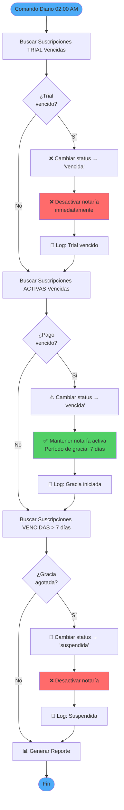

# Sistema de Gestión de Suscripciones - Fase 1.5

## 🎯 Objetivo

Permitir al SuperAdmin gestionar el ciclo de vida completo de las suscripciones de las notarías (activar, suspender, renovar, cambiar plan, etc.).

---

## 📊 Estados de Suscripción

```
trial → activa → vencida
              ↓
          suspendida
              ↓
          cancelada
```

### Estados Disponibles:

| Estado | Descripción | Acceso a Servicios | Notaría Activa | Período de Gracia | Acción Automática |
|--------|-------------|-------------------|----------------|-------------------|-------------------|
| **trial** | Período de prueba (1 mes gratis) | ✅ Completo | ✅ Sí | ❌ Sin gracia | Al vencer → desactivar inmediatamente |
| **activa** | Suscripción pagada y vigente | ✅ Completo | ✅ Sí | N/A | Al vencer → marcar como vencida |
| **vencida** | Venció el período, esperando pago | ✅ Completo | ✅ Sí (7 días) | ✅ 7 días | Después de 7 días → suspender |
| **suspendida** | Suspendida por falta de pago | ❌ Sin acceso | ❌ No | ❌ Gracia agotada | Manual: reactivar con pago |
| **cancelada** | Cancelada definitivamente | ❌ Sin acceso | ❌ No | N/A | Final (no reversible) |

**Nota Importante:** Solo las suscripciones **trial** se desactivan inmediatamente al vencer. Las suscripciones de **pago** tienen un período de gracia de 7 días para permitir la renovación antes de suspender.

---

## 🔄 Flujos de Gestión

### 1. Creación de Notaría (Actual)
```
SuperAdmin crea notaría
  → Se crea suscripción automática en estado 'trial'
  → Duración: 1 mes
  → Precio: $0 (gratis)
  → Auto-renovación: activada
```

### 2. Renovación Manual (NUEVO)
```
SuperAdmin → Menú "Renovar Suscripción"
  → Seleccionar ciclo (mensual/anual)
  → Confirmar precio del plan
  → Ingresar método de pago
  → Generar nueva fecha de vencimiento
  → Cambiar estado a 'activa'
```

### 3. Suspensión por Falta de Pago (NUEVO)
```
Automático:
  - Si subscription.status = 'vencida'
  - Y han pasado > 7 días desde fecha_vencimiento
  - Cambiar a 'suspendida'
  - Bloquear acceso a servicios

Manual:
  - SuperAdmin puede suspender inmediatamente
  - Razón: seleccionar de lista o escribir
```

### 4. Cambio de Plan (NUEVO)
```
SuperAdmin → "Cambiar Plan"
  → Seleccionar nuevo plan
  → Calcular prorrateo (opcional)
  → Actualizar notaria.plan_id
  → Actualizar subscription.plan_id
  → Copiar nuevos plan_services al tenant
  → Mantener estado actual de suscripción
```

### 5. Reactivación (NUEVO)
```
SuperAdmin → "Reactivar Suscripción"
  → Verificar si hay saldo pendiente
  → Registrar pago pendiente
  → Cambiar estado a 'activa'
  → Calcular nueva fecha de vencimiento
```

### 6. Cancelación Definitiva (NUEVO)
```
SuperAdmin → "Cancelar Suscripción"
  → Confirmar acción (irreversible)
  → Ingresar razón de cancelación
  → Cambiar estado a 'cancelada'
  → Opcionalmente: desactivar notaría
  → No eliminar datos (auditoría)
```

---

## 🤖 Sistema Automático de Verificación ✅ **IMPLEMENTADO**

### Flujo de Verificación de Suscripciones Vencidas



### Lógica de Negocio por Tipo de Suscripción

| Tipo Suscripción | Estado Inicial | Al Vencer | Período Gracia | Notaría Activa | Resultado Final |
|------------------|----------------|-----------|----------------|----------------|-----------------|
| **Trial** | `trial` | → `vencida` | ❌ Sin gracia | ❌ Desactivada | Bloqueo inmediato |
| **Pago (< 7 días)** | `activa` | → `vencida` | ✅ 7 días | ✅ Activa | Acceso completo |
| **Pago (≥ 7 días)** | `vencida` | → `suspendida` | ❌ Gracia agotada | ❌ Desactivada | Bloqueo total |

### Comando: `subscriptions:check-expired`

**Ubicación:** `app/Console/Commands/CheckExpiredSubscriptions.php`

**Programación:**
```php
// routes/console.php
Schedule::command('subscriptions:check-expired')
    ->daily()
    ->at('02:00')
    ->timezone('America/Mexico_City')
    ->description('Verifica suscripciones vencidas y desactiva notarías según el tipo');
```

**Opciones:**
```bash
# Ejecutar verificación (modifica base de datos)
php artisan subscriptions:check-expired

# Modo dry-run (solo muestra qué haría)
php artisan subscriptions:check-expired --dry-run
```

**Salida del Comando:**
```
🔄 Iniciando verificación de suscripciones vencidas...

📋 Buscando suscripciones TRIAL vencidas...
   ⚠️  Trial vencido: Notaría Ejemplo (ID: 123)
      Fecha vencimiento: 2026-01-15
      ✓ Suscripción marcada como vencida
      ✓ Notaría desactivada

💳 Buscando suscripciones de PAGO vencidas...
   ⚠️  Suscripción vencida: Notaría ABC (ID: 456)
      Fecha vencimiento: 2026-02-05
      📅 Iniciando período de gracia de 7 días
      ✓ Suscripción marcada como vencida
      ⏳ Notaría permanece activa (gracia)

🚫 Buscando suscripciones con período de gracia agotado (>7 días)...
   ❌ Período de gracia agotado: Notaría XYZ (ID: 789)
      Vencida hace: 10 días
      ✓ Suscripción suspendida
      ✓ Notaría desactivada

✅ Verificación completada

+--------------------------------------------+----------+
| Categoría                                  | Cantidad |
+--------------------------------------------+----------+
| Trials vencidos detectados                 | 1        |
| Suscripciones de pago vencidas             | 1        |
| Suscripciones suspendidas (gracia agotada) | 1        |
+--------------------------------------------+----------+
```

**Tests:**
- ✅ 7 tests implementados (16 assertions)
- ✅ Cobertura completa de casos de uso
- ✅ Test de transacciones (rollback en errores)
- ✅ Test de modo dry-run

**Logs Generados:**
```
[2026-02-10 02:00:15] INFO: CheckExpiredSubscriptions ejecutado {
    "trials_vencidos": 1,
    "pagos_vencidos": 1,
    "pagos_suspendidos": 1
}

[2026-02-10 02:00:15] WARNING: Trial vencido - Notaría desactivada: Notaría Ejemplo (ID: 123)
[2026-02-10 02:00:15] INFO: Suscripción de pago vencida - Período de gracia iniciado: Notaría ABC (ID: 456)
[2026-02-10 02:00:15] WARNING: Período de gracia agotado - Notaría suspendida: Notaría XYZ (ID: 789)
```

---

## 🛠️ Componentes a Implementar

### Backend

#### 1. **SubscriptionController** (Admin)
- `index()` - Listar todas las suscripciones
- `show()` - Ver detalle de suscripción
- `renew()` - Renovar suscripción
- `suspend()` - Suspender suscripción
- `reactivate()` - Reactivar suscripción
- `cancel()` - Cancelar suscripción
- `changePlan()` - Cambiar plan de una suscripción

#### 2. **SubscriptionService** (Lógica de Negocio)
- `createTrialSubscription()` - Crear suscripción trial automática
- `renewSubscription()` - Renovar con cálculo de fechas
- `suspendSubscription()` - Suspender con validaciones
- `reactivateSubscription()` - Reactivar con validaciones
- `cancelSubscription()` - Cancelar definitivamente
- `changePlan()` - Cambiar plan con prorrateo
- `checkExpiredSubscriptions()` - Job para revisar vencidas
- `calculateProrateo()` - Calcular prorrateo al cambiar plan

#### 3. **Command: CheckExpiredSubscriptions** ✅ **IMPLEMENTADO**
```bash
# Ejecutar verificación manual
php artisan subscriptions:check-expired

# Modo preview (no modifica datos)
php artisan subscriptions:check-expired --dry-run

# Ver tareas programadas
php artisan schedule:list
```

**Características:**
- ✅ Ejecuta diariamente a las 2:00 AM (automático vía scheduler)
- ✅ Lógica diferenciada por tipo de suscripción:
  - **Trial vencido**: Desactiva notaría inmediatamente (sin gracia)
  - **Pago vencido**: Mantiene activa 7 días (período de gracia)
  - **Gracia agotada**: Suspende y desactiva después de 7 días
- ✅ Modo `--dry-run` para previsualizar cambios
- ✅ Logs completos en `storage/logs/laravel.log`
- ✅ Reporte tabular con estadísticas
- ✅ Transaccional (rollback automático si hay errores)

#### 4. **Policies & Middleware**
- `CheckActiveSubscription` - Middleware para validar suscripción activa
- `SubscriptionPolicy` - Solo SuperAdmin puede gestionar

### Frontend (Inertia/Vue)

#### Vistas Nuevas:
1. **Admin/Subscriptions/Index.vue** - Lista de suscripciones
2. **Admin/Subscriptions/Show.vue** - Detalle de suscripción
3. **Admin/Notarias/Subscriptions/Manage.vue** - Widget en notaría

#### Componentes:
- `SubscriptionStatusBadge.vue` - Badge de estado
- `SubscriptionTimeline.vue` - Historial de cambios
- `RenewSubscriptionModal.vue` - Modal para renovar
- `ChangePlanModal.vue` - Modal para cambiar plan
- `SuspendSubscriptionModal.vue` - Modal para suspender

---

## 🎨 UI/UX Propuesta

### En el Panel de SuperAdmin

#### Sección Nueva: "Suscripciones"
```
📊 Dashboard de Suscripciones
├─ Estadísticas
│  ├─ Activas: 45
│  ├─ Trial: 12
│  ├─ Vencidas: 3
│  ├─ Suspendidas: 2
│  └─ MRR (Ingreso Mensual Recurrente): $45,000 MXN
│
├─ Tabla de Suscripciones
│  └─ Columnas: Notaría, Plan, Estado, F. Vencimiento, Acciones
│
└─ Filtros
   ├─ Por estado
   ├─ Por plan
   └─ Vencen pronto (próximos 7 días)
```

#### En Detalle de Notaría

Agregar widget:
```
┌─────────────────────────────────────┐
│ 💳 Suscripción Actual               │
├─────────────────────────────────────┤
│ Estado: [🟢 Activa]                 │
│ Plan: Plan Profesional              │
│ Vence: 09 Mar 2026 (28 días)       │
│ Precio: $999.00 MXN / mes           │
│                                      │
│ [Renovar] [Suspender] [Cambiar Plan]│
└─────────────────────────────────────┘
```

---

## 📋 Validaciones Importantes

### Al Suspender:
- ✅ Confirmar que no hay operaciones en curso
- ✅ Notificar al admin de la notaría
- ✅ Permitir período de gracia (configurable)

### Al Renovar:
- ✅ Calcular precio según ciclo seleccionado
- ✅ Aplicar descuentos si corresponde
- ✅ Generar fecha de vencimiento correcta
- ✅ Mantener auto_renovacion configurada

### Al Cambiar Plan:
- ✅ Validar que el nuevo plan existe
- ✅ Calcular prorrateo si aplica
- ✅ Actualizar servicios en tenant
- ✅ Notificar al admin de la notaría

### Al Cancelar:
- ✅ Requiere confirmación
- ✅ Razón obligatoria
- ✅ Irreversible (avisar claramente)
- ✅ Mantener datos históricos

---

## 🔐 Control de Acceso

### Restringir Servicios por Estado:

```php
// En ServiceAccessManager
public function canAccess(Service $service): bool
{
    // 1. Verificar suscripción activa
    $subscription = $this->getActiveSubscription();
    
    if (!$subscription) {
        return false; // Sin suscripción
    }
    
    if ($subscription->status === 'suspendida') {
        return false; // Suspendido = sin acceso
    }
    
    if ($subscription->status === 'cancelada') {
        return false; // Cancelado = sin acceso
    }
    
    if ($subscription->status === 'vencida') {
        // Período de gracia: solo lectura
        return $service->category === 'consulta'; // Solo búsquedas
    }
    
    // 2. Verificar si el servicio está en el plan...
    // (resto de la lógica)
}
```

---

## 📅 Implementación Propuesta

### Sprint 2A: Gestión de Suscripciones (2-3 días)
1. ✅ Crear SubscriptionService con lógica de negocio
2. ✅ Crear SubscriptionController (CRUD + acciones)
3. ✅ Crear Form Requests para validación
4. ✅ Crear CheckExpiredSubscriptions Command
5. ✅ Actualizar NotariaController::store() para usar SubscriptionService
6. ✅ Tests unitarios y de integración

### Sprint 2B: UI de Gestión (2 días)
1. ✅ Crear vistas de suscripciones (Index, Show)
2. ✅ Agregar widget en detalle de notaría
3. ✅ Crear modales de acciones
4. ✅ Agregar rutas y navegación
5. ✅ Integrar con Wayfinder

### Sprint 2C: Integración con ServiceAccessManager (1 día)
1. ✅ Implementar validación de suscripción en ServiceAccessManager
2. ✅ Crear middleware CheckActiveSubscription
3. ✅ Aplicar middleware a rutas protegidas
4. ✅ Tests de integración

---

## 🎯 Próximos Pasos

1. **¿Aprobas este diseño?**
2. **¿Alguna modificación o caso de uso adicional?**
3. **¿Procedemos con la implementación?**

