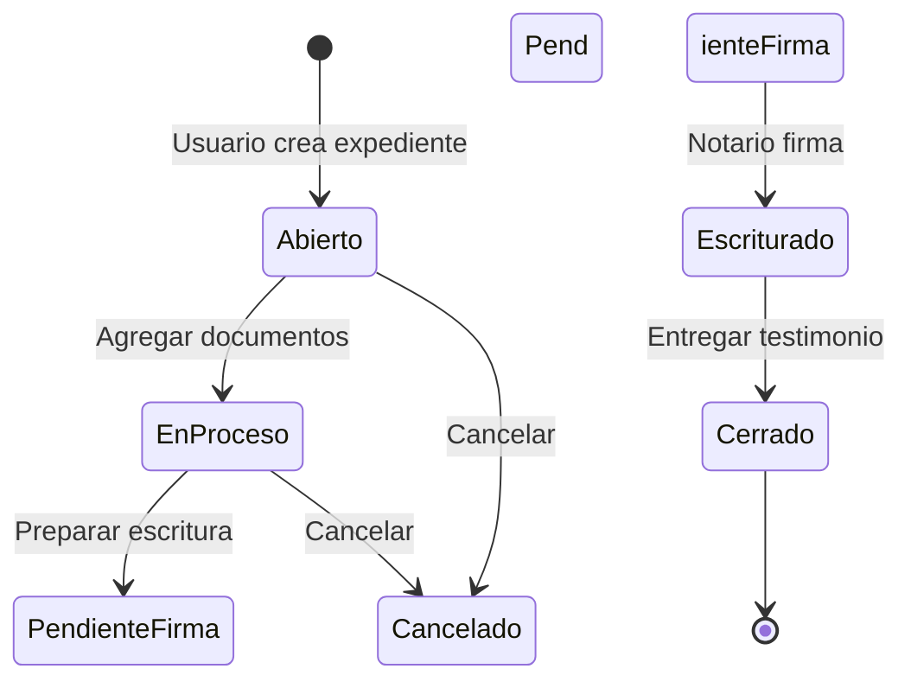

# Análisis del Sistema VB6 - Control Notarial

## 📋 Resumen Ejecutivo

**Sistema Analizado**: Control Notarial 30Campeche (VB6 + MySQL 5.0)  
**Versión**: MASTER.16.02.26  
**Fecha de Análisis**: 13 de Marzo de 2026  
**Arquitectura Actual**: Multi-tenant a nivel de BASE DE DATOS (cada notaría = BD separada)

---

## 🎯 RECOMENDACIÓN PRINCIPAL

### ✅ **OPCIÓN RECOMENDADA: SISTEMA INTEGRADO con módulo dedicado**

**Razones clave**:
1. **Complejidad EXTREMA del sistema VB6** (516 formularios, 275 componentes registrados)
2. **Datos ya están en atinet65_* databases** (legacy, mismo servidor)
3. **Usuarios ya autenticados** en Atinet_Compliance_Hub
4. **Evita duplicación** de infraestructura, auth, facturación
5. **Migración incremental** por módulos funcionales (no todo/nada)
6. **Reutilización** de componentes existentes (búsquedas, PDF, reportes)

---

## 📊 Complejidad del Sistema VB6

### Componentes de Código

| Tipo | Cantidad | Descripción |
|------|----------|-------------|
| **Formularios (.frm)** | 516 archivos | Interfaces de usuario |
| **Módulos (.bas)** | 18 | Lógica de negocio compartida |
| **Clases (.cls)** | 6 | Componentes reutilizables |
| **Reportes (.Dsr)** | 121 | Crystal Reports 9 |
| **TOTAL Componentes** | 661 | Sistema MASIVO |

### Módulos Principales Identificados

Basado en archivo .vbp y estructura de archivos:

#### 1. **Módulo de Expedientes** (Core del sistema)
- `Expedientes.frm` - Gestión principal
- `BusquedaExpediente.frm` - Búsqueda
- `ModificaExpedientes.frm` - Edición
- 40+ formularios relacionados

#### 2. **Módulo de Escrituras**
- `AltaEscritura.frm` (no encontrado en list pero inferido)
- `BusquedaEscritura.frm`
- `EntregaEscritura.frm`
- `EntregaEscritura2.frm`
- `VistaEscrituras.frm`
- 30+ formularios de tipos de escrituras (AFP, Certificaciones, Cotejos, Ratificaciones)

#### 3. **Módulo de Presupuestos**
- `NuevoPresupuesto.frm`
- `AltaPresupuesto.frm`
- `AltaPresPrevio.frm`
- `BusquedaPresupuestos.frm`
- `BusquedaPresupuestosPrev.frm`
- `Presupuestoexpediente.frm`
- 15+ vistas y diseños

#### 4. **Módulo de Recibos/Facturación**
- `FrmEmicionRecibos.frm`
- `AltaReciboOficial.frm` (A, B, C, D - 4 tipos)
- `AltaReciboAnticipo.frm` (1, 2, 3 - 3 tipos)
- `AltaReciboGastos.frm`
- `AltaReciboISR.frm`
- `AltaReciboIva.frm`
- `AltaRecibo218.frm`
- `AltaReciboDocAvi.frm`
- `PagoRecibo*.frm` (8 tipos)
- 50+ formularios de recibos

#### 5. **Módulo de Gestores/Trámites**
- `AltaGestores.frm`
- `BusquedaGestor.frm`
- `Gestores.frm`
- `PagoGestor.frm`
- `Formgestoria.frm` (1, 2, Nuevo - 3 versiones)
- `Tramites.frm`
- `EntregaTramite.frm` (1, 2)
- `BusquedaTramites.frm`
- 30+ formularios

#### 6. **Módulo de Otorgantes/Clientes**
- `AltaOtorgantes.frm`
- `AltaClientes.frm`
- `BusquedaCliente.frm` (1, 2)
- `SelOtorgantes.frm`

#### 7. **Módulo de Trámites/Impuestos**
- `Busquedaimpuesto.frm`
- `AltaImpuestos.frm`
- `AltaImpuZonas.frm`
- `ImpDerReg.frm`

#### 8. **Módulo Bancario**
- `AltaCuentaBco.frm`
- `AltaCheques.frm` (1, 2, 3)
- `AltaDepositos.frm` (1, 2)
- `AltaDepositosBanco.frm`
- `AjustesBancos.frm`
- `Traspasosbancos.frm`
- `BancosNuevo.frm`
- `Conciliacion.frm`

#### 9. **Módulo de Reportes**
- 121 diseños de Crystal Reports (.Dsr)
- Vistas para cada reporte (Vista*.frm - 150+ archivos)
- Reportes por tipo: Expedientes, Honorarios, Gastos, Impuestos, Indices, etc.

#### 10. **Módulo de Antilavado (PLD)**
- `Antilavado.frm`
- `frmExpedientesLavado.frm` (1, 2)
- `frmDetalleAntilavado.frm`
- `frmVistaRptAntiLavado.frm`
- `AltaListasNegras.frm`
- `ConsultaListas.frm`
- `ConsultaListasAdmin.frm`

#### 11. **Módulo de Catálogos**
- `AltaCat*.frm` (20+ formularios)
  - Actividades, Documentos, General, Honorarios, RPP, Vulnerables, Zonas, etc.
- `Mant_Catalogos.frm`

#### 12. **Módulo de Seguridad/Usuarios**
- `Login.frm`
- `AltaUsuarios.frm`
- `BusquedaUsuario.frm`
- `AltaSecretarias.frm`
- `AltadeResponsables.frm`
- `AltaNotario.frm`

#### 13. **Módulo de Alarmas/Seguimiento**
- `Alarmas.frm`
- `ActualizaAlarma.frm`
- `Recordatorio.frm` (1, 2)
- `AltaSeguimiento.frm`
- `AltaSeguimientoAvaluos.frm`
- `AltasSegEsc.frm`

#### 14. **Módulo de Formato 37A (Gobierno)**
- `Formato37A.frm`
- `BusquedaFormato37A.frm`
- `DiseForm37A.Dsr` (5+ versiones)
- `VistaFormato37A.frm` (1, 5)

#### 15. **Módulo de Facturación Electrónica**
- `FacturaElectronica.bas` (módulo)
- `ConsultaRecibos.frm`
- Integración con SAT/CFDI

#### 16. **Módulo de Exportación/Importación**
- `ExportaWord.frm` (1, 2, 3, 5 - 4 versiones)
- `ExportaDatBenControlador.frm`
- `FormatosExporta.frm` (1, 2)
- `d_ExportaWord.frm`

#### 17. **Módulo de Chat</ (interno)**
- `AltaChat.frm`
- `frmChat.frm`
- `AltaGruposChat.frm`
- `BusquedaGruposChat.frm`

### Módulos de Utilería (.bas)

| Módulo | Función |
|--------|---------|
| `General.bas` | Rutinas generales del sistema |
| `Datos.bas` | Acceso a datos/conexiones |
| `NumALetras.bas` | Convertir números a texto (español) |
| `Tipos.bas` | Definiciones de tipos de datos |
| `convertir.bas` | Conversiones varias |
| `Correo.bas` | Envío de correos |
| `FacturaElectronica.bas` | Integración con SAT |
| `Lector.bas`, `Lectura.bas` | Lectura de datos |
| `ModGeneral.bas`, `ModProtocol.bas` | Protocolos y funciones |
| `Rfc.bas`, `Gen_Rfc.bas` | Generación/validación de RFC |
| `Scroll.bas`, `Ruta_.bas` | Utilidades UI |
| `UTF_8.bas` | Manejo de encodings |
| `modSkin.bas`, `modFontsMenus.bas` | Personalización interfaz |
| `modGlobales.bas`, `modGlobalesFLEX.bas` | Variables globales |
| `modInternacionalizacion.bas` | i18n |

### Clases (.cls)

| Clase | Descripción |
|-------|-------------|
| `EstaText.cls` | Control de texto personalizado |
| `SelectF2Flex.cls`, `SelectText.cls`, `SelectF2Text.cls` | Selección en grids |
| `FLXGRD.cls` | Grid personalizado |
| `ClassMaster.cls` | Clase maestra del sistema |
| `clsSysTray.cls` | Integración con system tray |

---

## 🗄️ Estructura de la Base de Datos

### Información General

**Gestor**: MySQL 5.0.41 (muy antiguo, EOL desde 2011)  
**Nombre DB**: `controlnotarial_v12`  
**Tamaño archivo SQL**: 29.8 MB  
**Charset**: utf8 (viejo, debería ser utf8mb4)

### Categorías de Tablas

#### TABLAS PRINCIPALES (inferidas del SQL)

**1. Core del Sistema**
- `expedientes` - Expedientes notariales
- `escrituras` - Escrituras
- `operacion` - Operaciones realizadas
- `actexp` - Actividades de expedientes
- `actoperacion` - Actividades de operaciones

**2. Participantes**
- `otorgantes` - Personas que otorgan
- `clientes` - Clientes de la notaría
- `gestores` - Gestores de trámites
- `notarios` - Catálogo de notarios
- `pasantes` - Pasantes de la notaría
- `secretarias` - Secretarias
- `usuarios` - Usuarios del sistema

**3. Documentos/Actas**
- `actasfp` - Actas de Fe Pública
- `certificaciones` - Certificaciones emitidas
- `cotejos` - Cotejos de documentos
- `ratificaciones` - Ratificaciones

**4. Financiero**
- `cat_honorarios` - Catálogo de honorarios
- `cat_impuesto` - Catálogo de impuestos
- `arancel` - Aranceles notariales
- `arancelp` - Aranceles personalizados
- `bancos` - Catálogo de bancos
- `cuentasban` - Cuentas bancarias
- `cargoabono` - Movimientos bancarios
- `cheques` - Cheques emitidos
- `depositos` - Depósitos bancarios

**5. Presupuestos/Recibos**
- `presupuestos` - Presupuestos a clientes
- `recibooficial` - Recibos oficiales (A, B, C, D)
- `reciboant` - Recibos de anticipo
- `recibogastos` - Recibos de gastos
- `reciboisr` - Recibos de ISR
- `reciboiva` - Recibos de IVA
- `recibo218` - Recibos art. 218
- `facturascfdi` - Facturas CFDI (electrónicas)

**6. Trámites/Gestores**
- `tramites` - Trámites solicitados
- `cat_tramites` - Catálogo de trámites
- `cat_dependencias` - Dependencias de gobierno
- `gestoria` - Pagos a gestores

**7. Antilavado/PLD**
- `antilavado` - Avisos antilavado
- `objetoaviso` - Objetos del aviso
- `cat_vulnerable` - Catálogo de vulnerables
- Vistas: `comparecientesvulnerables`, `operacionesvulnerables`

**8. Catálogos/Configuración**
- `cat_actividades` - Actividades notariales
- `cat_documentos` - Tipos de documentos
- `cat_zonas` - Zonas/municipios
- `cat_cp` - Códigos postales
- `cat_impuestoslocales` - Impuestos locales
- `cat_rpp` - Registro Público de la Propiedad
- Muchos más...

**9. Control/Seguridad**
- `alarmas` - Alarmas del sistema
- `seguimiento` - Seguimiento de expedientes
- `marcadores` - Marcadores de documentos
- `folios` - Control de folios
- `volumen` - Control de volúmenes

**10. Reportes/Formatos**
- `formatos` - Formatos emitidos
- `formato37a` - Formato 37-A (declaración gobierno)

### VISTAS IDENTIFICADAS (38 vistas)

- `adeudo`, `adeudos` - Adeudos por expediente
- `adeudoactasfp`, `adeudoscertificaciones`, `adeudocotejos`, `adeudoratificaciones` - Por tipo
- `entrega con adeudo` - Entregas con saldo pendiente
- `facturasall` - Vista consolidada de facturas
- `gastos`, `totalgastos` - Totales de gastos
- `ingresos`, `ingresosafp`, `ingresoscert`, `ingresoscot` - Por tipo de ingreso
- `saldosexp` - Saldos por expediente
- `totalhonorarios`, `totalprovisional` - Totales por concepto
- `pagotramites` - Vista compleja de trámites con pagos
- `ordenexp` - Orden de expedientes
- `valores`, `valoresantilavado` - Valores para reportes
- Vistas de antilavado: `c_objetoaviso`, `o_objetoaviso`, `comparecientesvulnerables`, `operacionesvulnerables`

### STORED PROCEDURES (2 encontrados)

- **Procedimiento 1**: (nombre por determinar)
- **Procedimiento 2**: (nombre por determinar)

---

## 🏗️ Arquitectura Multi-Tenant Actual

### Modelo de Datos

```
MySQL Server
│
├── controlnotarial_10cuernavaca
│   ├── expedientes (datos específicos de 10Cuernavaca)
│   ├── escrituras
│   ├── presupuestos
│   └── ...todas las tablas con esquema idéntico
│
├── controlnotarial_30campeche
│   ├── expedientes (datos específicos de 30Campeche)
│   ├── escrituras
│   ├── presupuestos
│   └── ...todas las tablas con esquema idéntico
│
├── controlnotarial_101guadalajara
│   └── ...
│
└── [130 bases de datos, una por notaría]
```

**Características**:
- Schema IDÉNTICO entre todas las BDs
- Customizaciones por notaría: configuración en archivos .ini
- Ventajas: Aislamiento total de datos, backups independientes
- Desventajas: Mantenimiento (actualizar schema en 130 BDs), dificultad para reportes consolidados

---

## 🔧 Tecnologías y Dependencias

### VB6 Components

| Componente | Versión | Uso |
|------------|---------|-----|
| Crystal Reports | 9.0 ActiveX | Reportes (.rpt, .Dsr files) |
| Microsoft DAO | 2.5/3.5 | Acceso a datos (legacy) |
| Microsoft ADO | 2.8 | Acceso a datos (main) |
| MS Word Object Library | 12.0 | Exportación a Word |
| MS Excel Object Library | 12.0 | Exportación a Excel |
| MSXML | 6.0 | Procesamiento XML (CFDI) |
| MS Outlook | 12.0 | Envío de correos |
| DBGrid32.ocx | | Grids de datos |
| MSComCtl2.ocx | 2.0 | Date picker y controles |
| MSFlexGrid.ocx | 1.0 | Grids flexibles |
| ComCtl32.ocx | 1.3 | Controles comunes |
| ComDlg32.ocx | 1.2 | Diálogos (abrir/guardar) |
| MSHFlexGrid.ocx | 6.0 | Hierarchical FlexGrid |
| MSDatGrd.ocx | 1.0 | Data grid |
| MSComm32.ocx | | Comunicación serial |
| TabCtl32.ocx | 1.1 | Tabs |
| Chamaleon Button | 1.0 | Botones personalizados |
| ActiveSkin | 4.3 | Skins de la app |
| WinSock | | Comunicación red (chat) |
| RichTx32.ocx | 1.2 | Rich text box |

### Archivos de Configuración

| Archivo | Propósito |
|---------|-----------|
| `notaria.ini` | Configuración principal notaría |
| `SCN.ini` | Configuración Sistema Control Notarial |
| `Menus.ini`, `Menusiguala.ini` | Menús personalizados por notaría |
| `ctlusu.ini` | Control de usuarios |
| `ctldatosnot.ini` | Datos de la notaría |
| `ctlexp.ini` | Control de expedientes |
| `Factura.ini` | Configuración facturación |
| `Colonia_Declaranot.ini` | Colonias para formato 37-A |
| `chat.ini` | Configuración de chat |
| `drive.ini`, `file.ini`, `dir.ini` | Rutas y directorios |
| `url.ini` | URLs de servicios externos |
| `skincolors.ini`, `skinmenu.skn` | Personalización visual |

**NOTA IMPORTANTE**: Estos archivos contienen configuración POR NOTARÍA. Muchos están codificados (ver scripts `Codificador.ps1`, `Decodificador.ps1`).

---

## 📈 Estimación de Complejidad

### Métrica de Líneas de Código (estimada)

| Componente | Archivos | LOC Estimado | Complejidad |
|------------|----------|--------------|-------------|
| Formularios | 516 | 150,000+ | ⚠️ ALTA |
| Módulos | 18 | 20,000+ | MEDIA |
| Clases | 6 | 2,000+ | BAJA |
| Reportes | 121 | N/A (SQL+Crystal) | MEDIA |
| **TOTAL** | **661** | **~172,000 LOC** | **⚠️ MUY ALTA** |

### Complejidad por Módulo

| Módulo | Complejidad | LOC Est. | Prioridad Migración |
|--------|-------------|----------|---------------------|
| Expedientes | ⚠️ MUY ALTA | 40,000 | 🔴 1 - CRÍTICO |
| Escrituras | ⚠️ MUY ALTA | 35,000 | 🔴 1 - CRÍTICO |
| Recibos/Facturación | ⚠️ ALTA | 25,000 | 🟠 2 - IMPORTANTE |
| Presupuestos | ALTA | 15,000 | 🟠 2 - IMPORTANTE |
| Gestores/Trámites | ALTA | 18,000 | 🟠 3 - NORMAL |
| Reportes | MEDIA | 8,000 | 🟢 4 - BAJA |
| Catálogos | BAJA | 6,000 | 🟢 5 - MUY BAJA |
| Antilavado | MEDIA-ALTA | 10,000 | 🟠 2 - IMPORTANTE (regulatorio) |
| Bancario | MEDIA | 12,000 | 🟠 3 - NORMAL |
| Usuarios/Seguridad | BAJA | 3,000 | 🟢 6 - TRIVIAL (ya existe en Laravel) |

---

## 🚨 Riesgos y Desafíos

### Riesgos Técnicos

1. **Complejidad Extrema** ⚠️ CRÍTICO
   - 516 formularios con lógica embebida
   - No hay separación MVC
   - Acoplamiento alto entre formularios

2. **Dependencies Obsoletas** ⚠️ ALTO
   - MySQL 5.0 (EOL 2011, 15 años desactualizado)
   - Crystal Reports 9 (obsoleto, caro de migrar)
   - VB6 Runtime (soportado pero legacy)
   - Office 12.0 (Office 2007, muy viejo)

3. **Lógica de Negocio Embebida** ⚠️ ALTO
   - Reglas en formularios VB6 (difícil de extraer)
   - Validaciones en múltiples lugares
   - Cálculos en reportes Crystal

4. **Sin Documentación** ⚠️ MEDIO
   - No hay docs técnicos
   - Comentarios escasos en código
   - Lógica solo en cabeza de desarrolladores originales

5. **Archivos .ini Codificados** ⚠️ MEDIO
   - Configuración ofuscada (scripts Codificador/Decodificador existen)
   - Cada notaría tiene configuración diferente

### Riesgos de Negocio

1. **Tiempo de Migración** ⚠️ ALTO
   - Estimado: 18-24 meses para migración completa
   - Costo: Significativo (equipo dedicado necesario)

2. **Resistencia al Cambio** ⚠️ MEDIO
   - Usuarios acostumbrados a la interfaz VB6 (15+ años)
   - Curva de aprendizaje de web UI

3. **Riesgo Operacional** ⚠️ CRÍTICO
   - Sistema en producción 24/7
   - No puede haber downtime (notarías trabajan todos los días)

4. **Customizaciones Per-Notaría** ⚠️ ALTO
   - Cada notaría tiene configuraciones únicas
   - Menús personalizados, formatos especiales
   - Difícil de generalizar

---

## 💡 Estrategia de Migración Recomendada

### Fase 0: Preparación (2-3 meses)

**Objetivos**:
- Documentar módulos críticos
- Reverse engineering de lógica de negocio
- Crear diccionario de datos (tablas, columnas, relaciones)
- Setup entorno Laravel con conexiones multi-DB

**Entregables**:
- [ ] Documentación técnica de expedientes, escrituras, presupuestos
- [ ] Schema unificado (MySQL 8+ compatible)
- [ ] Plan detallado de migración por módulo
- [ ] Prototipos de UI en React/Inertia

### Fase 1: Módulo READ-ONLY - Dashboard Legacy (2 meses)

**Alcance**:
- Vista de consulta de expedientes legacy
- Vista de consulta de escrituras legacy
- Dashboard con estadísticas
- NO permite modificaciones

**Stack**:
```php
// Laravel
app/Services/LegacyControlNotarial/
    ├── LegacyExpedienteService.php
    ├── LegacyEscrituraService.php
    ├── LegacyPresupuestoService.php
    └── MultiTenantConnection.php

// Configuración dinámica de BD
config/database-control-notarial.php
foreach ($notarias as $notaria) {
    config(["database.connections.control_notarial_{$notaria->id}" => [
        'driver' => 'mysql',
        'host' => env('LEGACY_DB_HOST'),
        'database' => "controlnotarial_{$notaria->legacy_identifier}",
        'username' => env('LEGACY_DB_USER'),
        'password' => env('LEGACY_DB_PASSWORD'),
        'charset' => 'utf8mb4',
    ]]);
}
```

**Beneficio**: Los usuarios pueden VER sus datos históricos desde la nueva app.

### Fase 2: Módulo de Catálogos (3 meses)

**Alcance**:
- Migrar catálogos a Laravel (6,000 LOC estimado)
- CRUD completo: Actividades, Documentos, Honorarios, Impuestos, Zonas, etc.
- Sincronización bidireccional con VB6 (transición gradual)

**Tecnología**:
- API RESTful en Laravel
- Frontend en Inertia React
- Sincronización vía triggers MySQL o scheduled jobs

**Beneficio**: Funcionalidad simple y probatoria del enfoque.

### Fase 3: Módulo de Reportes (4 meses)

**Alcance**:
- Reemplazar Crystal Reports con solución moderna
- Reportes en PDF (dompdf/wkhtmltopdf)
- Exports Excel (Laravel Excel)
- Dashboard con gráficas (Recharts/Chart.js)

**Complejidad**: MEDIA (lógica en SQL, UI nueva)

**Reportes a migrar**: 121 reportes .Dsr

**Estrategia**:
1. Identificar los 20 reportes más usados (80/20)
2. Migrar esos primero
3. Rest on-demand

### Fase 4: Módulo de Presupuestos (5 meses)

**Alcance**:
- CRUD de presupuestos
- Cálculo de honorarios, impuestos, gastos
- Validación de montos
- Emisión de PDF
- Envío por correo

**Complejidad**: ALTA (15,000 LOC, lógica de cálculo compleja)

**Stack**:
- Laravel Models: `Presupuesto`, `PresupuestoDetalle`, `PresupuestoHonorario`, `PresupuestoGasto`, `PresupuestoImpuesto`
- Form Requests para validación
- Jobs para envío de correos
- Eventos para auditoría

### Fase 5: Módulo de Recibos/Facturación (6 meses)

**Alcance**:
- Emisión de recibos (8 tipos)
- Integración con SAT (CFDI 4.0)
- Pagos y aplicación de anticipos
- Conciliación bancaria
- Reportes fiscales

**Complejidad**: ⚠️ MUY ALTA (25,000 LOC, integración SAT crítica)

**Consideraciones**:
- CFDI 4.0 (actual en 2026)
- PAC (Proveedor Autorizado de Certificación)
- Validación SAT en tiempo real
- Cancelación de facturas
- Complementos de pago

### Fase 6: Módulo de Expedientes (Core) (8 meses)

**Alcance**:
- CRUD completo de expedientes
- Workflow: Abierto → En proceso → Firma → Escritura → Cerrado
- Otorgantes/comparecientes
- Documentos adjuntos (digitalizados)
- Historial de movimientos
- Alarmas y seguimiento

**Complejidad**: ⚠️ MUY ALTA (40,000 LOC, core del negocio)

**Arquitectura**:
```php
app/Models/ControlNotarial/
    ├── Expediente.php
    ├── ExpedienteOtorgante.php
    ├── ExpedienteDocumento.php
    ├── ExpedienteActividad.php
    ├── ExpedienteAlarma.php
    └── ExpedienteSeguimiento.php

app/StateMachines/
    └── ExpedienteStateMachine.php (Abierto, EnProceso, Firma, Escritura, Cerrado, Cancelado)
```

### Fase 7: Módulo de Escrituras (8 meses)

**Alcance**:
- Alta de escrituras (5 tipos: regulares, AFP, certificaciones, cotejos, ratificaciones)
- Asignación de folios/volúmenes
- Control de índices
- Formato 37-A (gobierno)
- Entrega de testimonios/copias certificadas

**Complejidad**: ⚠️ MUY ALTA (35,000 LOC, regulaciones notariales)

**Regulación**: Cumplir con Ley del Notariado de cada estado (30 estados diferentes).

### Fase 8: Módulo de Trámites/Gestores (5 meses)

**Alcance**:
- Solicitud de trámites a dependencias
- Asignación de gestores
- Control de ent/sal documentos
- Pagos a gestores
- Vencimientos y alarmas

**Complejidad**: ALTA (18,000 LOC, coordinación externa)

### Fase 9: Módulo de Antilavado (PLD) (4 meses)

**Alcance**:
- Detección automática de operaciones vulnerables
- Cálculo de montos acumulados
- Generación de avisos SAT
- Envío electrónico a UIF
- Reportes PLD

**Complejidad**: MEDIA-ALTA (10,000 LOC, pero CRÍTICO por cumplimiento regulatorio)

**Regulación**: Ley Federal de Prevención e Identificación de Operaciones con Recursos de Procedencia Ilícita.

### Fase 10: Módulo Bancario (4 meses)

**Alcance**:
- Cuentas bancarias
- Cheques, depósitos, traspasos
- Conciliación bancaria
- Integración con bancos (layouts BANAMEX, HSBC, etc.)

**Complejidad**: MEDIA (12,000 LOC)

### Fase 11: Optimización y Closure (3 meses)

- Performance tuning
- Migración completa de datos históricos
- Training de usuarios
- DECOMMISSION del sistema VB6 🎉

---

## 📅 Timeline Estimado

```
┌─────────────────────────────────────────────────────────────────┐
│ MIGRACIÓN COMPLETA: 24 MESES (2 años)                          │
└─────────────────────────────────────────────────────────────────┘

Fase 0 (Prep):        ████░░░░░░░░░░░░░ (3 meses)
Fase 1 (Read-Only):   ░░░███░░░░░░░░░░░ (2 meses)
Fase 2 (Catálogos):   ░░░░░████░░░░░░░░ (3 meses)
Fase 3 (Reportes):    ░░░░░░░░█████░░░░ (4 meses)
Fase 4 (Presupuestos):░░░░░░░░░░░░██████ (5 meses)
Fase 5 (Facturación): ░░░░░░░░░░░░░░░░░███████ (6 meses en paralelo con Fase 6)
Fase 6 (Expedientes): ░░░░░░░░░░░░░░░░░░░░░█████████ (8 meses)
Fase 7 (Escrituras):  ░░░░░░░░░░░░░░░░░░░░░░░░░█████████ (8 meses, continúa con 6)
Fase 8 (Trámites):    ░░░░░░░░░░░░░░░░░░░░░░░░░░░░░░░░██████ (5 meses)
Fase 9 (Antilavado):  ░░░░░░░░░░░░░░░░░░░░░░░░░░░░░░░░░░░░████░ (4 meses)
Fase 10 (Bancario):   ░░░░░░░░░░░░░░░░░░░░░░░░░░░░░░░░░░░░░░░████ (4 meses)
Fase 11 (Closure):    ░░░░░░░░░░░░░░░░░░░░░░░░░░░░░░░░░░░░░░░░░░███ (3 meses)

│─────────────────────────────────────────────────────────────│
0        6       12       18       24 meses
```

**Nota**: Algunas fases se pueden solapar (paralelize).

---

## 💰 Estimación de Costos

### Equipo Requerido

| Rol | Cantidad | Dedicación | Meses | 
|-----|----------|------------|--------|
| Tech Lead / Arquitecto | 1 | 100% | 24 |
| Desarrollador Laravel Senior | 2 | 100% | 24 |
| Desarrollador React Senior | 1 | 100% | 24 |
| Desarrollador Fullstack Mid | 2 | 100% | 18 |
| QA / Tester | 1 | 100% | 18 |
| Especialista en Migración de Datos | 1 | 50% | 12 |
| Product Owner (notaría) | 1 | 25% | 24 |
| **TOTAL** | **9 personas** | | |

### Costo Mensual Estimado (México)

- **Tech Lead**: $80,000 MXN/mes
- **Senior**: $60,000 MXN/mes
- **Mid**: $40,000 MXN/mes
- **QA**: $35,000 MXN/mes
- **Especialista Datos**: $50,000 MXN/mes (50%)
- **Product Owner**: $40,000 MXN/mes (25% de tiempo)

**Costo Mensual Total**: ~$535,000 MXN  
**Costo Total Proyecto (24 meses)**: ~$12,840,000 MXN (**~$640,000 USD** al tipo de cambio 20:1)

### Costos Adicionales

- Licencias (DB, servidores, herramientas): $50,000 USD
- Infraestructura Cloud (AWS/Azure): $30,000 USD (2 años)
- Contingencia (20%): $144,000 USD

**COSTO TOTAL ESTIMADO**: **$864,000 USD** (~$17,280,000 MXN)

---

## ⚖️ Comparativa: Integrado vs Separado

### Opción A: Sistema Integrado (REtegrado

| Aspecto | Ventajas ✅ | Desventajas ❌ |
|---------|------------|----------------|
| **Arquitectura** | - Un solo codebase<br>- Reutilización de código<br>- Shared services (auth, storage, etc.) | - Aplicación más grande<br>- Acoplamiento con core |
| **Autenticación** | - Single Sign-On<br>- Usuarios ya migrados | - Permisos más complejos |
| **Datos** | - Queries consolidados fáciles<br>- Un solo ORM (Eloquent) | - Mixing legacy + new tables |
| **Deploy** | - Un solo deploy<br>- Un solo dominio | - Downtime afecta todo |
| **Mantenimiento** | - Un solo equipo<br>- Actualizaciones conjuntas | - Cambios en core afectan control notarial |
| **Costo** | - Menor infraestructura<br>- No duplicar servicios | - N/A |
| **Timeline** | - Reutiliza dashboards, PDFs, etc. | - Puede ralentizar core si no se modulariza bien |

### Opción B: Microservicio Separado

| Aspecto | Ventajas ✅ | Desventajas ❌ |
|---------|------------|----------------|
| **Arquitectura** | - Desacoplado total<br>- Escalabilidad independiente<br>- Tecnologías diferentes si se requiere | - Duplicación de código (auth, helpers, etc.)<br>- Dos codebases |
| **Autenticación** | - Aislamiento de permisos | - SSO complejo (OAuth, JWT)<br>- Migrar usuarios dos veces |
| **Datos** | - Schemas limpios<br>- No contamina Atinet_Compliance_Hub | - Queries cross-db complicados |
| **Deploy** | - Deploy independiente<br>- Downtime no afecta Atinet | - Dos pipelines CI/CD<br>- Dos dominios (notaria.atinet.mx?) |
| **Mantenimiento** | - Equipos separados posibles | - Mayor overhead operacional<br>- Dos Laravel, dos React, etc. |
| **Costo** | - N/A | - Mayor infraestructura (2x servers)<br>- Mayor costo de desarrollo (rebuild auth, etc.) |
| **Timeline** | - N/A | - 3-4 meses adicionales construir base |

### 🎯 RECOMENDACIÓN FINAL: **SISTEMA INTEGRADO con Módulo Dedicado**

**Estructura propuesta**:

```
Atinet_Compliance_Hub/
├── app/
│   ├── Http/Controllers/
│   │   ├── Admin/              (existing)
│   │   ├── Busquedas/          (existing)
│   │   └── ControlNotarial/    ← NUEVO MÓDULO
│   │       ├── ExpedienteController.php
│   │       ├── EscrituraController.php
│   │       ├── PresupuestoController.php
│   │       ├── ReciboController.php
│   │       └── ... (15 controllers)
│   │
│   ├── Models/
│   │   ├── User.php, Notaria.php (existing)
│   │   └── ControlNotarial/    ← NUEVO MÓDULO
│   │       ├── Expediente.php
│   │       ├── Escritura.php
│   │       ├── Presupuesto.php
│   │       └── ... (40 models)
│   │
│   ├── Services/
│   │   ├── BusquedaService.php (existing)
│   │   └── ControlNotarial/    ← NUEVO MÓDULO
│   │       ├── ExpedienteService.php
│   │       ├── LegacyConnectionService.php
│   │       └── ... (20 services)
│   │
│   └── ... (Policies, Jobs, Events, etc.)
│
├── resources/js/Pages/
│   ├── Dashboard.tsx (existing)
│   ├── Busquedas/ (existing)
│   └── ControlNotarial/        ← NUEVO MÓDULO
│       ├── Expedientes/
│       │   ├── Index.tsx
│       │   ├── Create.tsx
│       │   ├── Edit.tsx
│       │   └── Show.tsx
│       ├── Escrituras/
│       ├── Presupuestos/
│       └── ... (15 submodules)
│
├── routes/
│   ├── web.php
│   ├── settings.php
│   └── control-notarial.php   ← NUEVO ARCHIVO RUTAS
│
├── database/migrations/
│   ├── 2024_*_create_users_table.php (existing)
│   └── 2026_03_*_create_control_notarial_tables.php ← MIGRACIONES NUEVAS
│
└── config/
    ├── database.php
    └── control-notarial.php   ← NUEVO ARCHIVO CONFIG
```

**Razones**:
1. **Reutilización máxima**: Auth, permisos, PDF, almacenamiento, correos, todo ya existe
2. **Single codebase**: Más fácil de mantener
3. **Migración gradual**: Módulos pequeños que se van agregando
4. **Costo menor**: No duplicar infraestructura ni servicios base
5. **User experience cohesivo**: Una sola app, un solo login
6. **Datos consolidados**: Fácil hacer reportes que mezclen búsquedas OFAC/SAT + expedientes
7. **Ya hay experiencia**: Equipo ya conoce este stack (Laravel 12 + Inertia React)

**Namespacing claro** evita acoplamiento:
```php
// Claro que es ControlNotarial
use App\Models\ControlNotarial\Expediente;
use App\Services\ControlNotarial\ExpedienteService;

// VS models de Atinet_Compliance_Hub
use App\Models\Notaria;
use App\Models\Busqueda;
```

---

## 🔐 Estrategia de Seguridad y Permisos

### Roles Necesarios (agregando a los existentes)

**Roles actuales en Atinet_Compliance_Hub**:
- `super_admin`
- `notaria_admin`
- `collaborator`

**Nuevos roles para Control Notarial**:
- `notario` - Notario titular (acceso total a su notaría)
- `pasante` - Pasante del notario (acceso según permisos)
- `secretaria` - Secretaria (expedientes, recibos, trámites)
- `contabilidad` - Área contable (reportes financieros, facturas)
- `gestor` - Gestor externo (solo sus trámites)

### Permisos Granulares

```php
// database/seeders/ControlNotarialPermissionsSeeder.php
const PERMISSIONS = [
    // Expedientes
    'control_notarial.expedientes.view',
    'control_notarial.expedientes.create',
    'control_notarial.expedientes.edit',
    'control_notarial.expedientes.delete',
    'control_notarial.expedientes.close', // Cerrar expediente
    
    // Escrituras
    'control_notarial.escrituras.view',
    'control_notarial.escrituras.create',
    'control_notarial.escrituras.assign_folio', // Asignar folio
    'control_notarial.escrituras.authorize', // Autorizar/firmar
    
    // Presupuestos
    'control_notarial.presupuestos.view',
    'control_notarial.presupuestos.create',
    'control_notarial.presupuestos.approve', // Aprobar presupuesto
    
    // Recibos/Facturación
    'control_notarial.recibos.view',
    'control_notarial.recibos.create',
    'control_notarial.recibos.cancel', // Cancelar factura CFDI
    
    // Reportes
    'control_notarial.reportes.financieros',
    'control_notarial.reportes.operativos',
    'control_notarial.reportes.antilavado',
    
    // Admin
    'control_notarial.settings.edit',
    'control_notarial.catalogos.edit',
];
```

### Multi-tenancy: Notaría Level

```php
// app/Http/Middleware/EnsureUserHasControlNotarialAccess.php
class EnsureUserHasControlNotarialAccess
{
    public function handle($request, Closure $next)
    {
        $user = $request->user();
        
        // Verificar que el usuario pertenece a una notaría con acceso a Control Notarial
        if (!$user->notaria->hasActiveControlNotarialSubscription()) {
            abort(403, 'Tu notaría no tiene acceso al módulo de Control Notarial');
        }
        
        // Establecer conexión dinámica a la BD legacy de esa notaría
        $this->setDynamicConnection($user->notaria);
        
        return $next($request);
    }
    
    private function setDynamicConnection($notaria)
    {
        config(["database.connections.control_notarial_legacy" => [
            'driver' => 'mysql',
            'host' => env('LEGACY_DB_HOST'),
            'database' => "controlnotarial_{$notaria->legacy_identifier}",
            // ... resto de config
        ]]);
    }
}
```

**Aplicar middleware a rutas**:
```php
// routes/control-notarial.php
Route::middleware([
    'auth',
    'verified',
    'subscription:control_notarial', // Suscripción activa
    EnsureUserHasControlNotarialAccess::class,
])->prefix('control-notarial')->group(function () {
    // Todas las rutas de control notarial aquí
});
```

---

## 📚 Documentación Requerida (Fase 0)

### 1. Diccionario de Datos

Archivo: `docs/control-notarial/diccionario-datos.md`

Para CADA tabla:
- Nombre
- Propósito
- Columnas (nombre, tipo, nullable, default, descripción)
- Relaciones (FK, tablas relacionadas)
- Índices
- Volumetría (filas estimadas)
- Patrón de acceso (lectura/escritura)

**Ejemplo**:
```markdown
## Tabla: `expedintes`

**Propósito**: Almacena los expedientes notariales.

| Columna | Tipo | Null | Default | Descripción |
|---------|------|------|---------|-------------|
| id | INT(11) | NO | AUTO_INCREMENT | ID único |
| expediente | VARCHAR(255) | NO | | Número de expediente (formato: "1/2025") |
| tipo_expediente | INT(11) | YES | NULL | FK a `tipos_expediente` |
| fecha_apertura | DATETIME | YES | NULL | Fecha de apertura |
| notario_id | INT(11) | NO | | FK a `notarios` |
| ... | ... | ... | ... | ... |

**Relaciones**:
- `tipos_expediente.id` (1:N)
- `notarios.id` (N:1)
- `expedientes_otorgantes.expediente_id` (1:N)

**Índices**:
- PRIMARY KEY (id)
- UNIQUE KEY (expediente)
- INDEX (fecha_apertura)

**Volumetría**: ~50,000 expedientes por notaría (promedio)
```

### 2. Flujos de Negocio (Workflows)

Archivo: `docs/control-notarial/workflows/`

**Documentar flujos críticos**:
- `workflow-expediente.md` - Desde apertura hasta cierre
- `workflow-escritura.md` - Asignación de folio, firma, entrega
- `workflow-presupuesto.md` - Cotización, aprobación, facturación
- `workflow-antilavado.md` - Detección, cálculo, envío de aviso

**Formato sugerido** (Mermaid diagrams):
```markdown
## Workflow: Expediente



**Reglas de negocio**:
- Un expediente NO puede cerrarse si tiene recibos pendientes de cobro
- Al cerrar expediente, se genera automáticamente el índice para el volumen
- ...
```

### 3. Catálogo de Reportes

Archivo: `docs/control-notarial/reportes-catalogo.xlsx`

Para CADA uno de los 121 reportes:
- Nombre (archivo .rpt)
- Descripción funcional
- Usuarios que lo usan (qué rol)
- Frecuencia de uso (diario/semanal/mensual/anual)
- Datos que muestra (tablas involucradas)
- Parámetros de entrada
- Formato de salida (PDF/Excel/impresión directa)
- Prioridad de migración (1-5)

---

## 🧪 Plan de Pruebas

### Testing por Fase

| Fase | Unit Tests | Integration Tests | E2E Tests | UAT |
|------|-----------|-------------------|-----------|-----|
| 2 (Catálogos) | 50+ | 20+ | 10+ | ✅ |
| 3 (Reportes) | 30+ | 15+ | 20+ | ✅ |
| 4 (Presupuestos) | 80+ | 30+ | 25+ | ✅ |
| 5 (Facturación) | 100+ | 40+ | 30+ | ✅ |
| 6 (Expedientes) | 150+ | 60+ | 50+ | ✅ |
| 7 (Escrituras) | 150+ | 60+ | 50+ | ✅ |
| ... | ... | ... | ... | ... |

### Cobertura de Código Objetivo

- **Unit Tests**: 80% coverage
- **Integration Tests**: Todos los endpoints críticos
- **E2E Tests**: Flujos completos (expediente abierto → cerrado)

### UAT (User Acceptance Testing)

**Sandbox Environment**:
- Copia de BD de producción (anonimizada)
- Usuarios reales de 3-5 notarías piloto
- 2 semanas de pruebas por fase
- Feedback estructurado (formularios)

---

## 🚀 Plan de Deployment

### Estrategia: Blue-Green Deployment

**Fase de transición (6 meses post-migración)**:
- VB6 sigue corriendo (BLUE)
- Laravel nuevo módulo disponible (GREEN)
- Usuarios pueden elegir (toggle en settings)
- Sincronización bidireccional de datos

**Cutover**:
- Cuando GREEN tenga 95%+ adopción
- Apagar VB6 (BLUE)
- Mantener BD legacy en read-only (histórico)

### Rollback Plan

Si hay issues críticos en GREEN:
1. Toggle automático a BLUE (VB6) para todos los usuarios
2. Investigar y corregir en staging
3. Re-deploy GREEN v2
4. Volver a activar toggle

**Criterios para rollback**:
- Error rate > 5%
- Performance degradation > 50%
- Data corruption detected
- User complaints > 20% de usuarios activos

---

## 📊 KPIs de Migración

### Métricas de Progreso

| KPI | Target | Medición |
|-----|--------|----------|
| **Módulos migrados** | 11/11 (100%) | Por fase |
| **Formularios VB6 eliminados** | 516/516 | Count |
| **Reportes migrados** | 121/121 | Count |
| **Usuarios activos en Laravel** | 100% | Analytics |
| **Downtime total** | < 8 horas (en 24 meses) | Uptime monitor |
| **Bugs críticos post-deploy** | < 5 por fase | Bug tracker |
| **Performance (load time)** | < 2s (p95) | APM tool |
| **User satisfaction** | > 4/5 | Surveys |

### Métricas de Negocio

| KPI | Target | Beneficio |
|-----|--------|-----------|
| **Costo de mantenimiento** | -40% | Eliminación de licencias VB6, Crystal Reports |
| **Tiempo de onboarding** | -50% | UI moderna más intuitiva |
| **Movilidad** | 100% web | Acceso desde cualquier dispositivo |
| **Reportes en tiempo real** | < 5s | vs minutos en VB6 |

---

## ⚠️ Decisiones Críticas Pendientes

### 1. ¿Migrar datos históricos completos o solo últimos X años?

**Opción A**: Migrar TODO (15+ años de datos)
- ✅ Historial completo disponible
- ❌ Tiempo de migración LARGO
- ❌ Volumetrías grandes en nueva BD

**Opción B**: Migrar solo últimos 5 años, resto en read-only legacy
- ✅ Migración rápida
- ✅ BD nueva más ligera
- ❌ Queries que necesiten datos viejos van a legacy (lento)

**Recomendación**: Opción B inicialmente, migración completa en background jobs.

### 2. ¿Reemplazar Crystal Reports o migrar reportes .rpt?

**Opción A**: Reemplazar con PDF/Excel en Laravel
- ✅ No license cost
- ✅ Full control del código
- ❌ Gran esfuerzo (121 reportes)

**Opción B**: Usar Crystal Reports Runtime en servidor
- ✅ Reportes funcionan sin cambios
- ❌ License cost ($$$)
- ❌ Dependencia legacy

**Recomendación**: Opción A (reemplazar), pero gradual (20 reportes más usados primero).

### 3. ¿Multi-tenancy a nivel DB o a nivel fila?

**Actual (VB6)**: Una BD por notaría (130 BDs)

**Opción A**: Mantener multi-DB
- ✅ Aislamiento total (seguridad)
- ✅ Backups independientes
- ❌ Complejidad en queries
- ❌ Mantenimiento de schema (130 BDs)

**Opción B**: Unificar en una BD con `notaria_id`
- ✅ Queries simples
- ✅ Mantenimiento fácil
- ❌ Riesgo de data leak si query mal construido

**Recomendación**: Opción A para datos legacy (mantener BDs actuales), Opción B para datos nuevos generados en Laravel.

```php
// Modelo híbrido
class Expediente extends Model
{
    // Usa conexión legacy dinámica
    public function __construct(array $attributes = [])
    {
        $this->connection = "control_notarial_legacy_{$this->notaria_id}";
        parent::__construct($attributes);
    }
}

class NuevoExpediente extends Model
{
    // Usa BD unificada
    protected $connection = 'mysql'; // BD principal Laravel
    protected $table = 'control_notarial_expedientes';
    
    // notaria_id como columna
}
```

### 4. ¿Cuándo decommissionar el servidor VB6?

**Timeline sugerido**:
- Mes 18: Todos los módulos migrados
- Mes 19-20: UAT masivo con todas las notarías
- Mes 21-22: Ajustes y correcciones
- Mes 23: Apagar VB6 en producción (mantener en backup por 3 meses)
- Mes 24: Decommission físico del servidor VB6

---

## 📞 Próximos Pasos (Acción Inmediata)

### Semana 1-2: Validación de Análisis

- [ ] Revisar este documento con equipo técnico
- [ ] Validar estimaciones de complejidad/timeline
- [ ] Confirmar disponibilidad de recursos (equipo)
- [ ] Presentar a stakeholders (decisores de la notaría)

### Semana 3-4: Decisiones Críticas

- [ ] Decidir: ¿Integrado o separado? (Recomendación: Integrado)
- [ ] Decidir: ¿Migrar datos históricos completos?
- [ ] Decidir: ¿Budget aprobado? ($864K USD estimado)
- [ ] Decidir: ¿Timeline aceptable? (24 meses)

### Mes 2: Kick-off Fase 0

- [ ] Contratar equipo (si hace falta)
- [ ] Setup entorno de desarrollo
- [ ] Clonar BD legacy de 1 notaría piloto (30Campeche)
- [ ] Iniciar documentación (diccionario de datos, workflows)
- [ ] Prototipos UI en Figma

### Mes 3: Documentación Completa

- [ ] Finalizar diccionario de datos (50+ tablas core)
- [ ] Documentar workflows críticos (5 workflows)
- [ ] Catalogar reportes (121 reportes priorizados)
- [ ] Reverse engineering de módulo de Expedientes
- [ ] Plan detallado Fase 1

### Mes 4: Inicio Fase 1 (Dashboard Read-Only)

- [ ] Implementar conexión dinámica multi-DB
- [ ] Vista de consulta de expedientes legacy
- [ ] Vista de consulta de escrituras legacy
- [ ] Dashboard con estadísticas
- [ ] Deploy a staging
- [ ] UAT con notaría piloto

---

## 🎯 Conclusiones y Recomendación Final

### Conclusión Principal

El **Sistema de Control Notarial en VB6** es un sistema:
- ⚠️ **EXTREMADAMENTE COMPLEJO** (516 formularios, ~172K LOC)
- 🏗️ **ARQUITECTURA MULTI-TENANT A NIVEL BD** (130 BDs separadas)
- 🕰️ **TECNOLOGÍA OBSOLETA** (VB6, MySQL 5.0, Crystal Reports 9)
- 💼 **CRÍTICO PARA EL NEGOCIO** (notarías dependen 100% de él)
- 📊 **15+ AÑOS DE DATOS HISTÓRICOS** valiosos

### Recomendación Estratégica

✅ **MIGRAR A LARAVEL - SISTEMA INTEGRADO CON MÓDULO DEDICADO**

**NO hacerlo como microservicio separado** porque:
- Duplicaría esfuerzos (auth, storage, PDF, etc.)
- Costaría 30-40% más
- Tomaría 3-4 meses adicionales
- Fragmentaría la experiencia del usuario

**HACERLO como módulo integrado en Atinet_Compliance_Hub** porque:
- Reutiliza toda la infraestructura existente
- Single sign-on (usuarios ya migrados)
- Codebase unificado (más fácil de mantener)
- Datos consolidados (búsquedas OFAC/SAT + expedientes en un solo lugar)
- Costo 30-40% menor
- Timeline más corto

### Enfoque de Migración

**GRADUAL E INCREMENTAL** (no big-bang):
1. Empezar con módulo READ-ONLY (Fase 1) - usuarios ven sus datos históricos
2. Migrar módulos simples primero (catálogos, reportes)
3. Migrar core del sistema al final (expedientes, escrituras)
4. Mantener VB6 en producción durante transición (6-12 meses de overlap)
5. Sincronización bidireccional durante transición
6. Decommission VB6 cuando adopción de Laravel sea > 95%

### Timeline y Presupuesto

- **Duración**: 24 meses (2 años)
- **Equipo**: 9 personas (mezcla de senior/mid)
- **Costo Total**: ~$864,000 USD (~$17.3M MXN)
- **ROI**: Se recupera en 3-4 años por:
  - Eliminación de licencias VB6/Crystal
  - Reducción de mantenimiento (40%)
  - Mayor productividad usuarios (50% menos tiempo en tareas)
  - Movilidad (acceso web desde cualquier lugar)

### Riesgos Principales

1. **Complejidad extrema** - Es un sistema MASIVO, subestimar = failure
2. **Resistencia al cambio** - Usuarios con 15+ años usando VB6
3. **Riesgo operacional** - Cualquier downtime afecta notarías (alta urgencia)
4. **Customizaciones per-notaría** - Cada notaría tiene configuración única

### Mitigación de Riesgos

- ✅ Fase 0 extensa (3 meses) de documentación y análisis
- ✅ Migración gradual (módulo por módulo)
- ✅ UAT riguroso con notarías piloto
- ✅ Rollback plan en cada fase
- ✅ Soporte 24/7 durante transición
- ✅ Training extenso a usuarios

---

## 📝 Siguientes Acciones

**Decisión requerida**: ¿Proceder con Fase 0 (Preparación)?

Si **SÍ**:
1. Aprobar presupuesto inicial (Fase 0: ~$80K USD, 3 meses)
2. Contratar Tech Lead / Arquitecto
3. Clonar BD legacy de notaría piloto
4. Iniciar documentación técnica
5. Reunión semanal de avance (stakeholders)

Si **NO** o **PENDIENTE**:
- ¿Qué información adicional se necesita?
- ¿Cuáles son las objeciones? (costo, timeline, riesgo)
- ¿Alternativas consideradas? (mantener VB6, migrar a otra plataforma)

---

**Elaborado por**: GitHub Copilot con Claude Sonnet 4.5  
**Fecha**: 13 de Marzo de 2026  
**Versión**: 1.0  
**Estado**: Análisis preliminar - PENDIENTE APROBACIÓN
