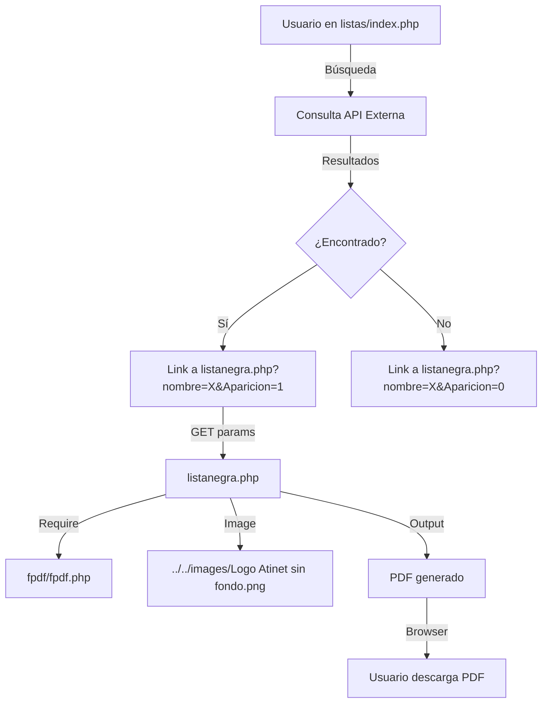

# 📋 Documentación Técnica del Proyecto
## Sistema de Gestión para Notarías - Atinet

**Fecha:** 23 de Febrero de 2026  
**Versión:** 1.0  
**Estado:** Refactorización en Progreso

---

## 📌 Resumen Ejecutivo

Atinet mantiene diferentes servicios y páginas web para múltiples Notarías, incluyendo:
- ✅ **Agenda Web** - Sistema de citas y calendario
- ✅ **Listas Negras** - Consulta de listas SAT y OFAC/UIF
- ✅ **Registro con QR** - Sistema de registro de clientes
- ✅ **OCR de INE** - Reconocimiento óptico de identificaciones

### 🎯 Objetivo Actual
Implementar una **solución de corto plazo** mientras se desarrolla un sistema multi-tenant completo en Laravel.

---

## 🏗️ Arquitectura Actual (Problemática)

### Estructura de Carpetas en Producción

```
/htdocs/
  ├── 312reynosa/          ← Notaría 1
  │   ├── index.php
  │   ├── src/
  │   ├── assets/
  │   ├── agenda_web/
  │   └── logo-notario.jpg
  ├── 313monterrey/        ← Notaría 2 (MISMO CÓDIGO)
  │   ├── index.php
  │   ├── src/
  │   ├── assets/
  │   └── logo-notario.jpg
  ├── 314guadalajara/      ← Notaría 3 (MISMO CÓDIGO)
  │   └── ...
  └── utilerias_appliweb/  ← Librería compartida
      ├── conexion.php
      ├── LogoAtinetSinFondo.png
      └── AVISODEPRIVACIDAD.pdf
```

### Estructura Local (Desarrollo)

```
c:\xampp\htdocs\Registro_Agenda_nuevo/
  ├── agenda_web atinet/           ← Código de desarrollo
  │   ├── index.php                ← Página principal de registro
  │   ├── agenda_web/              ← Sistema de agenda/calendario
  │   │   ├── conn.php             ← Conexión BD (diferente)
  │   │   ├── index.php            ← Login agenda
  │   │   └── agenda/
  │   │       └── calendario/
  │   │           ├── insert.php
  │   │           ├── update.php
  │   │           ├── delete.php
  │   │           └── load.php
  │   ├── listas_negras/           ← Consulta listas SAT/OFAC
  │   │   ├── login.php
  │   │   ├── conn.php             ← Función conectar
  │   │   ├── fpdf/                ← Generador PDF
  │   │   └── listas/
  │   │       ├── index.php        ← Búsquedas
  │   │       └── php/
  │   │           ├── listanegra.php  ← PDF Lista OFAC/UIF
  │   │           ├── listasat.php    ← PDF Lista SAT
  │   │           └── excel.php       ← Exportar Excel
  │   └── src/                     ← Lógica de negocio
  │       ├── conexion.php         ← Conexión LOCAL
  │       ├── registrar.php        ← Registro de usuarios
  │       ├── processing.php
  │       ├── processing2.php
  │       └── phpmailer/
  └── utilerias_appiweb/          ← Copia de producción
      ├── conexion.php            ← Conexión PRODUCCIÓN
      ├── ocr/
      └── app_web/
```

---

## 🔌 Sistema de Conexiones a Base de Datos

### 🚨 Problema: Doble Fuente de Verdad

Existen **TRES archivos de conexión diferentes** que causan confusión:

#### 1. `/utilerias_appliweb/conexion.php` (PRODUCCIÓN)
```php
$conexion  = mysqli_connect("localhost", "atinet65_uaplicativos", "@.atinet23#", "atinet65_aplicativos");
$conexion2 = mysqli_connect("localhost", "atinet65_catalogador", "atinet2020@", "atinet65_catalogos");
```
- ✅ **Usado por:** `index.php`, `registrar.php`, `buscar_codigo_postal.php`
- ✅ **Referencia:** Ruta absoluta `/home3/atinet65/notariosatinet.com.mx/utilerias_appliweb/conexion.php`
- ⚠️ **Problema:** Hardcoded, no funciona en local

#### 2. `agenda_web atinet/src/conexion.php` (LOCAL)
```php
$conexion  = mysqli_connect("localhost", "root", "123456", "atinet65_aplicativos");
$conexion2 = mysqli_connect("localhost", "root", "123456", "base_cat");
```
- ✅ **Usado por:** Desarrollo local
- ⚠️ **Problema:** Comentado en archivos principales, causa confusión

#### 3. `agenda_web atinet/agenda_web/conn.php` (AGENDA)
```php
$host = "localhost";
$usuario = "atinet65_uaplicativos";
$contrasena = "@.atinet23#";
$base_datos = "atinet65_aplicativos";
$conexion = new mysqli($host, $usuario, $contrasena, $base_datos);
```
- ✅ **Usado por:** Sistema de agenda (calendario)
- ⚠️ **Problema:** Credenciales hardcoded, no diferencia ambientes

#### 4. `listas_negras/conn.php` (FUNCIÓN)
```php
function conectar_base_datos($usuario, $contrasena, $base_datos) {
    $conexion = new mysqli("localhost", $usuario, $contrasena, $base_datos);
    return $conexion;
}
```
- ✅ **Usado por:** `login.php` de listas negras
- ✅ **Mejor práctica:** Función reutilizable

---

## 🗄️ Bases de Datos

### Producción

| Base de Datos | Usuario | Uso |
|---------------|---------|-----|
| `atinet65_aplicativos` | `atinet65_uaplicativos` | Datos principales (usuarios, registros, agenda) |
| `atinet65_catalogos` | `atinet65_catalogador` | Catálogos (países, nacionalidades, estados, etc.) |

### Desarrollo Local

| Base de Datos | Usuario | Uso |
|---------------|---------|-----|
| `atinet65_aplicativos` | `root` | Backup local de datos |
| `base_cat` | `root` | Catálogos locales |

### Tablas Principales

#### `usuario` (atinet65_aplicativos)
```sql
- id
- USER
- PASSWORD
- NOMBRE
- PERMISO_USUARIO
- SESION_LISTAS
- TIPO_USUARIO
- notaria        ← Identificador de notaría
```

#### `notarias` (atinet65_aplicativos)
```sql
- id
- nombre
- usuario
- contrasena
- logo_path      ← Ruta al logo
```

#### `registros` (atinet65_aplicativos)
```sql
- id
- nombre
- apellidopat
- apellidomat
- curp
- rfc
- correo
- telefono
- notaria        ← Identificador de notaría
- fecha_registro
```

#### Catálogos (atinet65_catalogos)
```sql
- catpaises
- cat_nacionalidad
- catregimenfiscal
- cat_estados
- cat_municipios
```

---

## 🎯 Sistema de Identificación de Notarías

### Método Actual (Basado en URL)

```php
// Ejemplo: URL = "https://notariosatinet.com.mx/312reynosa/index.php"
$url = $_SERVER['REQUEST_URI'];     // "/312reynosa/index.php"
$partes = explode('/', $url);       // ["", "312reynosa", "index.php"]
$fragmento = $partes[1];            // "312reynosa"
```

### Problemas
- ❌ Dependiente de estructura de carpetas
- ❌ No funciona en desarrollo local
- ❌ Código duplicado en cada carpeta de notaría
- ❌ Cambios requieren actualizar N carpetas

---

## 📦 Componentes Principales

### 1. **Sistema de Registro** (`index.php`)

**Funcionalidad:**
- Registro de clientes/usuarios
- Captura de datos personales completos
- Integración con OCR de INE
- Envío de correos con PHPMailer

**Dependencias:**
```php
include('/home3/atinet65/notariosatinet.com.mx/utilerias_appliweb/conexion.php');
require 'phpmailer/PHPMailer.php';
```

**Flujo:**
1. Usuario llena formulario
2. Frontend valida datos (JavaScript)
3. POST a `src/registrar.php`
4. Inserta en tabla `registros`
5. Envía correo de confirmación
6. Registra log de actividad

**Archivos involucrados:**
- `index.php` - Formulario principal
- `src/registrar.php` - Procesamiento
- `src/processing.php` - Procesamiento adicional
- `assets/js/validar.js` - Validaciones frontend
- `assets/js/myjava.js` - Funciones auxiliares

---

### 2. **Sistema de Agenda/Calendario** (`agenda_web/`)

**Funcionalidad:**
- Login de usuarios
- Calendario de citas
- CRUD de eventos
- Log de actividades

**Estructura:**
```
agenda_web/
  ├── index.php                    ← Login
  ├── conn.php                     ← Conexión BD
  └── agenda/
      ├── index.php                ← Vista del calendario
      └── calendario/
          ├── insert.php           ← Crear evento
          ├── update.php           ← Modificar evento
          ├── delete.php           ← Eliminar evento
          └── load.php             ← Cargar eventos (JSON)
```

**Base de Datos:**
- Tabla: `events`
- Tabla: `log_agenda` (historial de cambios)

**API Endpoints:**
```
POST   /agenda/calendario/insert.php  - Crear evento
PUT    /agenda/calendario/update.php  - Actualizar evento
DELETE /agenda/calendario/delete.php  - Eliminar evento
GET    /agenda/calendario/load.php    - Obtener eventos
```

---

### 3. **Sistema de Listas Negras** (`listas_negras/`)

**Funcionalidad:**
- Login de usuarios
- Búsqueda en listas SAT (Art. 69-B)
- Búsqueda en listas OFAC/UIF
- Generación de PDFs
- Exportación a Excel

**Estructura:**
```
listas_negras/
  ├── index.html                   ← Login inicial
  ├── login.php                    ← Autenticación
  ├── conn.php                     ← Función de conexión
  ├── fpdf/                        ← Librería para PDFs
  └── listas/
      ├── index.php                ← Panel de búsqueda
      └── php/
          ├── listanegra.php       ← PDF Lista OFAC/UIF
          ├── listasat.php         ← PDF Lista SAT
          └── excel.php            ← Exportación Excel
```

**Generación de PDFs:**
- Usa biblioteca **FPDF**
- Logo dinámico por notaría
- Fecha y hora de consulta
- Disclaimers legales
- Fuentes consultadas

**Clase personalizada:**
```php
class PDF extends FPDF {
    function JustifyText($text, $w, $h) {
        // Justifica texto en múltiples líneas
    }
}
```

**Parámetros GET:**
```
listanegra.php?nombre=XXX&Aparicion=1
listasat.php?nombre=XXX&Aparicionn=1&rfc=XXX&Aparicionr=0
```

---

### 4. **Sistema OCR** (`utilerias_appiweb/ocr/`)

**Funcionalidad:**
- Lectura de INE mediante OCR
- Extracción de datos automática
- Integración con Google Cloud Vision

**Dependencias:**
- `vendor/thiagoalessio/tesseract_ocr/` - OCR local
- `vendor/google/apiclient/` - Google Vision API

---

## 📊 Flujo de Datos

### Proceso de Registro de Usuario

```mermaid
graph TD
    A[Usuario en index.php] -->|Llena formulario| B[JavaScript validar.js]
    B -->|Validación OK| C[POST a registrar.php]
    C -->|Include| D[/utilerias_appliweb/conexion.php]
    D -->|Conecta| E[(atinet65_aplicativos)]
    C -->|Insert| E
    C -->|Query catálogos| F[(atinet65_catalogos)]
    E -->|Registro exitoso| G[PHPMailer]
    G -->|Envía| H[Correo al usuario]
    C -->|Respuesta JSON| A
    A -->|SweetAlert| I[Usuario ve confirmación]
```

### Proceso de Generación de PDF (Listas Negras)



---

## 🔥 Problemas Identificados

### 1. **Código Duplicado**
- ❌ Mismo código en N carpetas de notarías
- ❌ Cambios deben replicarse manualmente
- ❌ Riesgo de inconsistencias

### 2. **Mantenimiento Complejo**
- ❌ Un bug requiere corregir N archivos
- ❌ Difícil rastrear versiones
- ❌ Propenso a errores humanos

### 3. **Configuración Mezclada**
- ❌ Credenciales hardcoded
- ❌ Rutas absolutas de producción
- ❌ No diferencia ambientes (dev/prod)

### 4. **Doble Fuente de Verdad**
- ❌ Múltiples archivos `conexion.php`
- ❌ Credenciales en varios lugares
- ❌ Confusión sobre cuál usar

### 5. **Bases de Datos Confusas**
- ❌ ¿`base_cat` local o `atinet65_catalogos` producción?
- ❌ Nombres inconsistentes
- ❌ Sin sincronización automática

---

## ✅ Soluciones Propuestas

### 🚀 SOLUCIÓN DE CORTO PLAZO (Implementar YA)

#### 1. Crear Archivo de Configuración Centralizado

**Archivo:** `config/config.php`

```php
<?php
/**
 * Configuración Centralizada - Sistema Notarías Atinet
 * Detecta automáticamente el ambiente (Local o Producción)
 */

// Detectar ambiente
$is_local = (
    strpos($_SERVER['HTTP_HOST'], 'localhost') !== false || 
    strpos($_SERVER['HTTP_HOST'], '127.0.0.1') !== false ||
    strpos($_SERVER['HTTP_HOST'], '::1') !== false
);

if ($is_local) {
    // ====================================
    // DESARROLLO LOCAL
    // ====================================
    define('DB_HOST', 'localhost');
    
    // Base de datos principal
    define('DB_USER_MAIN', 'root');
    define('DB_PASS_MAIN', '123456');
    define('DB_NAME_MAIN', 'atinet65_aplicativos');
    
    // Base de datos de catálogos
    define('DB_USER_CAT', 'root');
    define('DB_PASS_CAT', '123456');
    define('DB_NAME_CAT', 'base_cat');
    
    // Rutas de archivos
    define('UPLOADS_PATH', __DIR__ . '/../uploads/');
    define('LOGOS_PATH', __DIR__ . '/../images/');
    
    // URLs
    define('BASE_URL', 'http://localhost/Registro_Agenda_nuevo/');
    define('UTILERIAS_URL', BASE_URL . 'utilerias_appiweb/');
    
} else {
    // ====================================
    // PRODUCCIÓN
    // ====================================
    define('DB_HOST', 'localhost');
    
    // Base de datos principal
    define('DB_USER_MAIN', 'atinet65_uaplicativos');
    define('DB_PASS_MAIN', '@.atinet23#');
    define('DB_NAME_MAIN', 'atinet65_aplicativos');
    
    // Base de datos de catálogos
    define('DB_USER_CAT', 'atinet65_catalogador');
    define('DB_PASS_CAT', 'atinet2020@');
    define('DB_NAME_CAT', 'atinet65_catalogos');
    
    // Rutas de archivos
    define('UPLOADS_PATH', '/home3/atinet65/notariosatinet.com.mx/uploads/');
    define('LOGOS_PATH', '/home3/atinet65/notariosatinet.com.mx/images/');
    
    // URLs
    define('BASE_URL', 'https://notariosatinet.com.mx/');
    define('UTILERIAS_URL', BASE_URL . 'utilerias_appliweb/');
}

// Configuración general
define('ENVIRONMENT', $is_local ? 'development' : 'production');
define('DEBUG_MODE', $is_local);

// Crear conexiones globales
$conexion = mysqli_connect(DB_HOST, DB_USER_MAIN, DB_PASS_MAIN, DB_NAME_MAIN);
$conexion->set_charset("utf8");

$conexion2 = mysqli_connect(DB_HOST, DB_USER_CAT, DB_PASS_CAT, DB_NAME_CAT);
$conexion2->set_charset("utf8");

// Verificar conexiones
if (!$conexion) {
    if (DEBUG_MODE) {
        die("Error en conexión principal: " . mysqli_connect_error());
    } else {
        error_log("Error en conexión principal: " . mysqli_connect_error());
        die("Error de conexión. Contacte al administrador.");
    }
}

if (!$conexion2) {
    if (DEBUG_MODE) {
        die("Error en conexión catálogos: " . mysqli_connect_error());
    } else {
        error_log("Error en conexión catálogos: " . mysqli_connect_error());
        die("Error de conexión. Contacte al administrador.");
    }
}

// Función helper para obtener notaría desde URL
function get_notaria_from_url() {
    $url = $_SERVER['REQUEST_URI'];
    $partes = explode('/', $url);
    // Buscar patrón de notaría (número + ciudad)
    foreach ($partes as $parte) {
        if (preg_match('/^\d{3}[a-z]+$/', $parte)) {
            return $parte; // Ej: "312reynosa"
        }
    }
    return null;
}

// Función helper para obtener logo de notaría
function get_notaria_logo($notaria = null) {
    if (!$notaria) {
        $notaria = get_notaria_from_url();
    }
    
    if (ENVIRONMENT === 'development') {
        // En desarrollo, usar logo genérico
        return LOGOS_PATH . 'Logo Atinet sin fondo.png';
    } else {
        // En producción, logo específico de notaría
        return LOGOS_PATH . $notaria . '/logo.png';
    }
}
?>
```

#### 2. Actualizar Archivos para Usar Configuración

**Antes:**
```php
include('/home3/atinet65/notariosatinet.com.mx/utilerias_appliweb/conexion.php');
```

**Después:**
```php
require_once __DIR__ . '/config/config.php';
// Ya tienes $conexion y $conexion2 disponibles
```

#### 3. Plan de Migración

**Fase 1: Preparación (1 día)**
1. Crear carpeta `config/`
2. Crear `config/config.php` con detección de ambiente
3. Probar en local

**Fase 2: Actualización (2-3 días)**
1. Actualizar `index.php`
2. Actualizar `src/registrar.php`
3. Actualizar `src/processing.php`
4. Actualizar `agenda_web/conn.php`
5. Actualizar `listas_negras/login.php`

**Fase 3: Testing (1 día)**
1. Pruebas en local
2. Pruebas en staging
3. Despliegue a producción

**Fase 4: Limpieza (1 día)**
1. Eliminar archivos `conexion.php` obsoletos
2. Actualizar documentación
3. Commit final

---

### 🏢 SOLUCIÓN DE LARGO PLAZO (Laravel Multi-Tenant)

#### Arquitectura Objetivo

```
/htdocs/
  ├── app_notarias/                ← UNA SOLA APLICACIÓN
  │   ├── public/
  │   │   ├── index.php
  │   │   └── assets/
  │   ├── app/
  │   │   ├── Models/
  │   │   │   ├── Notaria.php
  │   │   │   ├── Usuario.php
  │   │   │   └── Registro.php
  │   │   ├── Http/
  │   │   │   └── Middleware/
  │   │   │       └── IdentifyTenant.php
  │   │   └── Services/
  │   │       ├── RegistroService.php
  │   │       └── ListasNegrasService.php
  │   ├── config/
  │   │   └── database.php
  │   ├── resources/
  │   │   └── views/
  │   └── storage/
  │       └── app/
  │           └── notarias/
  │               ├── 312reynosa/
  │               │   └── logo.png
  │               └── 313monterrey/
  │                   └── logo.png
  └── utilerias_appliweb/          ← Librería compartida (deprecar)
```

#### Beneficios
- ✅ Un solo código para todas las notarías
- ✅ Fácil mantenimiento y actualizaciones
- ✅ Gestión de tenants automática
- ✅ Logs centralizados
- ✅ Sistema de permisos robusto
- ✅ API REST moderna

---

## 📁 Estructura de Archivos Clave

### Archivos de Configuración
```
config/
  └── config.php              ← Configuración centralizada

utilerias_appiweb/
  ├── conexion.php            ← [DEPRECAR] Conexión producción
  ├── LogoAtinetSinFondo.png  ← Logo genérico
  └── AVISODEPRIVACIDAD.pdf   ← Aviso de privacidad
```

### Archivos de Conexión (Actuales)
```
agenda_web atinet/
  ├── src/
  │   └── conexion.php        ← [DEPRECAR] Conexión local
  ├── agenda_web/
  │   └── conn.php            ← [ACTUALIZAR] Para usar config.php
  └── listas_negras/
      └── conn.php            ← [OK] Usa función, actualizar params
```

### Archivos Principales
```
agenda_web atinet/
  ├── index.php                    ← Formulario de registro
  ├── index2.php                   ← Alternativa(?)
  ├── src/
  │   ├── registrar.php            ← Procesar registro
  │   ├── processing.php           ← Procesamiento adicional
  │   ├── processing2.php          ← Procesamiento adicional 2
  │   ├── consulta_actualizar_usuarios.php
  │   ├── buscar_codigo_postal.php ← Ajax búsqueda CP
  │   └── phpmailer/               ← Envío de correos
  ├── agenda_web/
  │   ├── index.php                ← Login agenda
  │   └── agenda/
  │       ├── index.php            ← Calendario FullCalendar
  │       └── calendario/
  │           ├── insert.php       ← API crear evento
  │           ├── update.php       ← API actualizar evento
  │           ├── delete.php       ← API eliminar evento
  │           └── load.php         ← API cargar eventos
  └── listas_negras/
      ├── index.html               ← Login inicial
      ├── login.php                ← Autenticación
      └── listas/
          ├── index.php            ← Panel búsqueda
          └── php/
              ├── listanegra.php   ← Generar PDF OFAC/UIF
              ├── listasat.php     ← Generar PDF SAT
              └── excel.php        ← Exportar Excel
```

---

## 🔐 Sistema de Autenticación

### Agenda Web

**Login:** `agenda_web/index.php`
```php
$sql = "SELECT id, USER, PASSWORD, NOMBRE, PERMISO_USUARIO FROM usuario 
        WHERE USER = ? AND PASSWORD = ?";
```

**Sesiones:**
```php
$_SESSION["username"] = $username;
$_SESSION["id"] = $id;
$_SESSION["permiso"] = $permiso;
```

### Listas Negras

**Login:** `listas_negras/login.php`
```php
$sql = "SELECT id, USER, PASSWORD, NOMBRE, PERMISO_USUARIO, SESION_LISTAS, TIPO_USUARIO 
        FROM usuario 
        WHERE BINARY USER = ? AND BINARY PASSWORD = ? AND notaria = ?";
```

**Validación adicional:**
```php
$tipoUsuarioParts = explode(" | ", $tipo_usuario);
if (isset($tipoUsuarioParts[1]) && $tipoUsuarioParts[1] == 1) {
    // Usuario autorizado para listas negras
}
```

**Sesiones:**
```php
$_SESSION["username"] = $username;
$_SESSION["id"] = $id;
$_SESSION["permiso"] = $permisoUsuarioParts[1];
```

---

## 📚 Dependencias y Librerías

### Frontend
```json
{
  "jquery": "3.6.0",
  "bootstrap": "5.3.3",
  "select2": "4.1.0-rc.0",
  "sweetalert2": "11.x",
  "alertifyjs": "1.14.0",
  "fullcalendar": "5.x",
  "axios": "latest"
}
```

### Backend (PHP)
```
- PHP 7.4+
- MySQLi extension
- PHPMailer 6.x
- FPDF 1.8x
- Tesseract OCR (opcional)
- Google Cloud Vision (opcional)
```

### Composer (listas_negras)
```json
{
  "require": {
    "phpoffice/phpspreadsheet": "^1.x",
    "ezyang/htmlpurifier": "^4.x"
  }
}
```

---

## 🛠️ Instrucciones de Desarrollo

### Setup Inicial Local

1. **Clonar repositorio:**
```bash
cd c:\xampp\htdocs
git clone https://github.com/atinetmx/Registro_Agenda_nuevo.git
cd Registro_Agenda_nuevo
```

2. **Crear bases de datos locales:**
```sql
CREATE DATABASE atinet65_aplicativos;
CREATE DATABASE base_cat;
```

3. **Importar datos:**
```bash
# Importar backup de producción (solicitar a admin)
mysql -u root -p atinet65_aplicativos < backup_aplicativos.sql
mysql -u root -p base_cat < backup_catalogos.sql
```

4. **Configurar ambiente:**
- El sistema detectará automáticamente que estás en `localhost`
- Usará credenciales de desarrollo

5. **Probar conexión:**
```
http://localhost/Registro_Agenda_nuevo/agenda_web%20atinet/index.php
```

### Workflow de Desarrollo

1. Siempre trabaja en tu rama asignada
2. Pull de `main` al iniciar el día
3. Haz commits frecuentes
4. Push al final del día
5. Crea Pull Request para merge a `main`

---

## 📝 Convenciones de Código

### PHP
```php
// ✅ Bueno
function registrar_usuario($datos) {
    global $conexion;
    
    $stmt = $conexion->prepare("INSERT INTO registros ...");
    // ...
}

// ❌ Malo
function registrar($d) {
    $sql = "INSERT INTO registros VALUES (...)"; // SQL injection
    mysqli_query($sql);
}
```

### Nombres de Archivos
- `snake_case.php` para archivos PHP
- `camelCase.js` para JavaScript
- `kebab-case.css` para CSS

### Variables
```php
$nombre_usuario    // ✅ Descriptivo
$nu                // ❌ Poco claro
```

---

## 🧪 Testing

### Tests Manuales Requeridos

#### Registro de Usuario
1. Llenar formulario completo
2. Verificar validaciones frontend
3. Enviar formulario
4. Verificar inserción en BD
5. Verificar correo enviado
6. Verificar log de actividad

#### Listas Negras
1. Login con credenciales válidas
2. Buscar nombre en lista negra
3. Generar PDF
4. Verificar logo correcto
5. Verificar disclaimers
6. Exportar a Excel

#### Agenda
1. Login con credenciales
2. Crear evento
3. Modificar evento
4. Eliminar evento
5. Verificar logs

---

## 🚨 Solución de Problemas

### Error: "No se puede conectar a la base de datos"
```
- Verifica que MySQL esté corriendo
- Verifica credenciales en config/config.php
- Verifica que las bases de datos existan
```

### Error: "Call to undefined function mysqli_connect()"
```
- Habilita la extensión mysqli en php.ini
- Reinicia Apache
```

### Error: "Headers already sent"
```
- No debe haber salida antes de header()
- Verifica BOM en archivos PHP
- Usa ob_start() al inicio del archivo
```

### PDFs no se generan
```
- Verifica ruta de imágenes
- Verifica permisos de carpeta fpdf/
- Verifica que FPDF esté incluido correctamente
```

---

## 📞 Contactos y Recursos

### Equipo
- **Administrador de Proyecto:** [Nombre]
- **Desarrollador Frontend:** [Asignado a rama frontend]
- **Desarrollador Backend:** [Asignado a rama backend]
- **QA/Testing:** [Asignado a rama testing]

### Recursos
- **Repositorio:** https://github.com/atinetmx/Registro_Agenda_nuevo
- **Documentación Git:** [GUIA_GIT_EQUIPO.md](GUIA_GIT_EQUIPO.md)
- **Server Producción:** notariosatinet.com.mx
- **cPanel:** https://notariosatinet.com.mx:2083

---

## 📅 Historial de Cambios

| Fecha | Versión | Cambios |
|-------|---------|---------|
| 2026-02-23 | 1.0 | Documentación inicial del proyecto |
| 2026-02-23 | 1.1 | Actualización logos PDFs a imagen local |

---

## 🔮 Roadmap

### Corto Plazo (1-2 semanas)
- ✅ Crear `config/config.php`
- ⏳ Migrar todos los archivos a usar config centralizado
- ⏳ Probar en staging
- ⏳ Desplegar a producción

### Mediano Plazo (1-2 meses)
- ⏳ Finalizar sistema multi-tenant en Laravel
- ⏳ Migrar datos
- ⏳ Capacitar usuarios

### Largo Plazo (3-6 meses)
- ⏳ API REST completa
- ⏳ App móvil
- ⏳ Dashboard de analytics

---

**Fin del Documento**

*Última actualización: 23 de Febrero de 2026*
