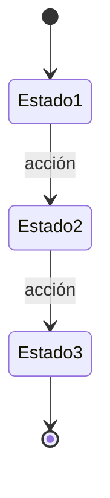

# Fase 0: Control Notarial - Quick Start Guide

## 🎯 Objetivo de la Fase 0 (Duración: 3 meses)

Preparar la base técnica y documentación para migrar el sistema VB6 "Control Notarial" a Laravel.

**NO se hace desarrollo funcional todavía** - solo preparación, análisis y setup.

---

## 📋 Checklist de Tareas - Fase 0

### Semana 1-2: Setup Inicial

- [ ] **T1.1**: Leer el documento de análisis completo: [ANALISIS_SISTEMA_VB6_CONTROL_NOTARIAL.md](./ANALISIS_SISTEMA_VB6_CONTROL_NOTARIAL.md)
- [ ] **T1.2**: Clonar BD legacy de la notaría piloto (30Campeche)
  ```bash
  # En MySQL Workbench o línea de comandos
  CREATE DATABASE controlnotarial_30campeche_dev;
  
  # Importar desde el archivo SQL
  mysql -u root -p controlnotarial_30campeche_dev < "d:/000. PROYECTO MASTER 30Campeche/sql/huziel 20251215 1129.sql"
  ```
- [ ] **T1.3**: Verificar que la BD importó correctamente
  ```bash
  php artisan tinker --execute="DB::connection('mysql')->select('SHOW DATABASES LIKE \"%controlnotarial%\"');"
  ```
- [ ] **T1.4**: Crear conexión en `config/database.php`
  ```php
  // Agregar en el array 'connections'
  'control_notarial_dev' => [
      'driver' => 'mysql',
      'host' => env('DB_HOST', '127.0.0.1'),
      'port' => env('DB_PORT', '3306'),
      'database' => 'controlnotarial_30campeche_dev',
      'username' => env('DB_USERNAME', 'root'),
      'password' => env('DB_PASSWORD', ''),
      'charset' => 'utf8mb4',
      'collation' => 'utf8mb4_unicode_ci',
      'prefix' => '',
      'strict' => true,
  ],
  ```

### Semana 3-4: Exploración de la BD Legacy

- [ ] **T2.1**: Crear script para listar todas las tablas con sus columnas
  ```bash
  php artisan make:command ControlNotarial/AnalyzeLegacyDatabase
  ```
  - Listar todas las tablas
  - Para cada tabla: nombre, cantidad de columnas, cantidad de registros
  - Guardar en `storage/app/control_notarial_schema_analysis.json`

- [ ] **T2.2**: Identificar las 20 tablas más importantes (por cantidad de registros)
  ```sql
  -- Queries a ejecutar
  SELECT COUNT(*) FROM expedientes;
  SELECT COUNT(*) FROM escrituras;
  SELECT COUNT(*) FROM presupuestos;
  SELECT COUNT(*) FROM otorgantes;
  -- etc.
  ```

- [ ] **T2.3**: Crear el diccionario de datos para las tablas CORE
  - `expedientes`
  - `escrituras`
  - `presupuestos`
  - `otorgantes`
  - `recibos` (todos los tipos)
  
  Formato:
  ```markdown
  ## Tabla: expedientes
  
  **Propósito**: Almacena los expedientes notariales
  
  | Columna | Tipo | Null | Default | FK | Descripción |
  |---------|------|------|---------|----|-----------  |
  | id | INT(11) | NO | AUTO_INCREMENT | | ID único |
  | expediente | VARCHAR(255) | NO | | | Número (ej: "1/2025") |
  | ... | ... | ... | ... | ... | ... |
  
  **Relaciones**:
  - `tipos_expediente.id` (N:1)
  - `notarios.id` (N:1)
  
  **Índices**:
  - PRIMARY KEY (id)
  - UNIQUE (expediente)
  
  **Volumetría**: ~50,000 registros
  
  **Queries comunes**:
  ```sql
  SELECT * FROM expedientes WHERE fecha_apertura BETWEEN ? AND ?;
  SELECT * FROM expedientes WHERE estatus = 'Abierto';
  ```
  ```

- [ ] **T2.4**: Documentar las relaciones entre tablas (ERD)
  - Usar MySQL Workbench para generar diagrama
  - Exportar como imagen PNG
  - Guardar en `docs/control-notarial/erd-legacy.png`

### Semana 5-6: Análisis del Código VB6

- [ ] **T3.1**: Explorar el formulario principal (`Principal.frm`)
  - Identificar menús disponibles
  - Mapear funcionalidad por rol de usuario
  - Listar módulos usados

- [ ] **T3.2**: Analizar módulo de Expedientes
  - Leer archivos .frm relacionados:
    * `Expedientes.frm`
    * `BusquedaExpediente.frm`
    * `ModificaExpedientes.frm`
  - Identificar lógica de negocio (validaciones, cálculos)
  - Documentar workflow (estados del expediente)

- [ ] **T3.3**: Analizar módulo de Escrituras
  - Leer archivos .frm:
    * `BusquedaEscritura.frm`
    * `EntregaEscritura.frm`
  - Identificar tipos de escrituras
  - Documentar proceso de asignación de folios

- [ ] **T3.4**: Analizar módulo de Presupuestos
  - Leer `NuevoPresupuesto.frm`, `AltaPresupuesto.frm`
  - Extraer fórmulas de cálculo (honorarios, impuestos, gastos)
  - Documentar generación de PDF

### Semana 7-8: Documentación de Workflows

- [ ] **T4.1**: Workflow de Expedientes
  - Crear diagrama Mermaid con estados
  - Documentar reglas de transición entre estados
  - Guardar en `docs/control-notarial/workflows/workflow-expediente.md`

- [ ] **T4.2**: Workflow de Escrituras
  - Diagrama de flujo: solicitud → asignación folio → firma → entrega
  - Reglas de negocio
  - Guardar en `docs/control-notarial/workflows/workflow-escritura.md`

- [ ] **T4.3**: Workflow de Presupuestos
  - Flujo: cotización → aprobación → facturación
  - Validaciones y cálculos
  - Guardar en `docs/control-notarial/workflows/workflow-presupuesto.md`

- [ ] **T4.4**: Workflow de Facturación/Recibos
  - Tipos de recibos (8 tipos identificados)
  - Proceso de emisión CFDI
  - Aplicación de anticipos
  - Guardar en `docs/control-notarial/workflows/workflow-facturacion.md`

### Semana 9-10: Catalogación de Reportes

- [ ] **T5.1**: Crear Excel con catálogo de los 121 reportes
  - Columnas:
    * Nombre archivo (.rpt)
    * Descripción funcional
    * Rol que lo usa
    * Frecuencia (diario/semanal/mensual)
    * Tablas involucradas
    * Parámetros entrada
    * Formato salida (PDF/Excel)
    * Prioridad (1-5)
  - Guardar en `docs/control-notarial/catalogo-reportes.xlsx`

- [ ] **T5.2**: Identificar los 20 reportes más usados
  - Entrevistar usuarios / revisar logs VB6
  - Marcar como prioridad 1 en el catálogo

- [ ] **T5.3**: Documentar estructura de 3 reportes críticos
  - Reporte de Expedientes
  - Reporte de Escrituras (índice)
  - Estado de cuenta

### Semana 11-12: Prototipado y Planificación

- [ ] **T6.1**: Crear prototipos de UI en Figma/Sketch (o directamente en React)
  - Vista de lista de expedientes
  - Formulario de creación de expediente
  - Detalle de expediente (tabs: datos generales, otorgantes, documentos, timeline)
  - Dashboard de expedientes por estatus

- [ ] **T6.2**: Crear modelos Eloquent preliminares (SIN migraciones todavía)
  ```bash
  php artisan make:model Models/ControlNotarial/Expediente --all
  php artisan make:model Models/ControlNotarial/Escritura --all
  php artisan make:model Models/ControlNotarial/Presupuesto --all
  php artisan make:model Models/ControlNotarial/Otorgante --all
  ```
  - Definir relaciones
  - Definir casts
  - Definir fillable/guarded

- [ ] **T6.3**: Crear servicio de conexión dinámica multi-DB
  ```bash
  php artisan make:class Services/ControlNotarial/MultiTenantConnectionService
  ```
  ```php
  class MultiTenantConnectionService
  {
      public function setConnectionForNotaria($notaria)
      {
          $connectionName = "control_notarial_{$notaria->id}";
          
          config(["database.connections.{$connectionName}" => [
              'driver' => 'mysql',
              'host' => env('LEGACY_DB_HOST'),
              'database' => "controlnotarial_{$notaria->legacy_identifier}",
              'username' => env('LEGACY_DB_USER'),
              'password' => env('LEGACY_DB_PASSWORD'),
              'charset' => 'utf8mb4',
          ]]);
          
          return $connectionName;
      }
  }
  ```

- [ ] **T6.4**: Plan detallado de Fase 1 (Dashboard Read-Only)
  - Crear documento `docs/control-notarial/FASE_1_PLAN_DETALLADO.md`
  - Listar todas las tareas (backend + frontend)
  - Estimar horas por tarea
  - Definir criterios de aceptación

---

## 🛠️ Scripts de Utilería a Crear

### 1. Script de Análisis de Schema

**Archivo**: `analyze_control_notarial_schema.php`

```php
<?php
require __DIR__.'/vendor/autoload.php';

$app = require_once __DIR__.'/bootstrap/app.php';
$app->make(Illuminate\Contracts\Console\Kernel::class)->bootstrap();

use Illuminate\Support\Facades\DB;

$connection = 'control_notarial_dev';

// Obtener todas las tablas
$tables = DB::connection($connection)
    ->select("SHOW TABLES");

$analysis = [];

foreach ($tables as $table) {
    $tableName = array_values((array)$table)[0];
    
    // Obtener columnas
    $columns = DB::connection($connection)
        ->select("DESCRIBE {$tableName}");
    
    // Obtener cantidad de registros
    $count = DB::connection($connection)
        ->table($tableName)
        ->count();
    
    $analysis[$tableName] = [
        'columns' => count($columns),
        'records' => $count,
        'structure' => $columns,
    ];
}

// Ordenar por cantidad de registros
uasort($analysis, function($a, $b) {
    return $b['records'] <=> $a['records'];
});

// Guardar análisis
file_put_contents(
    storage_path('app/control_notarial_schema_analysis.json'),
    json_encode($analysis, JSON_PRETTY_PRINT | JSON_UNESCAPED_UNICODE)
);

echo "✅ Análisis completado\n";
echo "📊 Total de tablas: " . count($analysis) . "\n\n";

echo "🔝 Top 20 tablas con más registros:\n\n";
$top20 = array_slice($analysis, 0, 20, true);
foreach ($top20 as $table => $data) {
    echo sprintf(
        "%-40s %10s registros, %3d columnas\n",
        $table,
        number_format($data['records']),
        $data['columns']
    );
}
```

### 2. Script de Extracción de Relaciones

**Archivo**: `extract_control_notarial_relationships.php`

```php
<?php
require __DIR__.'/vendor/autoload.php';

$app = require_once __DIR__.'/bootstrap/app.php';
$app->make(Illuminate\Contracts\Console\Kernel::class)->bootstrap();

use Illuminate\Support\Facades\DB;

$connection = 'control_notarial_dev';

// Obtener todas las foreign keys
$foreignKeys = DB::connection($connection)->select("
    SELECT 
        TABLE_NAME,
        COLUMN_NAME,
        CONSTRAINT_NAME,
        REFERENCED_TABLE_NAME,
        REFERENCED_COLUMN_NAME
    FROM
        INFORMATION_SCHEMA.KEY_COLUMN_USAGE
    WHERE
        REFERENCED_TABLE_SCHEMA = 'controlnotarial_30campeche_dev'
        AND REFERENCED_TABLE_NAME IS NOT NULL
    ORDER BY
        TABLE_NAME, COLUMN_NAME
");

$relationships = [];

foreach ($foreignKeys as $fk) {
    $relationships[] = [
        'from' => "{$fk->TABLE_NAME}.{$fk->COLUMN_NAME}",
        'to' => "{$fk->REFERENCED_TABLE_NAME}.{$fk->REFERENCED_COLUMN_NAME}",
        'constraint' => $fk->CONSTRAINT_NAME,
    ];
}

file_put_contents(
    storage_path('app/control_notarial_relationships.json'),
    json_encode($relationships, JSON_PRETTY_PRINT)
);

echo "✅ Relaciones extraídas: " . count($relationships) . "\n";
```

### 3. Script de Muestra de Datos

**Archivo**: `sample_control_notarial_data.php`

```php
<?php
require __DIR__.'/vendor/autoload.php';

$app = require_once __DIR__.'/bootstrap/app.php';
$app->make(Illuminate\Contracts\Console\Kernel::class)->bootstrap();

use Illuminate\Support\Facades\DB;

$connection = 'control_notarial_dev';

$tablesToSample = [
    'expedientes',
    'escrituras',
    'presupuestos',
    'otorgantes',
    'recibooficial',
];

foreach ($tablesToSample as $table) {
    echo "\n📋 Tabla: {$table}\n";
    echo str_repeat('=', 80) . "\n";
    
    $records = DB::connection($connection)
        ->table($table)
        ->limit(5)
        ->get();
    
    if ($records->isEmpty()) {
        echo "❌ Sin registros\n";
        continue;
    }
    
    echo "✅ Total registros: " . DB::connection($connection)->table($table)->count() . "\n\n";
    
    // Mostrar primeros 5 registros
    foreach ($records as $i => $record) {
        echo "Registro " . ($i + 1) . ":\n";
        foreach ((array)$record as $key => $value) {
            if (strlen($value) > 50) {
                $value = substr($value, 0, 50) . '...';
            }
            echo "  {$key}: " . ($value ?? 'NULL') . "\n";
        }
        echo "\n";
    }
}
```

---

## 📚 Documentos a Crear (Templates)

### Template: Diccionario de Datos

**Archivo**: `docs/control-notarial/diccionario-datos/[tabla].md`

```markdown
# Tabla: [nombre_tabla]

## Información General

- **Propósito**: [Descripción breve]
- **Volumetría**: ~[X] registros en producción
- **Patrón de acceso**: [alta lectura / alta escritura / mixto]
- **Índices importantes**: [índices críticos para performance]

## Estructura

| Columna | Tipo | Null | Default | FK | Descripción |
|---------|------|------|---------|----|-----------  |
| id | INT(11) | NO | AUTO_INCREMENT | | Identificador único |
| ... | ... | ... | ... | ... | ... |

## Relaciones

- **Pertenece a**:
  - `tabla_padre.id` (N:1) - [descripción]
  
- **Tiene muchos**:
  - `tabla_hija.fk_id` (1:N) - [descripción]

## Índices

```sql
PRIMARY KEY (id)
UNIQUE KEY unique_campo (campo)
INDEX idx_fecha (fecha_creacion)
```

## Queries Comunes

```sql
-- Query 1: [descripción]
SELECT * FROM [tabla] WHERE campo = ?;

-- Query 2: [descripción]
SELECT COUNT(*) FROM [tabla] 
WHERE fecha BETWEEN ? AND ?
GROUP BY campo;
```

## Reglas de Negocio

1. [Regla 1]
2. [Regla 2]
3. ...

## Notas de Migración

- ⚠️ [Problema potencial]
- ✅ [Solución propuesta]
- 📝 [Nota importante]
```

### Template: Workflow

**Archivo**: `docs/control-notarial/workflows/workflow-[modulo].md`

```markdown
# Workflow: [Módulo]

## Descripción General

[Descripción del proceso de negocio]

## Diagrama de Estados



## Estados

### Estado 1: [Nombre]

**Descripción**: [Qué significa este estado]

**Puede transicionar a**:
- Estado 2 (si [condición])
- Estado X (si [condición])

**Acciones disponibles**:
- Acción 1: [descripción]
- Acción 2: [descripción]

**Validaciones**:
- [ ] Validación 1
- [ ] Validación 2

---

[Repetir para cada estado]

## Reglas de Negocio

1. **Regla 1**: [Descripción detallada]
   - Condición: [...]
   - Acción si se cumple: [...]
   - Acción si no se cumple: [...]

2. **Regla 2**: [...]

## Casos de Uso

### Caso 1: [Escenario común]

**Actor**: [Rol del usuario]

**Precondiciones**:
- [ ] Precondición 1
- [ ] Precondición 2

**Flujo**:
1. Paso 1
2. Paso 2
3. ...

**Postcondiciones**:
- Estado final: [...]
- Datos creados/modificados: [...]

---

## Queries SQL Involucradas

```sql
-- Query para obtener [...]
SELECT ... FROM ... WHERE ...;

-- Query para actualizar estado
UPDATE ... SET estado = ? WHERE ...;
```

## Código VB6 Original (Referencia)

**Archivo**: `[nombre.frm]`

**Función clave**:
```vb
' Extracto de lógica relevante
Private Sub btnGuardar_Click()
    ' ...
End Sub
```
```

---

## 🎯 Criterios de Éxito de Fase 0

Al finalizar la Fase 0, deberás tener:

- [ ] ✅ BD legacy importada y accesible desde Laravel
- [ ] ✅ Diccionario de datos de 20+ tablas core documentado
- [ ] ✅ 4 workflows críticos documentados (Expedientes, Escrituras, Presupuestos, Facturación)
- [ ] ✅ Catálogo de 121 reportes con priorización
- [ ] ✅ ERD (diagrama de relaciones) generado
- [ ] ✅ Prototipos de UI para módulo de Expedientes
- [ ] ✅ Modelos Eloquent preliminares creados
- [ ] ✅ Servicio de conexión multi-DB implementado
- [ ] ✅ Scripts de análisis ejecutados y resultados guardados
- [ ] ✅ Plan detallado de Fase 1 escrito

**Entregable final**: Presentación de 30 minutos con hallazgos y plan de Fase 1.

---

## 📞 Puntos de Contacto

**Si encuentras problemas**:

1. **BD no importa correctamente**:
   - Verificar versión de MySQL (debe ser 5.7+ o 8.0+)
   - Revisar charset (debe ser utf8mb4)
   - Verificar permisos del usuario MySQL

2. **No entiendes lógica de negocio del VB6**:
   - Buscar en archivos `.bas` (módulos de lógica compartida)
   - Revisar comentarios en `.frm` (a veces hay documentación)
   - Consultar con usuarios finales de la notaría

3. **No encuentras relaciones entre tablas**:
   - Muchas relaciones NO tienen FK explícitas
   - Buscar columnas que terminan en `_id` o `Id`
   - Revisar código VB6 de los queries (archivo `Datos.bas`)

---

## 🚀 Inicio Rápido (Día 1)

```bash
# 1. Clonar BD legacy
mysql -u root -p -e "CREATE DATABASE controlnotarial_30campeche_dev;"
mysql -u root -p controlnotarial_30campeche_dev < "d:/000. PROYECTO MASTER 30Campeche/sql/huziel 20251215 1129.sql"

# 2. Agregar conexión en config/database.php
# (ver arriba T1.4)

# 3. Probar conexión
php artisan tinker --execute="DB::connection('control_notarial_dev')->select('SELECT COUNT(*) as total FROM expedientes');"

# 4. Crear script de análisis
touch analyze_control_notarial_schema.php
# (copiar contenido del script de arriba)

# 5. Ejecutar análisis
php analyze_control_notarial_schema.php

# 6. Ver resultados
cat storage/app/control_notarial_schema_analysis.json
```

---

## 📖 Recursos Adicionales

### Documentación Oficial

- [Laravel Multi-Tenancy](https://laravel.com/docs/12.x/database#multiple-database-connections)
- [Eloquent Relationships](https://laravel.com/docs/12.x/eloquent-relationships)
- [Laravel Migrations](https://laravel.com/docs/12.x/migrations)

### Herramientas Recomendadas

- **MySQL Workbench**: Para generar ERD automáticamente
- **Figma**: Para prototipos de UI (o código directo en React)
- **Mermaid Live Editor**: https://mermaid.live/ - Para diagramas de workflows
- **DB Diagram**: https://dbdiagram.io/ - Alternativa para ERD

### Scripts VB6 Clave a Revisar

| Archivo | Propósito |
|---------|-----------|
| `General.bas` | Funciones compartidas |
| `Datos.bas` | Acceso a datos (queries) |
| `NumALetras.bas` | Conversión números a texto (para facturas) |
| `FacturaElectronica.bas` | Integración CFDI |
| `Principal.frm` | Menú principal (estructura del sistema) |

---

## 🔀 Git Workflow - Rama Dedicada

### Setup Inicial (Primera Vez)

Para mantener el trabajo del módulo Control Notarial aislado del desarrollo principal, se ha creado una rama dedicada:

```bash
# 1. Cambiar a la rama de Control Notarial
git checkout feature/control-notarial

# 2. Verificar que estás en la rama correcta
git branch  # Debe mostrar * feature/control-notarial

# 3. Sincronizar con el remoto (si existe)
git pull origin feature/control-notarial
```

### Workflow Diario

```bash
# 1. Antes de empezar a trabajar, asegúrate de estar en la rama correcta
git checkout feature/control-notarial

# 2. Sincroniza cambios del remoto
git pull origin feature/control-notarial

# 3. Trabaja en tus tareas...
# (análisis BD, documentación, scripts, etc.)

# 4. Guarda tu progreso frecuentemente
git add .
git commit -m "feat(control-notarial): [descripción del avance]"

# 5. Sube tus cambios al remoto
git push origin feature/control-notarial
```

### Convenciones de Commits

Usa **Conventional Commits** para mensajes claros:

```bash
# ✅ Buenos ejemplos (recommended):
git commit -m "docs(control-notarial): add diccionario datos expedientes"
git commit -m "feat(control-notarial): create schema analysis script"
git commit -m "docs(control-notarial): document workflow expedientes"
git commit -m "chore(control-notarial): setup dev database connection"

# ❌ Evitar mensajes genéricos:
git commit -m "updates"
git commit -m "cambios"
git commit -m "WIP"
```

**Prefijos recomendados**:
- `docs(control-notarial):` - Documentación (diccionarios, workflows)
- `feat(control-notarial):` - Nuevos scripts, models, servicios
- `chore(control-notarial):` - Setup, configuración
- `refactor(control-notarial):` - Mejoras de código existente
- `test(control-notarial):` - Tests

### Submódulos/Carpetas del Proyecto

El trabajo de Control Notarial se organizará en estas carpetas:

```
Atinet_Compliance_Hub/
├── app/
│   ├── Console/Commands/ControlNotarial/    # Scripts de análisis
│   ├── Models/ControlNotarial/               # Eloquent models (Phase 1+)
│   ├── Http/Controllers/ControlNotarial/     # Controllers (Phase 1+)
│   └── Services/ControlNotarial/             # Business logic (Phase 1+)
│
├── docs/control-notarial/                    # 📁 TU CARPETA PRINCIPAL
│   ├── diccionarios-datos/                   # Diccionarios de tablas
│   ├── workflows/                            # Diagramas Mermaid
│   ├── analisis-vb6/                         # Análisis código VB6
│   └── reportes/                             # Catálogo de reportes
│
├── resources/js/Pages/ControlNotarial/       # React pages (Phase 1+)
└── storage/app/control-notarial-analysis/    # Scripts outputs (JSONs)
```

### Commits por Fase

**Fase 0 (Weeks 1-12)** - Solo documentación y análisis:

```bash
# Week 1-2
git commit -m "chore(control-notarial): setup dev database connection"

# Week 3-4
git commit -m "feat(control-notarial): add schema analysis script"
git commit -m "docs(control-notarial): add diccionario datos - expedientes"
git commit -m "docs(control-notarial): add diccionario datos - escrituras"

# Week 5-6
git commit -m "docs(control-notarial): analisis vb6 - modulo expedientes"
git commit -m "docs(control-notarial): analisis vb6 - modulo escrituras"

# Week 7-8
git commit -m "docs(control-notarial): workflow expedientes diagram"
git commit -m "docs(control-notarial): workflow escrituras diagram"

# Week 9-10
git commit -m "docs(control-notarial): catalogo 121 reportes crystal"

# Week 11-12
git commit -m "feat(control-notarial): create preliminary eloquent models"
git commit -m "feat(control-notarial): create multi-tenant connection service"
git commit -m "docs(control-notarial): fase 1 detailed plan"
```

### Sincronización con Master

**⚠️ IMPORTANTE**: Durante la Fase 0 (primeros 3 meses), NO es necesario mergear a `master` constantemente, ya que solo estás generando documentación y análisis.

**Cuándo sincronizar**:
- ✅ Al finalizar cada fase (Fase 0, Fase 1, etc.)
- ✅ Antes de comenzar desarrollo funcional (Phase 1+)
- ✅ Cuando necesites cambios críticos de `master` (ej: actualizaciones de dependencias)

**Cómo traer cambios de master** (si es necesario):

```bash
# 1. Guarda tu trabajo actual
git add .
git commit -m "docs(control-notarial): WIP - saving progress"

# 2. Trae cambios de master
git checkout master
git pull origin master

# 3. Vuelve a tu rama
git checkout feature/control-notarial

# 4. Integra cambios de master
git merge master

# 5. Resuelve conflictos si existen
# (probablemente no habrá conflictos en Fase 0)

# 6. Sube los cambios
git push origin feature/control-notarial
```

### Pull Request - Al Finalizar Fase 0

Cuando termines la Fase 0 (12 semanas), crearás un Pull Request para integrar la documentación a `master`:

```bash
# 1. Asegúrate de que todo esté commiteado
git status  # Debe estar limpio

# 2. Sube la rama (si no lo has hecho)
git push origin feature/control-notarial

# 3. Ir a GitHub/GitLab y crear Pull Request
# Base: master
# Compare: feature/control-notarial
# Título: "feat(control-notarial): Fase 0 - Análisis y Documentación Completa"
# Descripción: 
#   - Diccionarios de datos (20+ tablas)
#   - 4 workflows documentados
#   - 121 reportes catalogados
#   - Scripts de análisis
#   - Modelos Eloquent preliminares
#   - Plan detallado Fase 1
```

### Protección de la Rama

**Reglas recomendadas** (configurar en GitHub/GitLab):
- ✅ Solo tú puedes hacer push directo a `feature/control-notarial`
- ✅ `master` requiere Pull Request + revisión
- ✅ No permitir force push en `feature/control-notarial`

### Backup Local

**Recomendación**: Haz backups periódicos del trabajo (cada viernes):

```bash
# Crear ZIP del directorio docs/control-notarial/
7z a control-notarial-backup-$(Get-Date -Format 'yyyy-MM-dd').zip docs/control-notarial/

# O usa Git tags
git tag -a fase0-week4 -m "Fase 0 - Week 4 checkpoint"
git push origin fase0-week4
```

---

**Última actualización**: 13 de Marzo de 2026  
**Autor**: Equipo Atinet Development  
**Estado**: READY TO START ✅
