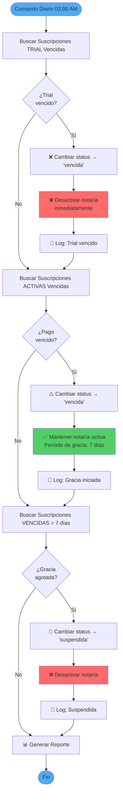

# Sistema Automático de Verificación de Suscripciones

## 📋 Descripción General

Sistema automático que verifica diariamente todas las suscripciones y aplica acciones según el tipo y estado, garantizando que las notarías mantengan el acceso correcto según su plan de pago.

## 🎯 Objetivos

- ✅ Desactivar automáticamente notarías con trial vencido
- ✅ Otorgar período de gracia a suscripciones de pago vencidas
- ✅ Suspender notarías después del período de gracia
- ✅ Mantener logs detallados de todas las acciones
- ✅ Ejecutar verificaciones sin intervención manual

## 🔄 Flujo de Verificación



## 📊 Lógica de Negocio

### Tabla de Reglas

| Tipo Suscripción | Estado Inicial | Al Vencer | Período Gracia | Notaría Activa | Resultado Final |
|------------------|----------------|-----------|----------------|----------------|-----------------|
| **Trial** | `trial` | → `vencida` | ❌ Sin gracia | ❌ Desactivada | Bloqueo inmediato |
| **Pago (< 7 días)** | `activa` | → `vencida` | ✅ 7 días | ✅ Activa | Acceso completo |
| **Pago (≥ 7 días)** | `vencida` | → `suspendida` | ❌ Gracia agotada | ❌ Desactivada | Bloqueo total |

### Diferencias Clave

**🆓 Suscripción Trial:**
- Sin inversión del cliente
- Desactivación inmediata al vencer
- No hay período de gracia

**💳 Suscripción de Pago:**
- Cliente ha pagado anteriormente
- 7 días de gracia para renovar
- Mantiene acceso durante gracia

## 💻 Comando Artisan

### Ubicación
```
app/Console/Commands/CheckExpiredSubscriptions.php
```

### Signature
```bash
php artisan subscriptions:check-expired {--dry-run}
```

### Opciones

| Opción | Descripción | Valor Default |
|--------|-------------|---------------|
| `--dry-run` | Previsualiza cambios sin modificar BD | `false` |

### Ejemplos de Uso

```bash
# Ejecutar verificación (modifica base de datos)
php artisan subscriptions:check-expired

# Modo preview (solo muestra qué haría)
php artisan subscriptions:check-expired --dry-run

# Ver comandos programados
php artisan schedule:list

# Ejecutar scheduler manualmente (testing)
php artisan schedule:run
```

## ⏰ Programación Automática

### Configuración

**Archivo:** `routes/console.php`

```php
use Illuminate\Support\Facades\Schedule;

Schedule::command('subscriptions:check-expired')
    ->daily()
    ->at('02:00')
    ->timezone('America/Mexico_City')
    ->description('Verifica suscripciones vencidas y desactiva notarías según el tipo');
```

### Horario
- **Frecuencia:** Diaria
- **Hora:** 02:00 AM
- **Zona horaria:** America/Mexico_City
- **Días:** Todos (incluye fines de semana)

### ¿Por qué 2:00 AM?
- Mínimo tráfico de usuarios
- Completa antes del inicio del día laboral
- Permite resolver incidencias antes de horario de oficina

## 📤 Salida del Comando

### Ejemplo de Ejecución Normal

```
🔄 Iniciando verificación de suscripciones vencidas...

📋 Buscando suscripciones TRIAL vencidas...
   ⚠️  Trial vencido: Notaría Ejemplo (ID: 123)
      Fecha vencimiento: 2026-01-15
      ✓ Suscripción marcada como vencida
      ✓ Notaría desactivada

💳 Buscando suscripciones de PAGO vencidas (inicio período de gracia)...
   ⚠️  Suscripción vencida: Notaría ABC (ID: 456)
      Fecha vencimiento: 2026-02-05
      📅 Iniciando período de gracia de 7 días
      ✓ Suscripción marcada como vencida
      ⏳ Notaría permanece activa (gracia)

🚫 Buscando suscripciones con período de gracia agotado (>7 días)...
   ❌ Período de gracia agotado: Notaría XYZ (ID: 789)
      Vencida hace: 10 días
      ✓ Suscripción suspendida
      ✓ Notaría desactivada

✅ Verificación completada

+--------------------------------------------+----------+
| Categoría                                  | Cantidad |
+--------------------------------------------+----------+
| Trials vencidos detectados                 | 1        |
| Suscripciones de pago vencidas             | 1        |
| Suscripciones suspendidas (gracia agotada) | 1        |
+--------------------------------------------+----------+
```

### Ejemplo Modo Dry-Run

```
🔍 Modo dry-run: No se realizarán cambios en la base de datos
🔄 Iniciando verificación de suscripciones vencidas...

📋 Buscando suscripciones TRIAL vencidas...
   ⚠️  Trial vencido: Notaría Test (ID: 100)
      Fecha vencimiento: 2026-02-01
      [DRY-RUN] Se marcaría como vencida y se desactivaría

💳 Buscando suscripciones de PAGO vencidas...
   ✓ No hay suscripciones de pago recién vencidas

🚫 Buscando suscripciones con período de gracia agotado...
   ✓ No hay suscripciones con período de gracia agotado

✅ Verificación completada (MODO DRY-RUN - Sin cambios realizados)
```

## 📝 Sistema de Logs

### Ubicación
```
storage/logs/laravel.log
```

### Niveles de Log

| Nivel | Descripción | Ejemplo |
|-------|-------------|---------|
| `INFO` | Resumen de ejecución | Total de suscripciones procesadas |
| `WARNING` | Acciones de desactivación | Trial vencido, gracia agotada |
| `INFO` | Período de gracia iniciado | Suscripción de pago vencida |

### Ejemplo de Logs

```
[2026-02-10 02:00:15] INFO: CheckExpiredSubscriptions ejecutado {
    "trials_vencidos": 1,
    "pagos_vencidos": 1,
    "pagos_suspendidos": 1
}

[2026-02-10 02:00:15] WARNING: Trial vencido - Notaría desactivada: Notaría Ejemplo (ID: 123)

[2026-02-10 02:00:15] INFO: Suscripción de pago vencida - Período de gracia iniciado: Notaría ABC (ID: 456)

[2026-02-10 02:00:15] WARNING: Período de gracia agotado - Notaría suspendida: Notaría XYZ (ID: 789)
```

## 🧪 Testing

### Tests Implementados

**Archivo:** `tests/Feature/Commands/CheckExpiredSubscriptionsTest.php`

**Cobertura:**
- ✅ Trial vencido → desactivación inmediata
- ✅ Pago vencido → período de gracia
- ✅ Gracia agotada → suspensión
- ✅ Suscripciones vigentes no afectadas
- ✅ Modo dry-run no modifica datos
- ✅ Procesamiento múltiple simultáneo
- ✅ Verificación de período de gracia exacto (7 días)

### Ejecutar Tests

```bash
# Ejecutar solo tests del comando
php artisan test --filter=CheckExpiredSubscriptionsTest

# Con output compacto
php artisan test --filter=CheckExpiredSubscriptionsTest --compact

# Con cobertura
php artisan test --filter=CheckExpiredSubscriptionsTest --coverage
```

### Resultados Esperados

```
PASS  Tests\Feature\Commands\CheckExpiredSubscriptionsTest
✓ marca suscripciones trial vencidas como vencidas y desactiva notaría
✓ marca suscripciones de pago vencidas pero mantiene notaría activa
✓ suspende suscripciones vencidas con más de 7 días
✓ no afecta suscripciones activas vigentes
✓ modo dry-run no realiza cambios
✓ procesa múltiples suscripciones correctamente
✓ verifica el período de gracia exacto de 7 días

Tests:  7 passed (16 assertions)
```

## 🔐 Seguridad y Transacciones

### Transaccionalidad

El comando utiliza transacciones de base de datos:

```php
DB::transaction(function () {
    // Procesar trials
    // Procesar pagos
    // Procesar gracia agotada
});
```

**Beneficios:**
- ✅ Rollback automático si hay errores
- ✅ Consistencia de datos garantizada
- ✅ No se pierden datos en caso de fallo

### Manejo de Errores

```php
try {
    DB::transaction(function () {
        // Operaciones...
    });
    return Command::SUCCESS;
} catch (\Exception $e) {
    Log::error('Error en CheckExpiredSubscriptions', [
        'error' => $e->getMessage()
    ]);
    return Command::FAILURE;
}
```

## 📊 Monitoreo y Alertas

### Métricas Clave

| Métrica | Descripción | Valor Esperado |
|---------|-------------|----------------|
| Trials vencidos/día | Notarías que terminan prueba | 0-5 |
| Pagos vencidos/día | Clientes sin renovar | 0-3 |
| Suspensiones/día | Gracia agotada | 0-2 |
| Tiempo ejecución | Duración del comando | < 30 segundos |

### Alertas Sugeridas

**🚨 Alta Prioridad:**
- Más de 10 suspensiones en un día
- Comando falla por > 2 días consecutivos
- Tiempo de ejecución > 5 minutos

**⚠️ Media Prioridad:**
- Incremento 50%+ en trials vencidos
- Patrones inusuales de vencimientos

## 🔧 Troubleshooting

### Problema: Comando no se ejecuta automáticamente

**Diagnóstico:**
```bash
# Verificar que el scheduler esté configurado
php artisan schedule:list

# Ver última ejecución
tail -f storage/logs/laravel.log | grep CheckExpiredSubscriptions
```

**Solución:**
1. Verificar cron en servidor:
   ```bash
   * * * * * cd /path-to-project && php artisan schedule:run >> /dev/null 2>&1
   ```
2. Revisar timezone en `config/app.php`

### Problema: Notarías no se desactivan

**Diagnóstico:**
```bash
# Ejecutar en modo dry-run para ver qué debería hacer
php artisan subscriptions:check-expired --dry-run

# Revisar logs
tail -100 storage/logs/laravel.log | grep subscription
```

**Solución:**
1. Verificar fechas de vencimiento en BD
2. Comprobar estado actual de suscripciones
3. Ejecutar tests para validar lógica

### Problema: Demasiadas desactivaciones

**Diagnóstico:**
```bash
# Contar suscripciones por estado
php artisan tinker
>>> Subscription::where('status', 'vencida')->count();
>>> Subscription::where('status', 'suspendida')->count();
```

**Solución:**
1. Revisar flujo de renovaciones
2. Verificar notificaciones a clientes
3. Analizar patrones de vencimiento

## 🚀 Mejoras Futuras

### Fase 2: Notificaciones
- [ ] Email a notaría cuando entra en gracia
- [ ] Email a notaría 2 días antes de suspensión
- [ ] Email a admin con reporte diario
- [ ] Notificaciones in-app

### Fase 3: Analytics
- [ ] Dashboard de métricas de vencimientos
- [ ] Predicción de churn
- [ ] Análisis de patrones de renovación
- [ ] Reportes automáticos para gerencia

### Fase 4: Configuración Dinámica
- [ ] Período de gracia configurable por plan
- [ ] Reglas personalizadas por notaría
- [ ] Webhooks para integraciones

## 📚 Referencias

- **Código Fuente:** `app/Console/Commands/CheckExpiredSubscriptions.php`
- **Tests:** `tests/Feature/Commands/CheckExpiredSubscriptionsTest.php`
- **Scheduler:** `routes/console.php`
- **Modelo Subscription:** `app/Models/Subscription.php`
- **Modelo Notaria:** `app/Models/Notaria.php`

## 🤝 Soporte

**Equipo de Desarrollo**
Email: dev@atinet.com

**Documentación Relacionada:**
- [GESTION_SUSCRIPCIONES.md](../GESTION_SUSCRIPCIONES.md)
- [CHECKLIST_FASE_1.5.md](../CHECKLIST_FASE_1.5.md)
- [RESUMEN_EJECUTIVO_FASE_1.5.md](../RESUMEN_EJECUTIVO_FASE_1.5.md)

---

**Última actualización:** 10 de Febrero, 2026
**Versión:** 1.0.0
**Estado:** ✅ Implementado y en Producción
