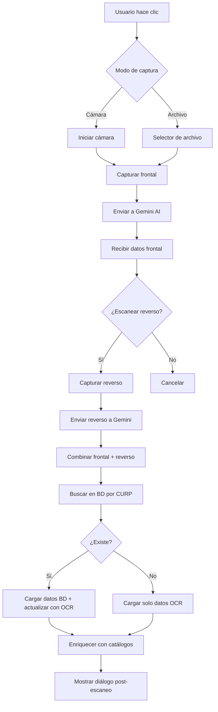
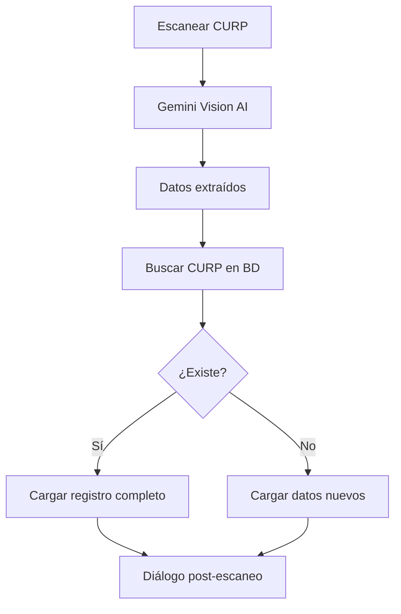
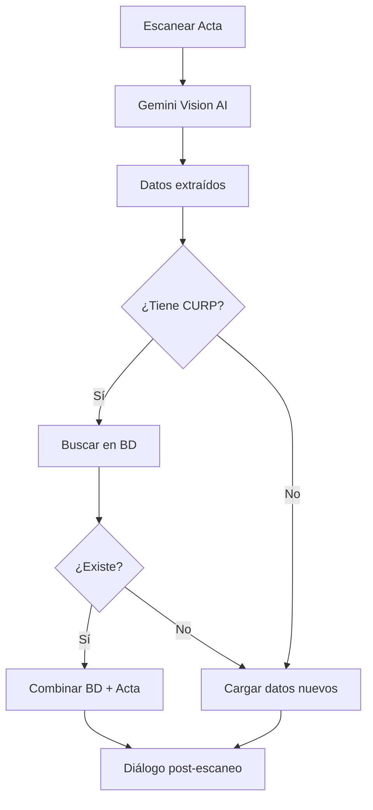
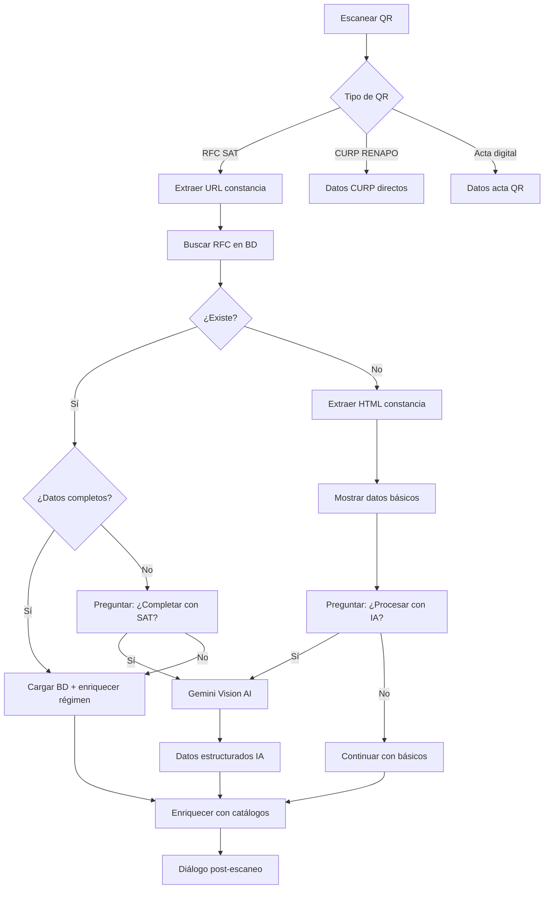
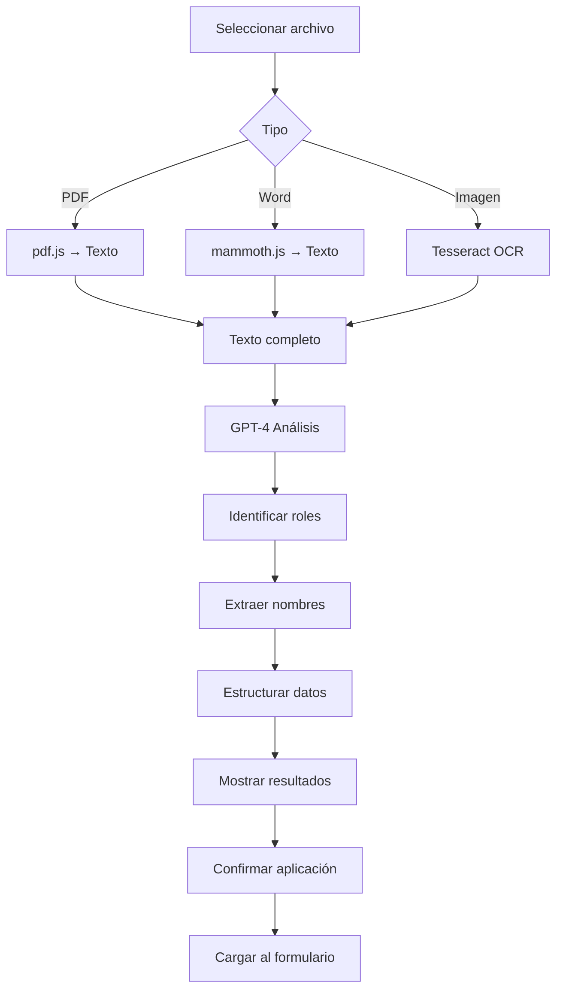
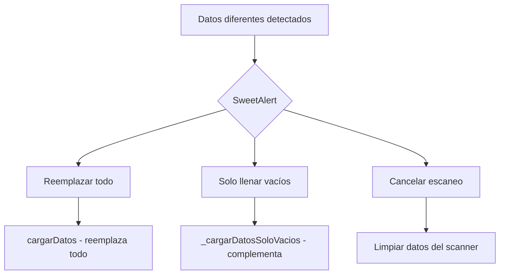
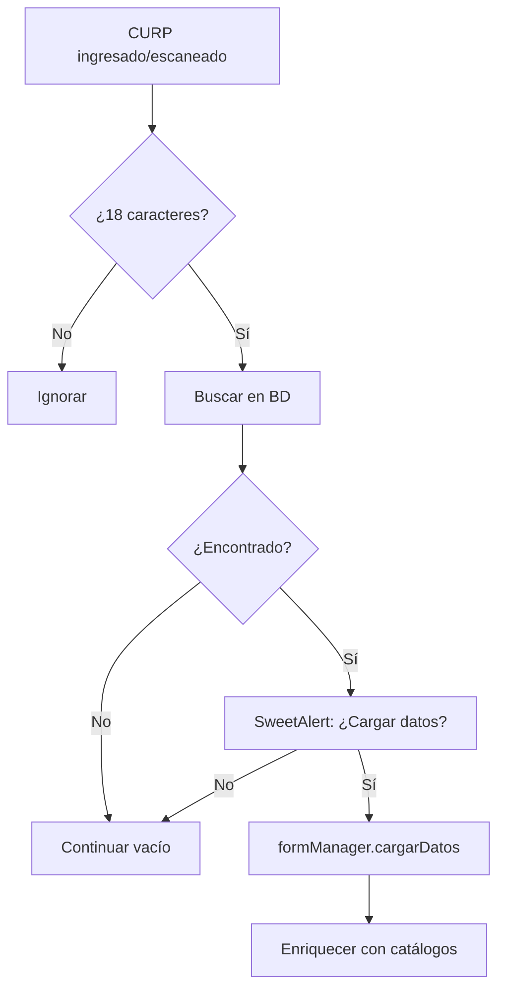
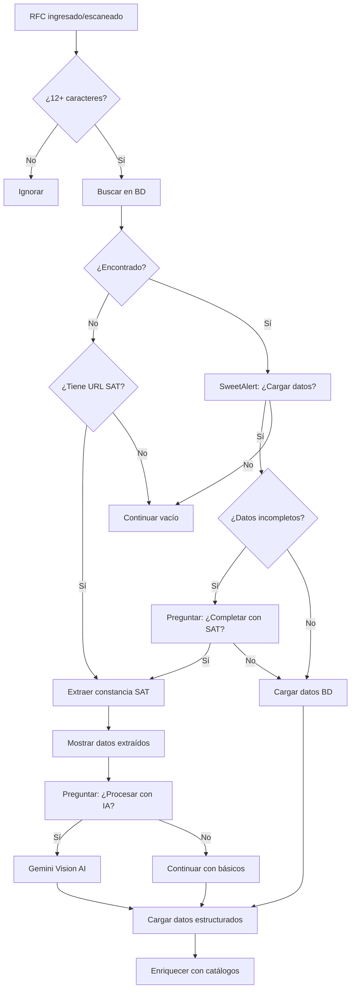
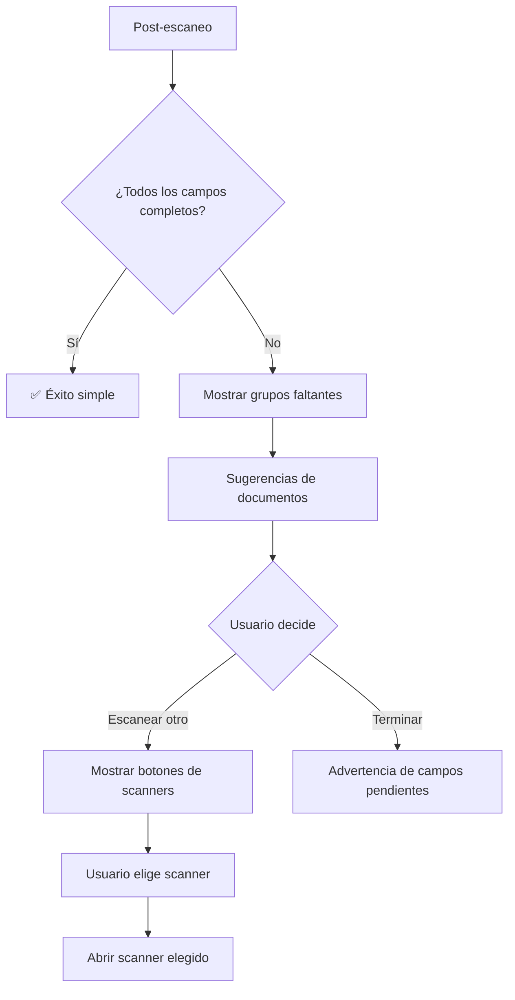

# 📘 Manual Técnico - Sistema de Registro Web atinet v3.0

**Fecha:** Mayo 2026  
**Autor:** Sistema atinet  
**Versión:** 3.0.0

---

## 📑 Índice

1. [Introducción](#introducción)
2. [Arquitectura del Sistema](#arquitectura-del-sistema)
3. [Botones Flotantes](#botones-flotantes)
4. [Scanner INE (OCR)](#scanner-ine-ocr)
5. [Scanner CURP](#scanner-curp)
6. [Scanner Acta de Nacimiento](#scanner-acta-de-nacimiento)
7. [Scanner QR](#scanner-qr)
8. [Scanner Testamento (IA)](#scanner-testamento-ia)
9. [Flujo de Validación](#flujo-de-validación)
10. [Búsquedas Automáticas](#búsquedas-automáticas)
11. [Catálogos (CP y RFC)](#catálogos)
12. [Sistema de Diálogos Inteligentes](#sistema-de-diálogos-inteligentes)
13. [APIs y Endpoints](#apis-y-endpoints)
14. [Casos Especiales](#casos-especiales)
15. [Debugging y Logs](#debugging-y-logs)

---

## 🎯 Introducción

El **Sistema de Registro Web atinet v3.0** es una aplicación modular para la captura de datos de personas físicas y morales en notarías. Su característica principal es la **automatización mediante IA** para escanear documentos oficiales y extraer datos estructurados.

### Tecnologías Principales

- **Frontend:** JavaScript ES6+ (modular)
- **Backend:** PHP 8+
- **IA:** Gemini Vision AI (Google) + GPT-4 (OpenAI)
- **Base de Datos:** MySQL/MariaDB
- **UI:** SweetAlert2, TailwindCSS

### Características Clave

✅ **OCR Automático** - Escaneo de INE, CURP, Acta de Nacimiento  
✅ **QR Scanner** - Lectura de códigos QR (RFC SAT, CURP RENAPO)  
✅ **IA Contextual** - Análisis de testamentos con GPT  
✅ **Búsqueda Automática** - Detección de duplicados por CURP/RFC  
✅ **Validación Inteligente** - Prevención de mezcla de datos  
✅ **Catálogos Dinámicos** - CP, Colonias, Régimen Fiscal

---

## 🏗️ Arquitectura del Sistema

### Estructura de Carpetas

```
utilerias_appliweb/
├── index.php                          # Punto de entrada principal
├── assets/
│   ├── js/
│   │   ├── main.js                    # Inicialización y coordinador central
│   │   └── modules/
│   │       ├── form-manager.js        # Gestor del formulario (lógica central)
│   │       ├── api-client.js          # Cliente API (peticiones HTTP)
│   │       ├── ocr-processor.js       # Scanner INE
│   │       ├── curp-scanner.js        # Scanner CURP
│   │       ├── acta-scanner.js        # Scanner Acta
│   │       ├── qr-processor.js        # Scanner QR
│   │       ├── testamento-scanner.js  # Scanner Testamento
│   │       ├── avisos-captura.js      # Avisos contextuales
│   │       └── atinet-loader.js       # Animaciones de carga
│   ├── css/
│   │   ├── main.css                   # Estilos principales
│   │   └── scanner.css                # Estilos de scanners
│   └── img/                           # Imágenes y logos
├── api/
│   ├── ocr/
│   │   └── procesar.php               # API OCR INE
│   ├── curp/
│   │   └── procesar-ocr.php           # API OCR CURP
│   ├── acta/
│   │   └── procesar-ocr.php           # API OCR Acta
│   ├── catalogos/
│   │   ├── cp.php                     # Catálogo de Códigos Postales
│   │   └── regimen-fiscal.php         # Catálogo Régimen Fiscal
│   ├── registrar/
│   │   └── guardar.php                # Guardar registro en BD
│   ├── sat/
│   │   ├── consultar.php              # Consultar constancia SAT (IA)
│   │   └── extraer.php                # Extraer datos SAT (sin IA)
│   └── extract-testamento-ai.php      # Analizar testamento con GPT
└── config/
    ├── config.php                     # Configuración general
    └── database.php                   # Conexión a BD
```

### Módulos JavaScript

El sistema usa arquitectura modular ES6:

#### 1. **main.js** - Coordinador Principal

```javascript
class atinetApp {
    constructor() {
        this.formManager = null;
        this.apiClient = null;
        this.scannerOCR = null;
        this.scannerQR = null;
        this.currentPersonType = 'fisica';
    }
    
    init() {
        // Inicializa todos los módulos
        // Vincula eventos
        // Registra funciones globales
    }
}
```

#### 2. **form-manager.js** - Gestor del Formulario

Maneja toda la lógica del formulario:
- Carga de datos desde scanners
- Validación de campos
- Búsqueda automática en BD
- Completar datos con catálogos
- Vista previa antes de guardar

#### 3. **api-client.js** - Cliente HTTP

Centraliza todas las peticiones al backend:
```javascript
class APIClient {
    async procesarOCR(imagen, lado)
    async buscarPorCURP(curp)
    async buscarPorRFC(rfc)
    async consultarCodigoPostal(cp, colonia)
    async consultarSAT(url)
    async guardarRegistro(datos)
}
```

---

## 🎮 Botones Flotantes

El sistema tiene **5 botones flotantes** en la esquina inferior derecha:

### 1. 📸 Scanner INE (btnOCRScanner)

**Ubicación:** `index.php` → Botón flotante azul  
**Archivo:** `ocr-processor.js`  
**API:** `/api/ocr/procesar.php`

**¿Qué hace?**
- Escanea INE/IFE frontal y reverso
- Extrae: Nombre, CURP, Dirección, Vigencia
- Usa Gemini Vision AI

**Flujo Completo:**



**Datos Extraídos:**

**Frontal:**
- `nombre`, `apellidopat`, `apellidomat`
- `curp` (18 caracteres)
- `dia` (fecha nacimiento YYYY-MM-DD)
- `genero` (H/M)
- `calle`, `no_exterior`, `no_interior`
- `colonia`, `cp` (5 dígitos), `municipio`, `estado`
- `clave_elector` (18 caracteres)
- `vigencia` (año de vencimiento)

**Reverso:**
- `idm` (identificador máquina)
- `ocr_code` (código MRZ completo)
- `vigencia` (validación cruzada)
- `clave_elector` (backup si no está en frontal)

**Casos Especiales:**

1. **Si el usuario cancela reverso:** Se limpian datos del frontal
2. **Si falla reverso:** Se resetea proceso completo
3. **Prioridad de datos:** Frontal siempre prevalece sobre reverso

### 2. 🪪 Scanner CURP (btnCURPScanner)

**Archivo:** `curp-scanner.js`  
**API:** `/api/curp/procesar-ocr.php`

**¿Qué hace?**
- Escanea Constancia de CURP (RENAPO)
- Extrae: CURP, Nombre, Fecha, Lugar de Nacimiento
- Funciona con papel o pantalla de PC

**Flujo:**



**Datos Extraídos:**
- `curp` (18 caracteres validados)
- `nombre`, `apellidopat`, `apellidomat`
- `dia` (YYYY-MM-DD)
- `genero` (H/M)
- `estado_nac`, `municipio_nac`, `ciudad_nac`
- `nacionalidad`, `paisnac`

**Ventajas:**
- ✅ Más ligero que INE (no tiene reverso)
- ✅ Válido para personas sin INE
- ✅ Complementa datos de nacimiento

### 3. 📄 Scanner Acta de Nacimiento (btnActaScanner)

**Archivo:** `acta-scanner.js`  
**API:** `/api/acta/procesar-ocr.php`

**¿Qué hace?**
- Escanea Acta de Nacimiento (física o digital)
- Extrae: Datos del registrado, padres, lugar de nacimiento
- Soporta actas antiguas y modernas

**Flujo:**



**Datos Extraídos:**
- `curp` (si aparece en el acta)
- `nombre`, `apellidopat`, `apellidomat`
- `dia` (YYYY-MM-DD)
- `genero` (H/M)
- `estado_nac`, `municipio_nac`, `ciudad_nac`
- `nacionalidad`, `paisnac`
- **`padre_nombre`** (nombre completo)
- **`madre_nombre`** (nombre completo)
- `folio_acta` (número de folio)
- `num_acta`, `oficialía`, `fecha_registro`

**Casos Especiales:**

1. **Actas antiguas:** Pueden no tener CURP
2. **Actas digitales:** Tienen códigos QR (ver Scanner QR)
3. **Nombres de padres:** Se guardan en un solo campo cada uno

### 4. 📱 Scanner QR (btnQRScanner)

**Archivo:** `qr-processor.js`  
**APIs:** `/api/sat/consultar.php`, `/api/sat/extraer.php`

**¿Qué hace?**
- Lee códigos QR de documentos oficiales
- Soporta: RFC SAT, CURP RENAPO, Acta digital
- Validación automática en línea

**Flujo Complejo (RFC SAT):**



**Tipos de QR Soportados:**

#### A. RFC SAT (Constancia Fiscal)
**URL:** `https://siat.sat.gob.mx/app/qr/faces/pages/mobile/validadorqr.jsf?D1=...`

**Proceso en 2 pasos:**

**Paso 1: Extracción Básica (sin IA)**
- API: `/api/sat/extraer.php`
- Extrae: RFC, Nombre/Razón Social, Email, Régimen, CP, Dirección
- Rápido (2-3 seg)

**Paso 2: Procesamiento IA (opcional)**
- API: `/api/sat/consultar.php`
- Gemini Vision analiza HTML completo
- Estructurado: 85 campos posibles
- Lento (15-20 seg)

#### B. CURP RENAPO
**URL:** `https://www.gob.mx/curp?curp=XXXX...`

**Proceso:**
1. Extraer CURP del QR
2. Buscar en BD
3. Si existe → Cargar registro
4. Si no existe → Cargar solo CURP

#### C. Acta Digital (QR Nuevo Formato)
**Contiene:** JSON con datos completos

**Proceso:**
- Parsear JSON directo
- Llamar a `cargarDatosActa()`
- Buscar CURP si está presente

**Ventajas del QR:**
- ⚡ Más rápido que OCR
- ✅ 100% preciso (no hay errores de lectura)
- 🔗 Validación en línea con SAT/RENAPO

### 5. 📜 Scanner Testamento (btnScanTestamento)

**Archivo:** `testamento-scanner.js`  
**API:** `/api/extract-testamento-ai.php` (GPT-4)

**¿Qué hace?**
- Analiza escrituras de testamentos
- Extrae: Herederos, Albaceas, Tutores, Familia
- Usa GPT para comprensión contextual

**Flujo:**



**Datos Extraídos:**

**Metadatos Notariales:**
- `escritura_num`, `volumen`, `libro`
- `fecha_escritura`, `notario`

**Testador:**
- `curp` (si aparece)
- Nombre completo

**Familia:**
- `padre_nombre`, `madre_nombre`
- `hijos` (array de nombres)

**Cláusulas Testamentarias:**
- `herederos` (principales)
- `herederos_sustitutos`
- `albacea`, `albacea_sustituto`
- `tutor`, `tutor_sustituto`

**Casos Especiales:**

1. **Hijos con apellido compartido:**
   ```
   "procreó a Juan, María y Pedro todos apellidos García López"
   → ["Juan García López", "María García López", "Pedro García López"]
   ```

2. **Tutor del menor:**
   ```
   "designa como tutor del menor Juan a Pedro Martínez"
   → tutor: "Pedro Martínez" (NO "Juan")
   ```

3. **Herederos sustitutos:**
   ```
   "para el caso de que fallezcan, nombro a..."
   → herederos_sustitutos
   ```

**Prompt GPT (Simplificado):**

```
Analiza este testamento y extrae ÚNICAMENTE nombres propios.

REGLAS:
- Solo nombres, sin frases ni verbos
- Si vacío → "" o []
- Dividir apellidos compartidos

CONTEXTO:
- TESTADOR: "compareció el señor [NOMBRE]"
- HIJOS: "procreó a [NOMBRES]"
- TUTOR: después de "al señor", NO "del menor"
- HEREDEROS: sin "para el caso de"
- SUSTITUTOS: después de "para el caso de que"

Retorna JSON:
{
  "curp": "",
  "padre_nombre": "",
  "madre_nombre": "",
  "hijos": [],
  "herederos": [],
  "herederos_sustitutos": [],
  "albacea": "",
  "albacea_sustituto": "",
  "tutor": "",
  "tutor_sustituto": ""
}
```

---

## ✅ Flujo de Validación

### 1. Prevención de Mezcla de Datos

El sistema detecta automáticamente cuando se intenta cargar datos de una **persona diferente** a la que ya está en el formulario.

**Función:** `_verificarConflictoIdentidad()`

**Criterios de Comparación (actualizados):**

1. **RFC** (prioridad máxima):
    - Si ambos tienen RFC → Compara
    - Si son diferentes → ⚠️ Conflicto

2. **CURP** (segunda prioridad):
    - Si ambos tienen CURP → Compara
    - Si son diferentes → ⚠️ Conflicto

3. **Nombre + Apellido** (fallback):
    - Si no hay RFC/CURP comparables
    - Compara nombre completo normalizado

**Normalización:**
```javascript
const norm = (s) => (s || '')
    .toUpperCase()
    .trim()
    .normalize('NFD')
    .replace(/[\u0300-\u036f]/g, '')  // Quitar acentos
    .replace(/\s+/g, ' ');
```

**Opciones al Detectar Conflicto:**



**Ejemplo de Alerta:**

```html
⚠️ Posible mezcla de datos

CURP diferente:
En formulario: HEPR850615HTCLRZ09
Documento escaneado: GOMJ900812MDFNRS07

¿Qué deseas hacer?

[Reemplazar todo] [Solo llenar vacíos] [Cancelar]
```

**Estado de implementación (junio 2026):**
- ✅ Implementado en flujo **QR** antes de la secuencia BD/SAT/IA.
- 🟡 Pendiente de replicar en scanners **INE**, **CURP** y **Acta**.

### 2. Validación de Formato

**CURP:**
```javascript
validarCURPFormato(curp) {
    const regex = /^[A-Z]{4}\d{6}[HM][A-Z]{5}[0-9A-Z]\d$/;
    return regex.test(curp);
}
```

**RFC:**
```javascript
validarRFCFormato(rfc) {
    const regexFisica = /^[A-Z]{4}\d{6}[0-9A-Z]{3}$/;  // 13 caracteres
    const regexMoral = /^[A-Z]{3}\d{6}[0-9A-Z]{3}$/;   // 12 caracteres
    return regexFisica.test(rfc) || regexMoral.test(rfc);
}
```

**Email:**
```javascript
validarEmailFormato(email) {
    const regex = /^[^\s@]+@[^\s@]+\.[^\s@]+$/;
    return regex.test(email);
}
```

### 3. Validación Antes de Guardar

**Función:** `formManager.validar(datos)`

**Validaciones Persona Física:**
- ✅ RFC mínimo 12 caracteres
- ✅ CURP exactamente 18 caracteres
- ✅ Nombre obligatorio
- ✅ Apellido paterno obligatorio
- ✅ Fecha de nacimiento obligatoria
- ✅ Género obligatorio
- ✅ Email formato válido (opcional)

**Validaciones Persona Moral:**
- ✅ RFC mínimo 12 caracteres
- ✅ Razón social obligatoria

**Validaciones Cónyuge (si casado):**
- ✅ Nombre cónyuge obligatorio

**Ejemplo de Errores:**

```javascript
{
    valido: false,
    errores: [
        'El CURP debe tener 18 caracteres',
        'El nombre es obligatorio',
        'El formato del correo electrónico no es válido'
    ]
}
```

---

## 🔍 Búsquedas Automáticas

### 1. Búsqueda por CURP

**Trigger:** Al perder foco del campo `#curp` o al escanear documento

**API:** `/api/registrar/buscar-curp.php`

**Flujo:**



**Código:**

```javascript
async buscarPorCURP(curp) {
    if (!curp || curp.length !== 18) return;
    
    try {
        const datos = await this.apiClient.buscarPorCURP(curp);
        
        if (datos) {
            const result = await Swal.fire({
                title: 'CURP encontrado',
                text: '¿Deseas cargar los datos guardados?',
                icon: 'question',
                showCancelButton: true,
                confirmButtonText: 'Sí, cargar',
                cancelButtonText: 'No'
            });
            
            if (result.isConfirmed) {
                this.formManager.cargarDatos(datos);
            }
        }
    } catch (error) {
        console.error('Error buscando CURP:', error);
    }
}
```

### 2. Búsqueda por RFC

**Trigger:** Al perder foco del campo `#rfc` o al escanear QR

**API:** `/api/registrar/buscar-rfc.php`

**Flujo:**



**Detección de Datos Incompletos:**

```javascript
const camposIncompletos = 
    !response.data.cp_fiscal || 
    !response.data.colonia_fiscal || 
    (response.data.Persona === 'FISICA' && 
        (!response.data.cp || !response.data.colonia));
```

---

## 📚 Catálogos

### 1. Catálogo de Códigos Postales

**API:** `/api/catalogos/cp.php`

**Base de Datos:** `cat_cp` (tabla de SEPOMEX)

**Campos:**
- `d_codigo` - Código postal (5 dígitos)
- `d_asenta` - Nombre de la colonia
- `d_tipo_asenta` - Tipo (Colonia, Fraccionamiento, etc.)
- `D_mnpio` - Municipio
- `d_estado` - Estado
- `d_ciudad` - Ciudad
- `d_zona` - Urbano/Rural

**Búsqueda Inteligente:**

```php
// Palabras clave a ignorar
$typeWords = [
    'FRACCIONAMIENTO', 'FRACC', 'COLONIA', 'COL',
    'AMPLIACION', 'AMP', 'RESIDENCIAL', 'RES'
];

// Extraer palabras significativas
$keywords = array_filter($allWords, function($w) use ($typeWords) {
    return strlen($w) > 2 && !in_array($w, $typeWords);
});

// Buscar con LIKE
SELECT d_asenta 
FROM cat_cp 
WHERE d_codigo = ? 
AND d_asenta LIKE '%PALABRA1%' 
AND d_asenta LIKE '%PALABRA2%'
```

**Respuesta API:**

```json
{
    "success": true,
    "data": {
        "cp": "06400",
        "municipio": "Cuauhtémoc",
        "estado": "Ciudad de México",
        "ciudad": "Ciudad de México",
        "zona": "Urbano",
        "colonias": ["Centro", "Buenavista", "Guerrero"],
        "colonias_detalle": [
            {"nombre": "Centro", "tipo": "Colonia"},
            {"nombre": "Buenavista", "tipo": "Barrio"}
        ],
        "colonia_match": "Buenavista"
    }
}
```

**Uso en Formulario:**

1. **Automático al ingresar CP:**
   - Debounce de 800ms
   - Carga colonias en select
   - Preselecciona mejor match

2. **Manual con botón:**
   - `#btnBuscarCp` (CP particular)
   - `#btnBuscarCpFiscal` (CP fiscal)

**Código:**

```javascript
async _buscarColoniasPorCP(cp, idSelectColonia, idInputMunicipio, idInputEstado) {
    const response = await this.apiClient.consultarCodigoPostal(cp);
    
    if (response.success) {
        // Llenar municipio y estado
        inputMunicipio.value = response.data.municipio;
        inputEstado.value = response.data.estado;
        
        // Cargar colonias en select
        const colonias = response.data.colonias_detalle;
        selectColonia.innerHTML = '<option value="">Seleccione...</option>';
        
        colonias.forEach(item => {
            const option = document.createElement('option');
            option.value = item.nombre;
            option.textContent = `${item.nombre} (${item.tipo})`;
            
            // Preseleccionar match
            if (response.data.colonia_match === item.nombre) {
                option.selected = true;
            }
            
            selectColonia.appendChild(option);
        });
    }
}
```

### 2. Catálogo de Régimen Fiscal

**API:** `/api/catalogos/regimen-fiscal.php`

**Base de Datos:** `cat_regimen_fiscal`

**Campos:**
- `clave` - Código SAT (3 dígitos)
- `descripcion` - Descripción completa

**Búsqueda:**

```php
SELECT clave, descripcion 
FROM cat_regimen_fiscal 
WHERE clave = ?
```

**Respuesta:**

```json
{
    "success": true,
    "data": {
        "clave": "612",
        "descripcion": "Personas Físicas con Actividades Empresariales y Profesionales",
        "completo": "612 - Personas Físicas con Actividades Empresariales y Profesionales"
    }
}
```

**Uso:**

- Se consulta automáticamente después de escanear QR SAT
- Se muestra en el campo `#regimen_fiscal`
- Ayuda al usuario a identificar el régimen correcto

---

## 💬 Sistema de Diálogos Inteligentes

### Diálogo Post-Escaneo

**Función:** `formManager.mostrarDialogoPostEscaneo()`

Este diálogo aparece **después de cada escaneo** y guía al usuario para completar campos faltantes.

**Características:**

1. **Verifica campos vacíos** por grupo:
   - Datos personales (Nombre, CURP, Fecha)
   - Domicilio (Calle, Colonia, CP)
   - Credencial INE (No. ID, Vigencia)
   - Lugar de nacimiento (Estado, Municipio)
   - Datos familiares (Padres)

2. **Sugiere documentos** para completar:
   - INE → Domicilio, Credencial
   - CURP → Lugar de nacimiento
   - Acta → Datos familiares
   - QR → Validación en línea

3. **Opciones del usuario:**
   - ✅ Escanear otro documento
   - ✅ Terminar escaneo

**Flujo:**



**Ejemplo Visual:**

```
✅ INE leída

Juan Pérez López
PERJ850615HTCLPZ09

─────────────────────────
⚠️ Campos pendientes:

📍 Lugar de nacimiento:
   Estado de Nacimiento, Municipio de Nacimiento

👨‍👩‍👧 Datos familiares:
   Nombre del Padre, Nombre de la Madre

¿Deseas escanear otro documento para completar los datos?

[📷 Escanear otro documento] [✋ Terminar escaneo]
```

**Si elige escanear otro:**

```
¿Qué documento vas a escanear?

[📄 Escanear CURP]
[📜 Escanear Acta de Nacimiento]
[📱 Escanear código QR]

──────────────────────
O usa los botones flotantes de la pantalla
```

**Ventajas:**
- ✅ Usuario sabe exactamente qué falta
- ✅ Guía contextual según lo escaneado
- ✅ Reduce errores de captura
- ✅ Mejora completitud de datos

---

## 📡 APIs y Endpoints

### 1. OCR INE

**Endpoint:** `POST /api/ocr/procesar.php`

**Request:**
```javascript
FormData {
    imagen: File,
    lado: "frontal" | "reverso"
}
```

**Response:**
```json
{
    "success": true,
    "data": {
        "nombre": "JUAN",
        "apellidopat": "PEREZ",
        "apellidomat": "LOPEZ",
        "curp": "PERJ850615HTCLPZ09",
        "dia": "1985-06-15",
        "genero": "H",
        "calle": "AV INSURGENTES SUR",
        "no_exterior": "1234",
        "colonia": "DEL VALLE",
        "cp": "03100",
        "municipio": "Benito Juárez",
        "estado": "Ciudad de México",
        "clave_elector": "PRLJN85061512H300",
        "idm": "1234567890123",
        "ocr_code": "IDMEX<<PERJ850615H...",
        "vigencia": "2029",
        "lado": "reverso"
    },
    "message": "INE (reverso) procesada exitosamente"
}
```

**IA:** Gemini 2.5 Flash

**Prompt (Simplificado):**
```
Analiza esta imagen de la cara FRONTAL de una Credencial para Votar (INE/IFE) mexicana.

Localiza cada etiqueta y extrae el valor:
- Etiqueta "APELLIDO PATERNO" → apellidopat
- Etiqueta "CURP" → curp (18 caracteres)
- Etiqueta "VIGENCIA" → vigencia (año 4 dígitos)

Retorna JSON:
{
  "nombre": "",
  "apellidopat": "",
  "curp": "",
  "vigencia": ""
}
```

### 2. OCR CURP

**Endpoint:** `POST /api/curp/procesar-ocr.php`

**Request:**
```javascript
FormData {
    imagen: File
}
```

**Response:**
```json
{
    "success": true,
    "data": {
        "curp": "PERJ850615HTCLPZ09",
        "nombre": "JUAN",
        "apellidopat": "PEREZ",
        "apellidomat": "LOPEZ",
        "dia": "1985-06-15",
        "genero": "H",
        "estado_nac": "BAJA CALIFORNIA SUR",
        "municipio_nac": "La Paz",
        "nacionalidad": "MEXICANA",
        "paisnac": "México"
    },
    "message": "Constancia CURP procesada exitosamente"
}
```

**IA:** Gemini 2.5 Flash

### 3. OCR Acta

**Endpoint:** `POST /api/acta/procesar-ocr.php`

**Request:**
```javascript
FormData {
    imagen: File
}
```

**Response:**
```json
{
    "success": true,
    "data": {
        "curp": "PERJ850615HTCLPZ09",
        "nombre": "JUAN",
        "apellidopat": "PEREZ",
        "apellidomat": "LOPEZ",
        "dia": "1985-06-15",
        "genero": "H",
        "estado_nac": "CIUDAD DE MEXICO",
        "municipio_nac": "Benito Juárez",
        "nacionalidad": "MEXICANA",
        "padre_nombre": "JOSE PEREZ GARCIA",
        "madre_nombre": "MARIA LOPEZ HERNANDEZ",
        "folio_acta": "CMDX20210123A1234BC"
    },
    "message": "Acta de nacimiento procesada exitosamente"
}
```

**IA:** Gemini 2.5 Flash

### 4. Consultar SAT (Con IA)

**Endpoint:** `POST /api/sat/consultar.php`

**Request:**
```json
{
    "url": "https://siat.sat.gob.mx/app/qr/faces/pages/mobile/validadorqr.jsf?D1=..."
}
```

**Response:**
```json
{
    "success": true,
    "data": {
        "rfc": "PERJ850615ABC",
        "nombre": "JUAN PEREZ LOPEZ",
        "Persona": "FISICA",
        "correo": "juan@example.com",
        "telefono_movil": "5551234567",
        "regimen_fiscal": "612",
        "calle_fiscal": "AV INSURGENTES SUR",
        "no_exterior_fiscal": "1234",
        "colonia_fiscal": "DEL VALLE",
        "cp_fiscal": "03100",
        "municipio_fiscal": "Benito Juárez",
        "estado_fiscal": "Ciudad de México",
        "dia": "2024-05-15"
    },
    "message": "Constancia SAT procesada exitosamente"
}
```

**IA:** Gemini 2.5 Flash (analiza HTML completo)

### 5. Extraer SAT (Sin IA)

**Endpoint:** `POST /api/sat/extraer.php`

**Request:**
```json
{
    "url": "https://siat.sat.gob.mx/app/qr/faces/pages/mobile/validadorqr.jsf?D1=..."
}
```

**Response:**
```json
{
    "success": true,
    "data": {
        "datos": {
            "rfc": "PERJ850615ABC",
            "nombre": "JUAN PEREZ LOPEZ",
            "regimen_fiscal": "612"
        },
        "raw": [
            "RFC: PERJ850615ABC",
            "NOMBRE: JUAN PEREZ LOPEZ",
            "..."
        ]
    },
    "message": "Datos extraídos exitosamente"
}
```

**Proceso:** Scraping HTML sin IA (más rápido)

### 6. Analizar Testamento

**Endpoint:** `POST /api/extract-testamento-ai.php`

**Request:**
```json
{
    "texto": "ESCRITURA NÚMERO...\nCOMPARECIÓ EL SEÑOR...\n..."
}
```

**Response:**
```json
{
    "success": true,
    "datos": {
        "curp": "",
        "padre_nombre": "JOSE PEREZ GARCIA",
        "madre_nombre": "MARIA LOPEZ HERNANDEZ",
        "hijos": [
            "JUAN PEREZ MARTINEZ",
            "MARIA PEREZ MARTINEZ"
        ],
        "herederos": [
            "JUAN PEREZ MARTINEZ",
            "MARIA PEREZ MARTINEZ"
        ],
        "herederos_sustitutos": [
            "PEDRO GOMEZ LOPEZ"
        ],
        "albacea": "CARLOS MARTINEZ GARCIA",
        "albacea_sustituto": "ANA LOPEZ HERNANDEZ",
        "tutor": "LUIS HERNANDEZ LOPEZ",
        "tutor_sustituto": "SOFIA GARCIA MARTINEZ"
    },
    "model": "gpt-4",
    "tokens_used": 1850
}
```

**IA:** GPT-4 (OpenAI)

### 7. Guardar Registro

**Endpoint:** `POST /api/registrar/guardar.php`

**Request:**
```json
{
    "Persona": "FISICA",
    "curp": "PERJ850615HTCLPZ09",
    "rfc": "PERJ850615ABC",
    "nombre": "JUAN",
    "apellidopat": "PEREZ",
    "apellidomat": "LOPEZ",
    "dia": "1985-06-15",
    "genero": "HOMBRE",
    "calle": "AV INSURGENTES SUR",
    "cp": "03100",
    "correo": "juan@example.com"
}
```

**Response:**
```json
{
    "success": true,
    "message": "Registro guardado correctamente",
    "idregistro": 12345
}
```

---

## 🎯 Casos Especiales

### 1. Persona con Múltiples Documentos

**Escenario:**
- Usuario escanea INE
- Después escanea CURP
- Después escanea Acta

**Comportamiento:**
1. **INE:** Carga datos básicos + dirección
2. **CURP:** Sistema detecta CURP coincide
   - Pregunta: ¿Complementar datos?
   - Usuario: Sí
   - Agrega: Lugar de nacimiento
3. **Acta:** Sistema detecta CURP coincide
   - Pregunta: ¿Complementar datos?
   - Usuario: Sí
   - Agrega: Nombres de padres

**Resultado Final:**
- ✅ Sin duplicados
- ✅ Datos de 3 fuentes combinados
- ✅ Usuario en control

### 2. Registro Existente con Datos Incompletos

**Escenario:**
- Registro en BD sin CP ni colonias
- Usuario escanea QR con URL SAT

**Comportamiento:**
1. Buscar RFC en BD
2. Detectar campos vacíos
3. Preguntar: ¿Completar con SAT?
4. Si sí → Consultar SAT
5. **Solo llenar campos vacíos** (no sobrescribir)

**Función:** `_cargarDatosSoloVacios()`

```javascript
_cargarDatosSoloVacios(datos) {
    for (const [key, value] of Object.entries(datos)) {
        const input = this.form.querySelector(`[name="${key}"]`);
        if (!input) continue;
        
        const estaVacio = !input.value || input.value.trim() === '';
        
        if (estaVacio) {
            input.value = this.mapearValor(key, value);
        }
    }
}
```

### 3. Código Postal No Encontrado

**Escenario:**
- Usuario ingresa CP que no existe en catálogo
- O CP muy nuevo (no actualizado)

**Comportamiento:**
1. Mostrar aviso informativo (no error)
2. Habilitar captura manual
3. Agregar opciones básicas al select:
   ```html
   <option value="">Seleccione...</option>
   <option value="OTRA">OTRA / NO LISTADA</option>
   <option value="SIN ESPECIFICAR">SIN ESPECIFICAR</option>
   ```

**Mensaje:**

```
ℹ️ CP No Encontrado en Catálogo

No se encontró información automática para el CP 99999

Los campos están disponibles para captura manual:
✓ Municipio
✓ Estado
✓ Colonia (selecciona "OTRA" si no está listada)

[Entendido]
```

### 4. Gemini API Falla

**Escenario:**
- Gemini no responde
- Cuota excedida
- Error de red

**Comportamiento:**
1. Intentar con modelo secundario (gemini-2.5-pro)
2. Si falla también → Mostrar error amigable
3. NO se pierde el progreso del usuario

**Código:**

```php
foreach ($GEMINI_ENDPOINTS as $index => $endpoint) {
    $ch = curl_init($endpoint);
    curl_setopt($ch, CURLOPT_POSTFIELDS, json_encode($requestData));
    $response = curl_exec($ch);
    
    if ($response && !isset($decoded['error'])) {
        return $decoded['candidates'][0]['content']['parts'][0]['text'];
    }
    
    // Si falla, continuar con siguiente modelo
}

throw new Exception("No se pudo procesar la imagen con ningún modelo");
```

### 5. QR SAT Sin Datos Suficientes

**Escenario:**
- QR solo tiene RFC y fecha
- No hay URL de constancia

**Comportamiento:**
1. Cargar solo RFC y fecha
2. Mostrar diálogo:
   ```
   🔍 RFC capturado
   
   RFC: PERJ850615ABC
   
   Complete los datos manualmente o escanee otros documentos.
   ```
3. Habilitar botones de otros scanners

### 6. Testamento con Nombres Anonimizados

**Escenario:**
- Testamento tiene "XXXXXXXXXXXXXXX" en nombres

**Comportamiento:**
1. GPT detecta patrón de anonimización
2. Retorna array vacío `[]`
3. NO carga texto basura

**Regla GPT:**
```
Si un nombre es "XXXXXXXXXXXXXXX" → null o []
```

---

## 🐛 Debugging y Logs

### Logs en Consola

El sistema usa `console.log()` con emojis para facilitar debugging:

```javascript
console.log('📸 Imagen capturada');
console.log('✅ Datos del frontal guardados:', datos);
console.log('🔍 Procesando lado:', lado);
console.log('❌ Error:', error);
console.log('🔗 Datos combinados:', datosCombinados);
console.log('📦 Registro encontrado en BD:', datos);
console.log('🪪 Scanner CURP abierto');
console.log('📄 Datos Acta cargados:', datos);
console.log('📱 Datos QR procesados:', datos);
console.log('🤖 Análisis Inteligente con IA');
```

### Niveles de Log

**Información:** `✅ ℹ️ 📋 📸 🔍`
```javascript
console.log('✅ Datos cargados correctamente');
```

**Advertencia:** `⚠️ 🔔`
```javascript
console.warn('⚠️ Campo CURP vacío');
```

**Error:** `❌ 🚨`
```javascript
console.error('❌ Error en API:', error);
```

**Debug:** `🐛 🔍`
```javascript
console.log('🔍 Estado actual:', state);
```

### Logs en Backend (PHP)

```php
error_log("Error en procesar OCR INE: " . $e->getMessage());
error_log("[CP] Código postal encontrado: $cp");
error_log("[SAT] URL recibida: $url");
```

**Ubicación:** `/var/log/apache2/error.log` o `/logs/php_errors.log`

### Debug de Gemini API

```javascript
console.log('📤 Request a Gemini:', {
    model: endpoint,
    imageSize: imageData.length,
    lado: lado
});

console.log('📥 Respuesta Gemini:', resultado);
```

### Debug de Flujo de Datos

```javascript
console.log('🔗 Datos combinados (frontal + reverso):', {
    frontal: {
        nombre: datosFrontal.nombre,
        apellidopat: datosFrontal.apellidopat
    },
    reverso: {
        idm: datosReverso.idm,
        ocr_code: datosReverso.ocr_code
    },
    combinado: datosCombinados
});
```

### Verificar Catálogos

```javascript
console.log('📋 Colonias cargadas:', {
    cp: '06400',
    total: colonias.length,
    primera: colonias[0],
    match: colonia_match
});
```

### Tracking de Scanner

```javascript
console.log('📷 Scanner INE abierto');
console.log('📹 Cámara iniciada');
console.log('📸 Imagen capturada');
console.log('📷 Scanner INE cerrado');
```

---

## 📝 Notas Finales

### Mejores Prácticas

1. **Siempre validar entrada del usuario**
2. **Usar try-catch en llamadas async**
3. **Cerrar conexiones de cámara**
4. **Limpiar canvas después de uso**
5. **Normalizar datos antes de comparar**
6. **Usar SweetAlert para feedback**
7. **Logs descriptivos con emojis**

### Próximas Mejoras

- [ ] Cache de catálogos en localStorage
- [ ] Modo offline con Service Worker
- [ ] Validación CURP/RFC con algoritmo
- [ ] Detección automática de tipo de documento
- [ ] Historial de escaneos

### Recursos Adicionales

- **Gemini API:** https://ai.google.dev/
- **OpenAI API:** https://platform.openai.com/
- **SweetAlert2:** https://sweetalert2.github.io/
- **pdf.js:** https://mozilla.github.io/pdf.js/

---

**Manual creado:** Mayo 2026  
**Versión Sistema:** 3.0.0  
**Autor:** atinet Development Team

Para dudas o reportes de bugs, contactar al equipo de desarrollo.
