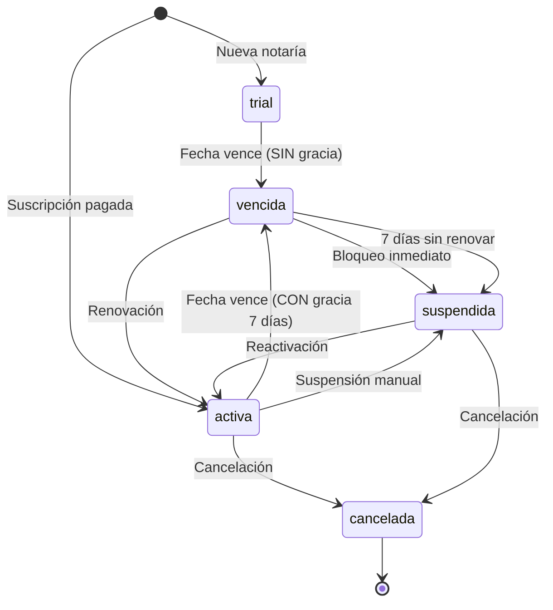
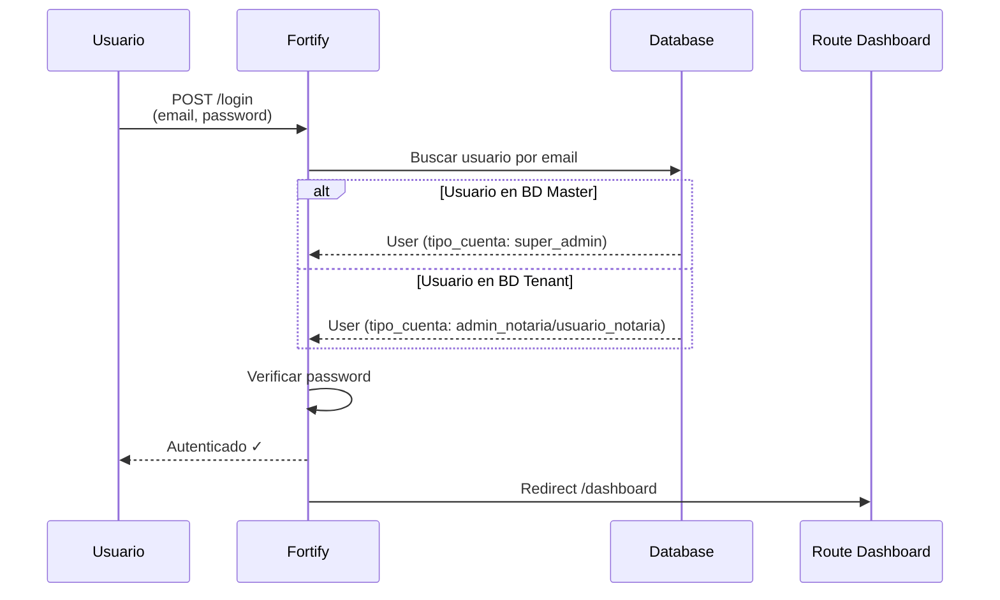
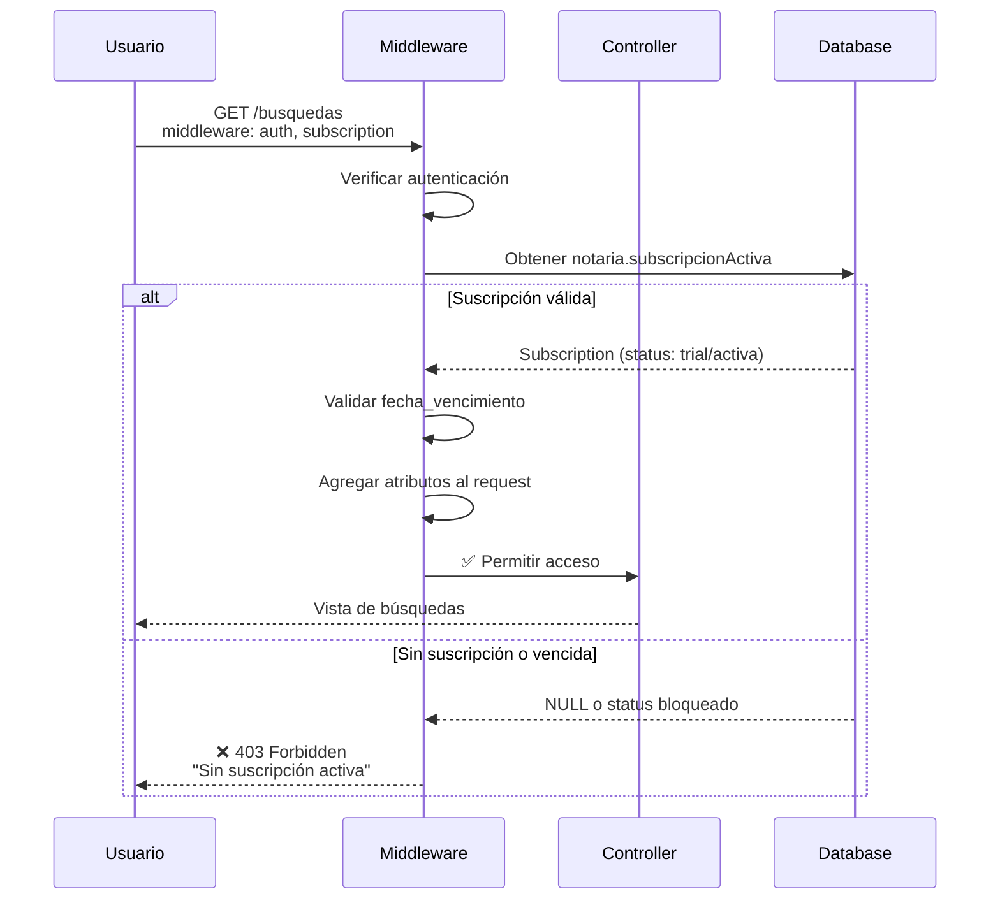
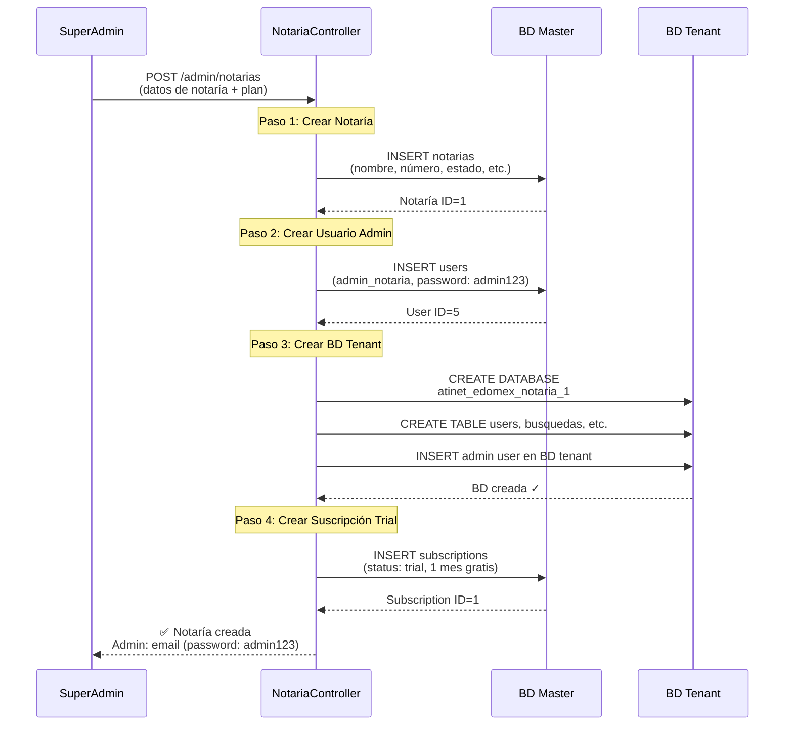

# Sistema de Autenticación y Suscripciones

> **Documentación Técnica Completa**
> Flujo de autenticación, validación de suscripciones, middleware y aislamiento multi-tenant

## 📋 Tabla de Contenidos

1. [Arquitectura General](#arquitectura-general)
2. [Estados de Suscripción](#estados-de-suscripción)
3. [Modelo Subscription](#modelo-subscription)
4. [Middleware CheckSubscriptionStatus](#middleware-checksubscriptionstatus)
5. [Relación subscripcionActiva()](#relación-subscripcionactiva)
6. [Flujo de Autenticación](#flujo-de-autenticación)
7. [Aislamiento Multi-Tenant](#aislamiento-multi-tenant)
8. [Creación de Notarías y Asignación Automática](#creación-de-notarías-y-asignación-automática-de-suscripciones)
9. [Troubleshooting](#troubleshooting)

---

## 🎯 Arquitectura General

### Estructura de Bases de Datos

```
┌─────────────────────────────────────────────────────────────┐
│  BD MASTER (atinet_compliance_hub)                          │
│  ├── users (solo super_admin)                               │
│  ├── notarias (metadata de notarías)                        │
│  ├── plans (Básico, Profesional, Empresa)                  │
│  └── subscriptions (control de suscripciones)              │
└─────────────────────────────────────────────────────────────┘
                            │
                            ├──────────────┬──────────────┐
                            ▼              ▼              ▼
┌───────────────────┐  ┌───────────────────┐  ┌───────────────────┐
│ atinet_edomex_    │  │ atinet_edomex_    │  │ atinet_edomex_    │
│ notaria_1         │  │ notaria_2         │  │ notaria_N         │
├───────────────────┤  ├───────────────────┤  ├───────────────────┤
│ ├── users         │  │ ├── users         │  │ ├── users         │
│ ├── busquedas     │  │ ├── busquedas     │  │ ├── busquedas     │
│ ├── documentos    │  │ ├── documentos    │  │ ├── documentos    │
│ └── tenant_services│  │ └── tenant_services│  │ └── tenant_services│
└───────────────────┘  └───────────────────┘  └───────────────────┘
```

### Principios Clave

1. **BD Master**: Contiene solo metadata y configuración global
2. **BD Tenant**: Datos operativos de cada notaría (100% aislados)
3. **SuperAdmin**: Opera en BD Master, sin suscripción
4. **Usuarios Notaría**: Operan en BD Tenant, requieren suscripción activa

---

## 🔐 Estados de Suscripción

### Tabla de Estados

| Estado | Código | Acceso | Período de Gracia | Descripción |
|--------|--------|--------|-------------------|-------------|
| **Trial** | `trial` | ✅ Completo | ❌ No | Período de prueba gratuito |
| **Activa** | `activa` | ✅ Completo | N/A | Suscripción pagada y vigente |
| **Vencida** | `vencida` | ⚠️ Limitado* | ✅ 7 días | Venció pero hay período de gracia |
| **Suspendida** | `suspendida` | ❌ Bloqueado | ❌ No | Gracia agotada o falta de pago |
| **Cancelada** | `cancelada` | ❌ Bloqueado | ❌ No | Cancelada definitivamente |

**\*Solo para suscripciones pagadas; Trial vence inmediatamente.**

### Asignación Automática del Trial

⚠️ **IMPORTANTE**: Cuando el SuperAdmin crea una nueva notaría desde el panel administrativo:

1. Se crea automáticamente una suscripción con status `trial`
2. Duración por defecto: **1 mes** desde la fecha de creación
3. Acceso completo a todos los servicios del plan asignado
4. No requiere pago ni configuración adicional

Ver sección [Creación de Notarías](#creación-de-notarías-y-asignación-automática-de-suscripciones) para detalles completos del proceso.

### Transiciones de Estado



### Diferencias Clave: Trial vs Pago

| Aspecto | Trial | Suscripción Pagada |
|---------|-------|-------------------|
| **Costo** | Gratuito | Pago mensual/anual |
| **Al vencer** | ❌ Bloqueo inmediato | ⚠️ 7 días de gracia |
| **Período de gracia** | No aplica | 7 días completos |
| **Auto-renovación** | No disponible | Opcional |
| **Acceso durante vigencia** | ✅ Completo | ✅ Completo |
| **Transición** | trial → vencida → suspendida | activa → vencida (7d) → suspendida |

**Razonamiento**: Trial es gratuito sin inversión del cliente, por lo tanto no merece período de gracia. Suscripciones pagadas merecen cortesía de 7 días.

---

## 💻 Modelo Subscription

### Ubicación
```
app/Models/Subscription.php
```

### Constantes de Estado

```php
public const STATUS_ACTIVA = 'activa';
public const STATUS_VENCIDA = 'vencida';
public const STATUS_CANCELADA = 'cancelada';
public const STATUS_SUSPENDIDA = 'suspendida';
public const STATUS_TRIAL = 'trial';
```

### Método Principal: `estaActiva()`

Determina si la suscripción permite acceso al sistema.

```php
public function estaActiva(): bool
{
    // TRIAL y ACTIVA: acceso completo si no ha vencido
    if (in_array($this->status, [self::STATUS_ACTIVA, self::STATUS_TRIAL])) {
        return $this->fecha_vencimiento > now();
    }

    // VENCIDA: período de gracia de 7 días (SOLO para pagadas)
    if ($this->status === self::STATUS_VENCIDA) {
        $periodoGracia = 7; // días
        return now()->lessThanOrEqualTo($this->fecha_vencimiento->addDays($periodoGracia));
    }

    // SUSPENDIDA, CANCELADA: sin acceso
    return false;
}
```

### Lógica de Validación

1. **Estados con acceso inmediato**: `trial`, `activa`
   - ✅ Validación: `fecha_vencimiento > now()`
   - ❌ Rechazado si: fecha ya pasó

2. **Estado con período de gracia**: `vencida`
   - ✅ Validación: `now() <= fecha_vencimiento + 7 días`
   - ⚠️ Solo para suscripciones que fueron `activa` previamente
   - ❌ Trial vencido NO tiene gracia (va directo a suspendida)

3. **Estados bloqueados**: `suspendida`, `cancelada`
   - ❌ Siempre rechazado

### Scopes Útiles

```php
// Suscripciones activas (incluye trial)
Subscription::activas()->get();
// WHERE status IN ('activa', 'trial') AND fecha_vencimiento > now()

// Suscripciones que vencen pronto
Subscription::vencenPronto(7)->get();
// WHERE status = 'activa' AND fecha_vencimiento BETWEEN now() AND now()+7d

// Todas las suscripciones de una notaría
$notaria->subscripciones()->get();

// Solo la suscripción activa actual
$notaria->subscripcionActiva; // Usa relación HasOne
```

---

## 🛡️ Middleware CheckSubscriptionStatus

### Ubicación y Registro

**Archivo**: `app/Http/Middleware/CheckSubscriptionStatus.php`
**Alias**: `subscription`
**Registro**: `bootstrap/app.php`

```php
->withMiddleware(function (Middleware $middleware) {
    $middleware->alias([
        'subscription' => CheckSubscriptionStatus::class,
    ]);
})
```

### Flujo de Validación

```mermaid
flowchart TD
    Start([Request con middleware 'subscription']) --> Auth{¿Usuario<br/>autenticado?}

    Auth -->|No| Unauthorized[❌ 401 Unauthorized<br/>Redirect a login]
    Auth -->|Sí| SuperAdmin{¿Es<br/>SuperAdmin?}

    SuperAdmin -->|Sí| Bypass[✅ BYPASS Total<br/>Sin validación]
    Bypass --> Continue[→ Continue Request]

    SuperAdmin -->|No| HasNotaria{¿Tiene<br/>notaría?}
    HasNotaria -->|No| NoNotaria[❌ 403 Forbidden<br/>"No asociado a notaría"]
    HasNotaria -->|Sí| GetSub[Obtener suscripción<br/>WHERE status IN<br/>activa, trial, vencida]

    GetSub --> HasSub{¿Encontró<br/>suscripción?}
    HasSub -->|No| NoSub[❌ 403 Forbidden<br/>"Sin suscripción activa"]

    HasSub -->|Sí| CheckDate{¿Fecha vence<br/>< now?}
    CheckDate -->|No| CheckStatus
    CheckDate -->|Sí| GraceDays{¿Días vencido<br/>> 7?}

    GraceDays -->|Sí| Expired[❌ 403 Forbidden<br/>"Suscripción expirada"]
    GraceDays -->|No| GraceMode[⚠️ Modo Gracia<br/>Agregar atributo]
    GraceMode --> CheckStatus

    CheckStatus{Validar<br/>Status}
    CheckStatus -->|suspendida| Suspended[❌ 403 Forbidden<br/>"Suspendida"]
    CheckStatus -->|cancelada| Cancelled[❌ 403 Forbidden<br/>"Cancelada"]
    CheckStatus -->|vencida + >7d| GraceExpired[❌ 403 Forbidden<br/>"Gracia agotada"]
    CheckStatus -->|trial| Allow
    CheckStatus -->|activa| Allow
    CheckStatus -->|vencida + ≤7d| AllowGrace

    Allow[✅ Acceso Completo]
    AllowGrace[✅ Acceso Gracia]
    Allow --> AddAttrs[Agregar atributos al request]
    AllowGrace --> AddAttrs
    AddAttrs --> Continue

    style Bypass fill:#51cf66
    style Allow fill:#51cf66
    style AllowGrace fill:#ffd43b
    style Unauthorized fill:#ff6b6b
    style NoNotaria fill:#ff6b6b
    style NoSub fill:#ff6b6b
    style Expired fill:#ff6b6b
    style Suspended fill:#ff6b6b
    style Cancelled fill:#ff6b6b
    style GraceExpired fill:#ff6b6b
```

### Casos de Uso

#### ✅ Acceso Permitido

| Tipo Usuario | Condición | Validación |
|--------------|-----------|------------|
| SuperAdmin | Cualquiera | BYPASS total (sin verificar suscripción) |
| Admin Notaría | Status: `trial`, `activa` | `fecha_vencimiento > now()` |
| Usuario Notaría | Status: `vencida` | `now() <= fecha_vencimiento + 7 días` |

#### ❌ Acceso Bloqueado

| Razón | Status | Mensaje |
|-------|--------|---------|
| Sin autenticación | N/A | "No autenticado" |
| Sin notaría | N/A | "No asociado a ninguna notaría" |
| Sin suscripción | NULL | "Sin suscripción activa" |
| Vencida > 7 días | `vencida` | "Suscripción expirada" |
| Suspendida | `suspendida` | "Suscripción suspendida" |
| Cancelada | `cancelada` | "Suscripción cancelada" |

### Atributos Añadidos al Request

El middleware agrega información al request para uso posterior:

```php
// Ejemplo de atributos disponibles
$request->attributes->get('subscription_status');  // 'trial', 'activa', 'grace_period'
$request->attributes->get('subscription');          // Modelo Subscription
$request->attributes->get('notaria');              // Modelo Notaria
$request->attributes->get('grace_period_days_remaining'); // int (si aplica)
```

### Aplicación en Rutas

```php
// Sin protección (solo autenticación)
Route::middleware('auth')->group(function () {
    Route::get('/dashboard', ...);
});

// Con protección de suscripción
Route::middleware(['auth', 'subscription'])->group(function () {
    Route::get('/busquedas', ...);
    Route::post('/busquedas/crear', ...);
    Route::get('/reportes', ...);
});

// Modo específico (read-only si está en gracia)
Route::middleware(['auth', 'subscription:read_only'])->group(function () {
    Route::get('/documentos', ...);
});
```

---

## 🔗 Relación subscripcionActiva()

### Ubicación
```
app/Models/Notaria.php (líneas 102-114)
```

### Definición

```php
public function subscripcionActiva(): HasOne
{
    return $this->hasOne(Subscription::class)
        ->whereIn('status', [
            Subscription::STATUS_ACTIVA,    // 'activa'
            Subscription::STATUS_TRIAL,     // 'trial'
            Subscription::STATUS_VENCIDA,   // 'vencida'
        ])
        ->where('fecha_vencimiento', '>=', now()->subDays(7)); // Período de gracia
}
```

### ⚠️ Requisitos Críticos

Para que esta relación devuelva un registro, **DEBE cumplir AMBAS condiciones**:

1. **Status debe ser**: `activa`, `trial` o `vencida`
2. **Fecha debe cumplir**: `fecha_vencimiento >= now() - 7 días`

### 🐛 Problema Común: NULL Result

**Síntoma**: `$notaria->subscripcionActiva` devuelve `NULL` aunque existe suscripción con status `trial`.

**Causa**: `fecha_vencimiento` es `NULL` en la base de datos.

**SQL Generado**:
```sql
SELECT * FROM subscriptions
WHERE notaria_id = 1
  AND status IN ('activa', 'trial', 'vencida')
  AND fecha_vencimiento >= DATE_SUB(NOW(), INTERVAL 7 DAY)
```

Si `fecha_vencimiento` es `NULL`, la condición `NULL >= fecha` evalúa a `FALSE`, entonces no devuelve registro.

### ✅ Solución

Toda suscripción **DEBE tener fechas configuradas**:

```php
// Correcto: Trial de 30 días
Subscription::create([
    'notaria_id' => $notaria->id,
    'plan_id' => $plan->id,
    'status' => 'trial',
    'fecha_inicio' => now(),
    'fecha_vencimiento' => now()->addDays(30), // ← OBLIGATORIO
]);

// Correcto: Suscripción anual
Subscription::create([
    'notaria_id' => $notaria->id,
    'plan_id' => $plan->id,
    'status' => 'activa',
    'fecha_inicio' => now(),
    'fecha_vencimiento' => now()->addYear(), // ← OBLIGATORIO
]);
```

---

## 🚀 Flujo de Autenticación Completo

### 1. Login del Usuario



### 2. Redirección según Tipo de Cuenta

**Archivo**: `routes/web.php`

```php
Route::get('dashboard', function () {
    $user = Auth::user();

    switch ($user->tipo_cuenta) {
        case 'super_admin':
            return Inertia::render('SuperAdminDashboard', [
                'stats' => [...],
                'recent_subscriptions' => [...]
            ]);

        case 'admin_notaria':
        case 'usuario_notaria':
            $notaria = $user->notaria()
                ->with(['subscripcionActiva.plan.services'])
                ->first();

            $subscription = $notaria?->subscripcionActiva;

            return Inertia::render('NotariaDashboard', [
                'notaria' => $notaria,
                'subscription' => $subscription,
                'stats' => [...]
            ]);

        case 'invitado':
            return Inertia::render('InvitadoDashboard', [
                'notaria' => $user->notaria
            ]);
    }
})->middleware('auth');
```

### 3. Acceso a Rutas Protegidas



---

## 🔒 Aislamiento Multi-Tenant

### Estrategia: Database Per Tenant

Cada notaría opera en su **propia base de datos física**, garantizando:

1. ✅ **Aislamiento total**: Imposible acceder datos de otra notaría por query
2. ✅ **Escalabilidad**: BDs independientes pueden distribuirse en servidores
3. ✅ **Seguridad**: Compromiso de una BD no afecta a otras
4. ✅ **Performance**: Sin filtros `WHERE notaria_id` en cada consulta

### Nomenclatura de Bases de Datos

```
atinet_{estado_codigo}_notaria_{numero}

Ejemplos:
- atinet_edomex_notaria_1      ← Notaría 1 del Estado de México
- atinet_edomex_notaria_25     ← Notaría 25 del Estado de México
- atinet_cdmx_notaria_150      ← Notaría 150 de CDMX
```

### Validación de Aislamiento

**Test**: `tests/Feature/MultiTenancy/DatabasePerTenantIsolationTest.php`

```bash
# Ejecutar tests de aislamiento
php artisan test --filter=DatabasePerTenantIsolationTest

# Resultado esperado:
# ✓ Cada notaría tiene su propia BD aislada
# ✓ Usuarios solo pueden ver datos de su propia BD
# ✓ NotariaUserController accede a BD tenant correctamente
# ✓ SuperAdmin puede consultar múltiples BDs tenant
# ✓ BD Master no contiene datos operativos de notarías
```

### Conexión Dinámica a BD Tenant

```php
use App\Enums\EstadoMexico;

// Obtener código de estado
$estadoCodigo = EstadoMexico::getCodeFromName($notaria->estado);

// Construir nombre de BD
$dbName = "atinet_{$estadoCodigo}_notaria_{$notaria->numero_notaria}";

// Configurar conexión dinámica
config([
    'database.connections.tenant_temp' => [
        'driver' => 'mysql',
        'host' => config('database.connections.mysql.host'),
        'port' => config('database.connections.mysql.port'),
        'database' => $dbName,
        'username' => config('database.connections.mysql.username'),
        'password' => config('database.connections.mysql.password'),
    ]
]);

// Usar conexión
$users = DB::connection('tenant_temp')->table('users')->get();
```

---

## 🏢 Creación de Notarías y Asignación Automática de Suscripciones

### Flujo Completo del Proceso

Cuando el **SuperAdmin** crea una nueva notaría desde el panel administrativo, el sistema ejecuta automáticamente un proceso de 4 pasos que configura completamente la infraestructura:



### Proceso Detallado (4 Pasos Automáticos)

#### **Paso 1: Crear Notaría en BD Master**

```php
// NotariaController->store()
$notaria = Notaria::create([
    'nombre' => 'Notaría Prueba 1',
    'numero_notaria' => '1',
    'estado' => 'Estado de México',
    'municipio' => 'Cuautitlán',
    'plan_id' => 1, // Plan Básico
    'contacto_principal' => 'Leinad Spartha',
    'email_contacto' => 'leinad@notaria1.com',
    'fecha_registro' => now(),
    'activa' => true,
    'total_usuarios' => 0,
    'busquedas_mes_actual' => 0,
]);
```

**Resultado**: Notaría registrada en `atinet_compliance_hub.notarias`

---

#### **Paso 2: Crear Usuario Administrador**

```php
$tempPassword = 'admin123'; // Contraseña temporal

$adminUser = User::create([
    'name' => $contacto_principal,
    'email' => $email_contacto,
    'password' => Hash::make($tempPassword),
    'recoverable_password' => Crypt::encryptString($tempPassword), // Recuperable para SuperAdmin
    'tipo_cuenta' => 'admin_notaria',
    'notaria_id' => $notaria->id,
    'email_verified_at' => now(),
]);
```

**Resultado**: Usuario admin creado en `atinet_compliance_hub.users` (BD Master) con credenciales:
- Email: proporcionado por SuperAdmin
- Password: `admin123` (temporal, debe cambiarla en primer login)

**Nota**: El password se guarda cifrado pero recuperable (`recoverable_password`) para que el SuperAdmin pueda comunicarlo al cliente.

---

#### **Paso 3: Crear Base de Datos Tenant**

```php
// Construir nombre de BD
$estadoCodigo = EstadoMexico::getCodeFromName($notaria->estado); // 'edomex'
$dbName = "atinet_{$estadoCodigo}_notaria_{$notaria->numero_notaria}";
// Resultado: atinet_edomex_notaria_1

// Crear BD
DB::statement("CREATE DATABASE IF NOT EXISTS `{$dbName}`
    CHARACTER SET utf8mb4 COLLATE utf8mb4_unicode_ci");

// Crear tablas (users, busquedas, documentos, tenant_services)
$this->createNotariaTables($dbName);

// Insertar usuario admin en BD tenant
DB::connection('tenant_temp')->table('users')->insert([
    'name' => $adminUser->name,
    'email' => $adminUser->email,
    'password' => $adminUser->password,
    'tipo_cuenta' => 'admin_notaria',
    'created_at' => now(),
    'updated_at' => now(),
]);
```

**Resultado**:
- BD tenant creada: `atinet_edomex_notaria_1`
- Tablas replicadas desde estructura base
- Usuario admin duplicado en BD tenant (necesario para queries locales)

---

#### **Paso 4: Crear Suscripción Trial Automática**

```php
$plan = Plan::find($validated['plan_id']);

Subscription::create([
    'notaria_id' => $notaria->id,
    'plan_id' => $validated['plan_id'],
    'status' => 'trial',                    // ← TRIAL automático
    'fecha_inicio' => now(),                // ← Fecha actual
    'fecha_vencimiento' => now()->addMonth(), // ← 1 mes gratis
    'precio_pagado' => $plan->precio_mensual,
    'moneda' => 'MXN',
    'ciclo_facturacion' => 'mensual',
    'auto_renovacion' => true,
]);
```

**Resultado**: Suscripción trial creada en `atinet_compliance_hub.subscriptions` con:
- **Duración**: 1 mes desde la fecha de creación
- **Status**: `trial` (acceso completo, sin pago)
- **Vencimiento**: Fecha actual + 1 mes
- **Auto-renovación**: Habilitada (cuando expire trial, puede convertirse a pago)

---

### Configuración del Trial por Defecto

| Parámetro | Valor | Descripción |
|-----------|-------|-------------|
| **Duración** | 1 mes | `now()->addMonth()` |
| **Status** | `trial` | Acceso completo sin restricciones |
| **Fecha inicio** | Fecha de creación | `now()` |
| **Fecha vencimiento** | Inicio + 1 mes | `now()->addMonth()` |
| **Precio** | Precio del plan | Se registra pero no se cobra |
| **Auto-renovación** | `true` | Puede convertirse a pago al vencer |
| **Ciclo** | `mensual` | Por defecto mensual |

### Credenciales Generadas

#### Usuario Administrador de Notaría

**Almacenamiento**:
```php
// En BD Master (users)
'password' => Hash::make('admin123'),  // Hash bcrypt (no recuperable)

// Campo adicional para SuperAdmin
'recoverable_password' => Crypt::encryptString('admin123'), // Cifrado recuperable
```

**Propósito**:
- `password`: Hash bcrypt para autenticación normal
- `recoverable_password`: Cifrado reversible para que SuperAdmin pueda consultar/comunicar al cliente

**Seguridad**:
- El usuario debe cambiar la contraseña en el primer login
- SuperAdmin puede recuperar la contraseña temporal desde el panel
- Usa cifrado Laravel (`Crypt`) con `APP_KEY` del sistema

### Verificación Post-Creación

Después de crear una notaría, verificar:

```bash
# 1. Notaría en BD Master
php artisan tinker
> App\Models\Notaria::find(1);

# 2. BD Tenant existe
> DB::select("SHOW DATABASES LIKE 'atinet_edomex_notaria_1'");

# 3. Usuario en BD Master
> App\Models\User::where('email', 'leinad@notaria1.com')->first();

# 4. Usuario en BD Tenant
> DB::connection('tenant_temp')->table('users')
    ->where('email', 'leinad@notaria1.com')->first();

# 5. Suscripción trial creada
> App\Models\Subscription::where('notaria_id', 1)->first();
> # Verificar: status = 'trial', fecha_vencimiento = now() + 1 mes
```

### Ubicación del Código

**Controlador**: `app/Http/Controllers/Admin/NotariaController.php`

**Métodos clave**:
- `store()` - Líneas 62-130: Proceso completo de creación
- `createNotariaDatabase()` - Líneas 240-280: Crear BD tenant
- `createNotariaTables()` - Líneas 282-500: Crear tablas en BD tenant

**Vista**: `resources/js/Pages/Admin/Notarias/Create.jsx`

**Ruta**:
```php
Route::post('/admin/notarias', [NotariaController::class, 'store'])
    ->middleware(['auth', 'superadmin'])
    ->name('admin.notarias.store');
```

### Casos Especiales

#### ¿Qué pasa si falla algún paso?

El proceso **NO es transaccional entre BDs**, por lo que:

1. **Falla Paso 1 (Notaría)**: No se ejecutan pasos siguientes ✅
2. **Falla Paso 2 (Usuario)**: Notaría existe pero sin admin ❌
3. **Falla Paso 3 (BD Tenant)**: Notaría y usuario existen pero sin BD operativa ❌
4. **Falla Paso 4 (Suscripción)**: Todo existe pero sin suscripción (bloqueo) ❌

**Recomendación**: Implementar rollback manual o comando de limpieza para estados inconsistentes.

#### ¿Se puede crear notaría sin trial?

Actualmente **NO**. El código siempre crea suscripción trial. Para saltarlo:

```php
// Modificar NotariaController->store() líneas 115-123
// Comentar o modificar la creación de suscripción
```

#### ¿Se puede cambiar la duración del trial?

**SÍ**. Modificar línea 120 del controlador:

```php
// Actual: 1 mes
'fecha_vencimiento' => now()->addMonth(),

// Alternativas:
'fecha_vencimiento' => now()->addDays(15),  // 15 días
'fecha_vencimiento' => now()->addMonths(3), // 3 meses
'fecha_vencimiento' => now()->addWeeks(2),  // 2 semanas
```

---

## 🔧 Troubleshooting

### Problema 1: subscripcionActiva() devuelve NULL

**Síntoma**:
```php
$notaria->subscripcionActiva; // NULL
```

**Diagnóstico**:
```php
// Verificar que existe suscripción
$sub = Subscription::where('notaria_id', $notaria->id)->first();
echo $sub->status;              // 'trial'
echo $sub->fecha_vencimiento;   // NULL ← PROBLEMA

// Método estaActiva() funciona
echo $sub->estaActiva();  // false (por falta de fecha)
```

**Causa**: `fecha_vencimiento` es `NULL`. La relación `subscripcionActiva()` requiere:
```sql
WHERE fecha_vencimiento >= NOW() - INTERVAL 7 DAY
```

**Solución**:
```php
$subscription->update([
    'fecha_inicio' => now(),
    'fecha_vencimiento' => now()->addDays(30), // Trial 30 días
]);
```

### Problema 2: Usuario bloqueado en trial válido

**Síntoma**: Usuario con suscripción `trial` no puede acceder, recibe 403.

**Diagnóstico**:
```bash
# Ejecutar script de verificación
php artisan tinker
> $notaria = App\Models\Notaria::find(1);
> $sub = $notaria->subscripciones()->first();
> $sub->status;                    // 'trial'
> $sub->fecha_vencimiento;         // NULL o fecha pasada
> $sub->estaActiva();              // false
> $notaria->subscripcionActiva;   // NULL
```

**Solución**: Configurar fechas válidas (ver Problema 1).

### Problema 3: SuperAdmin requiere suscripción

**Síntoma**: SuperAdmin recibe error de suscripción al intentar acceder.

**Diagnóstico**:
```php
$user = Auth::user();
echo $user->tipo_cuenta; // ¿Es 'super_admin'?
echo $user->isSuperAdmin(); // ¿Devuelve true?
```

**Causa**: El método `isSuperAdmin()` no está definido o el tipo_cuenta es incorrecto.

**Solución**: Verificar en `app/Models/User.php`:
```php
public function isSuperAdmin(): bool
{
    return $this->tipo_cuenta === 'super_admin';
}
```

### Problema 4: Acceso denegado en período de gracia

**Síntoma**: Usuario con suscripción vencida hace 3 días recibe 403.

**Diagnóstico**:
```php
$sub = $notaria->subscripciones()->first();
$sub->status;              // 'vencida'
$sub->fecha_vencimiento;   // 3 días atrás
$sub->estaActiva();        // true (dentro de gracia)
```

**Causa**: Suscripción es `trial` vencido (no tiene gracia).

**Solución**: Convertir a suscripción pagada:
```php
$subscription->update([
    'status' => 'activa', // o crear nueva suscripción pagada
]);
```

### Problema 5: Tests fallan en aislamiento

**Síntoma**: Test `DatabasePerTenantIsolationTest` falla.

**Causa Común**: BDs de prueba no se limpiaron correctamente.

**Solución**:
```bash
# Limpiar BDs de prueba manualmente
php artisan tinker
> DB::statement("DROP DATABASE IF EXISTS atinet_edomex_notaria_999");
> DB::statement("DROP DATABASE IF EXISTS atinet_edomex_notaria_888");

# Re-ejecutar tests
php artisan test --filter=DatabasePerTenantIsolationTest
```

### Problema 6: Notaría nueva sin suscripción o con fecha_vencimiento NULL

**Síntoma**: Notaría creada pero usuario no puede acceder, `subscripcionActiva()` retorna `null`.

**Causa Común**:
- Notaría creada manualmente sin seguir el proceso automático
- Migración de datos antiguos sin fechas
- Error en transacción que dejó suscripción incompleta

**Diagnóstico**:
```bash
php artisan tinker
> $notaria = Notaria::find(1);
> $sub = $notaria->subscription;
> $sub->fecha_vencimiento; // NULL o vacío = PROBLEMA
```

**Solución**:
```php
// Script: fix_subscription_dates.php
use App\Models\Notaria;

$notaria = Notaria::find(1); // Cambiar ID según sea necesario
$subscription = $notaria->subscription;

if ($subscription && !$subscription->fecha_vencimiento) {
    // Caso 1: Trial sin fechas - asignar 1 mes desde ahora
    if ($subscription->status === 'trial') {
        $subscription->update([
            'fecha_inicio' => now(),
            'fecha_vencimiento' => now()->addMonth(),
        ]);
        echo "✅ Trial actualizado con 1 mes de validez\n";
    }

    // Caso 2: Activa sin fechas - asignar 1 mes según plan
    elseif ($subscription->status === 'activa') {
        $subscription->update([
            'fecha_inicio' => now(),
            'fecha_vencimiento' => now()->addMonth(), // Ajustar según plan
        ]);
        echo "✅ Suscripción activa actualizada\n";
    }
}

// Verificar resultado
$notaria->load('subscription');
echo "Status: {$notaria->subscription->status}\n";
echo "Vence: {$notaria->subscription->fecha_vencimiento}\n";
echo "Acceso: " . ($notaria->subscripcionActiva() ? "✅ Permitido" : "❌ Bloqueado") . "\n";
```

**Prevención**:
- ✅ **Siempre usar** `NotariaController->store()` para crear notarías
- ✅ **Validar migración** de datos con `fecha_vencimiento IS NOT NULL`
- ✅ **Backup transaccional** en creación de notarías
- ⚠️ **Nunca crear** notaría sin suscripción automática

---

## 📚 Referencias Relacionadas

- [Verificación Automática de Suscripciones](VERIFICACION_SUSCRIPCIONES_AUTOMATICA.md) - Sistema automático diario
- [Arquitectura Multi-Tenant](ARQUITECTURA_MULTI_TENANT.md) - Diseño de bases de datos
- [Plan de Desarrollo](PLAN_DESARROLLO_ATINET_COMPLIANCE_HUB.md) - Roadmap completo

---

## 📝 Notas Importantes

1. **Fechas son obligatorias**: Toda suscripción debe tener `fecha_inicio` y `fecha_vencimiento`
2. **SuperAdmin sin suscripción**: No requiere ni valida suscripción
3. **Trial sin gracia**: Bloqueo inmediato al vencer, sin período de cortesía
4. **Gracia solo para pagadas**: 7 días exclusivos para suscripciones que fueron `activa`
5. **Aislamiento garantizado**: Cada notaría en BD física separada

---

**Última actualización**: 2026-03-04
**Versión**: 1.0.0
**Mantenedor**: Equipo Atinet Development
