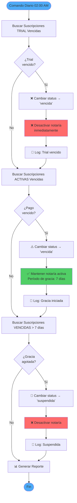

# 🎯 FASE 1.5: SISTEMA DE SERVICIOS Y PLANES DE SUSCRIPCIÓN

**Versión:** 2.1  
**Fecha:** 4 de Marzo, 2026  
**Estado:** ✅ COMPLETADA AL 100% - LISTO PARA FASE 2  
**Prioridad:** ✅ COMPLETADA

**✅ Completado:**
- ✅ Sprint 1: Base de datos (100%)
- ✅ Sprint 2: Lógica de negocio (100%)
  - ServiceAccessManager (6 métodos, 14 tests)
  - CheckServiceAccess Middleware (11 tests)
  - ServiceUsageRecorder (8 métodos, 23 tests)
  - Global Helpers (5 funciones)
- ✅ Sprint 3: Panel Super Admin (100%)
  - CRUD Servicios
  - CRUD Planes con auto-sincronización
  - Gestión Plan-Servicio
  - Servicios por Notaría
- ✅ Sprint 4: Reportes Dashboard (100%)
  - ReportsController con 9 endpoints
  - Dashboard principal con filtros y exportación CSV
- ✅ Sprint 5: Gestión Multi-Tenant Usuarios (100%)
  - NotariaUserController compatible Laravel 12
  - CRUD usuarios por BD tenant
  - Correcciones de importación EstadoMexico
- ✅ Estandarización notaria_id (100%)
- ✅ Tests: 132 passing (354 assertions)
- ✅ Documentación completa y actualizada

**⚠️ Nota para próxima sesión:**
- Los helpers globales están implementados pero el autoload de Composer no los está cargando
- Ubicación: `bootstrap/helpers.php`
- Ver sección "PROBLEMA PENDIENTE: AUTOLOAD DE HELPERS" al final del documento

---

## 📊 CONTEXTO Y JUSTIFICACIÓN

### ¿Por qué este paso es crítico AHORA?

La Fase 1 implementó la estructura multi-tenant con planes básicos. **ANTES** de implementar herramientas específicas (listas negras, PEP, APIs, etc.) en la Fase 2, necesitamos:

1. **Arquitectura escalable** que soporte crecimiento sin migraciones constantes
2. **Modelo de negocio flexible** que permita ventas personalizadas
3. **Sistema de facturación** basado en consumo y límites
4. **Catálogo de servicios** independiente de los planes
5. **Control granular** de acceso y permisos por servicio

### Problema que resuelve

**❌ Arquitectura actual (limitada):**
```sql
plans
- id
- name
- monthly_price
- features (JSON) ← rígido, difícil escalar
```

**✅ Arquitectura propuesta (flexible):**
```sql
services (catálogo independiente)
plans (marcos de suscripción)
plan_services (relación con límites)
tenant_services (personalizaciones)
service_usage (consumo real)
```

### Beneficios clave

- ✅ **Sin migraciones futuras** al agregar servicios
- ✅ **Add-ons y bundles** para ventas especiales
- ✅ **Pricing personalizado** por notaría
- ✅ **Auditoría de consumo** para facturación precisa
- ✅ **Control granular** de acceso por servicio
- ✅ **Escalabilidad** sin límites arquitectónicos

---

## 🔗 INTEGRACIÓN CON ARQUITECTURA EXISTENTE

### Relación con tabla `subscriptions`

**IMPORTANTE:** La tabla `subscriptions` (ya existente) **NO queda obsoleta**. Ambas arquitecturas son **complementarias** y trabajan juntas:

#### **`subscriptions`** → Gestión de la suscripción
```sql
subscriptions
├─ notaria_id          (¿Qué notaría?)
├─ plan_id             (¿Qué plan contrató?)
├─ fecha_inicio
├─ fecha_vencimiento
├─ status              (activa/vencida/cancelada)
├─ precio_pagado
├─ ciclo_facturacion   (mensual/anual)
└─ auto_renovacion

Propósito: Gestionar PAGOS, RENOVACIONES y STATUS de la suscripción
```

#### **Nueva arquitectura de servicios** → Gestión de herramientas
```sql
services              → Catálogo de herramientas disponibles
plan_services         → Qué servicios incluye cada plan + límites
tenant_services       → Customizaciones por notaría
service_usage         → Tracking de consumo para facturación

Propósito: Gestionar ACCESO, LÍMITES y CONSUMO de herramientas
```

### Flujo de integración

```
┌─────────────────────────────────────────────────────────────────┐
│ 1. Usuario de Notaría intenta usar servicio BLACKLIST_SAT      │
└─────────────────────────────────────────────────────────────────┘
                            ↓
┌─────────────────────────────────────────────────────────────────┐
│ 2. Sistema verifica: ¿Tiene suscripción activa?                │
│    → notaria.subscription WHERE status = 'activa'              │
└─────────────────────────────────────────────────────────────────┘
                            ↓
                         ✅ SÍ
                            ↓
┌─────────────────────────────────────────────────────────────────┐
│ 3. Obtener el plan de la suscripción                           │
│    → subscription.plan                                          │
└─────────────────────────────────────────────────────────────────┘
                            ↓
┌─────────────────────────────────────────────────────────────────┐
│ 4. ¿El plan incluye el servicio?                               │
│    → plan.services WHERE code = 'BLACKLIST_SAT'                │
└─────────────────────────────────────────────────────────────────┘
                            ↓
                         ✅ SÍ
                            ↓
┌─────────────────────────────────────────────────────────────────┐
│ 5. ¿Hay customización para esta notaría?                       │
│    → notaria.services WHERE code = 'BLACKLIST_SAT'             │
│    Si existe: usar custom_limit y custom_price                 │
│    Si no: usar usage_limit del plan                            │
└─────────────────────────────────────────────────────────────────┘
                            ↓
┌─────────────────────────────────────────────────────────────────┐
│ 6. Verificar consumo actual del mes                            │
│    → service_usage WHERE tenant_id AND service_id               │
│       AND MONTH(consumed_at) = current_month                    │
└─────────────────────────────────────────────────────────────────┘
                            ↓
┌─────────────────────────────────────────────────────────────────┐
│ 7. ¿Ha alcanzado el límite?                                    │
│    → count(usage) < limit                                       │
└─────────────────────────────────────────────────────────────────┘
                            ↓
                    ✅ NO (tiene cuota)
                            ↓
┌─────────────────────────────────────────────────────────────────┐
│ 8. Permitir acceso + registrar uso                             │
│    → INSERT INTO service_usage                                  │
└─────────────────────────────────────────────────────────────────┘
```

### Ejemplo en código

```php
// Middleware: CheckServiceAccess (IMPLEMENTADO)
// Ver: app/Http/Middleware/CheckServiceAccess.php
// Tests: tests/Feature/Http/Middleware/CheckServiceAccessTest.php (11 tests)

public function handle(Request $request, Closure $next, string $serviceCode)
{
    $notaria = auth()->user()->notaria;
    $accessManager = app(ServiceAccessManager::class);
    
    // Verificar acceso completo (suscripción activa + servicio incluido)
    if (!$accessManager->canAccess($notaria, $serviceCode)) {
        return response()->json(['error' => 'No tienes acceso a este servicio'], 403);
    }
    
    // Verificar límites de uso mensual
    if ($accessManager->hasReachedLimit($notaria, $serviceCode)) {
        return response()->json(['error' => 'Has alcanzado el límite mensual'], 429);
    }
    
    return $next($request);
}

// ServiceAccessManager (IMPLEMENTADO)
// Ver: app/Services/ServiceAccessManager.php
// Tests: tests/Feature/Services/ServiceAccessManagerTest.php (14 tests)

class ServiceAccessManager
{
    public function canAccess(Notaria $notaria, string $serviceCode): bool
    public function hasReachedLimit(Notaria $notaria, string $serviceCode): bool
    public function getRemainingUsage(Notaria $notaria, string $serviceCode): ?int
    public function getUsageStats(Notaria $notaria, string $serviceCode): array
    // + 2 métodos privados de helpers
}

// ServiceUsageRecorder (IMPLEMENTADO)
// Ver: app/Services/ServiceUsageRecorder.php
// Tests: tests/Feature/Services/ServiceUsageRecorderTest.php (23 tests)

class ServiceUsageRecorder
{
    public function record(...): ?ServiceUsage
    public function recordBatch(...): int
    public function getCurrentMonthUsage(...): int
    public function getCurrentMonthCost(...): float
    public function markAsBilled(...): int
    public function getPendingBilling(...): Collection
    // + 2 métodos privados de helpers
}
```

### Conclusión

- **`subscriptions`** gestiona el ciclo de vida comercial (pago, renovación, vencimiento)
- **`services + plan_services + tenant_services`** gestiona permisos y límites de herramientas
- **`service_usage`** registra consumo real para facturación de excedentes
- **Trabajan juntas** para un sistema completo de suscripciones + servicios

---


## 📊 Estados de Suscripción

```
trial → activa → vencida
              ↓
          suspendida
              ↓
          cancelada
```

### Estados Disponibles:

| Estado | Descripción | Acceso a Servicios | Notaría Activa | Período de Gracia | Acción Automática |
|--------|-------------|-------------------|----------------|-------------------|-------------------|
| **trial** | Período de prueba (1 mes gratis) | ✅ Completo | ✅ Sí | ❌ Sin gracia | Al vencer → desactivar inmediatamente |
| **activa** | Suscripción pagada y vigente | ✅ Completo | ✅ Sí | N/A | Al vencer → marcar como vencida |
| **vencida** | Venció el período, esperando pago | ✅ Completo | ✅ Sí (7 días) | ✅ 7 días | Después de 7 días → suspender |
| **suspendida** | Suspendida por falta de pago | ❌ Sin acceso | ❌ No | ❌ Gracia agotada | Manual: reactivar con pago |
| **cancelada** | Cancelada definitivamente | ❌ Sin acceso | ❌ No | N/A | Final (no reversible) |

**Nota Importante:** Solo las suscripciones **trial** se desactivan inmediatamente al vencer. Las suscripciones de **pago** tienen un período de gracia de 7 días para permitir la renovación antes de suspender.

---

## 🔄 Flujos de Gestión

### 1. Creación de Notaría (Actual)
```
SuperAdmin crea notaría
  → Se crea suscripción automática en estado 'trial'
  → Duración: 1 mes
  → Precio: $0 (gratis)
  → Auto-renovación: activada
```

### 2. Renovación Manual (NUEVO)
```
SuperAdmin → Menú "Renovar Suscripción"
  → Seleccionar ciclo (mensual/anual)
  → Confirmar precio del plan
  → Ingresar método de pago
  → Generar nueva fecha de vencimiento
  → Cambiar estado a 'activa'
```

### 3. Suspensión por Falta de Pago (NUEVO)
```
Automático:
  - Si subscription.status = 'vencida'
  - Y han pasado > 7 días desde fecha_vencimiento
  - Cambiar a 'suspendida'
  - Bloquear acceso a servicios

Manual:
  - SuperAdmin puede suspender inmediatamente
  - Razón: seleccionar de lista o escribir
```

### 4. Cambio de Plan (NUEVO)
```
SuperAdmin → "Cambiar Plan"
  → Seleccionar nuevo plan
  → Calcular prorrateo (opcional)
  → Actualizar notaria.plan_id
  → Actualizar subscription.plan_id
  → Copiar nuevos plan_services al tenant
  → Mantener estado actual de suscripción
```

### 5. Reactivación (NUEVO)
```
SuperAdmin → "Reactivar Suscripción"
  → Verificar si hay saldo pendiente
  → Registrar pago pendiente
  → Cambiar estado a 'activa'
  → Calcular nueva fecha de vencimiento
```

### 6. Cancelación Definitiva (NUEVO)
```
SuperAdmin → "Cancelar Suscripción"
  → Confirmar acción (irreversible)
  → Ingresar razón de cancelación
  → Cambiar estado a 'cancelada'
  → Opcionalmente: desactivar notaría
  → No eliminar datos (auditoría)
```

---

## 🤖 Sistema Automático de Verificación ✅ **IMPLEMENTADO**

### Flujo de Verificación de Suscripciones Vencidas



### Lógica de Negocio por Tipo de Suscripción

| Tipo Suscripción | Estado Inicial | Al Vencer | Período Gracia | Notaría Activa | Resultado Final |
|------------------|----------------|-----------|----------------|----------------|-----------------|
| **Trial** | `trial` | → `vencida` | ❌ Sin gracia | ❌ Desactivada | Bloqueo inmediato |
| **Pago (< 7 días)** | `activa` | → `vencida` | ✅ 7 días | ✅ Activa | Acceso completo |
| **Pago (≥ 7 días)** | `vencida` | → `suspendida` | ❌ Gracia agotada | ❌ Desactivada | Bloqueo total |

### Comando: `subscriptions:check-expired`

**Ubicación:** `app/Console/Commands/CheckExpiredSubscriptions.php`

**Programación:**
```php
// routes/console.php
Schedule::command('subscriptions:check-expired')
    ->daily()
    ->at('02:00')
    ->timezone('America/Mexico_City')
    ->description('Verifica suscripciones vencidas y desactiva notarías según el tipo');
```

**Opciones:**
```bash
# Ejecutar verificación (modifica base de datos)
php artisan subscriptions:check-expired

# Modo dry-run (solo muestra qué haría)
php artisan subscriptions:check-expired --dry-run
```

**Salida del Comando:**
```
🔄 Iniciando verificación de suscripciones vencidas...

📋 Buscando suscripciones TRIAL vencidas...
   ⚠️  Trial vencido: Notaría Ejemplo (ID: 123)
      Fecha vencimiento: 2026-01-15
      ✓ Suscripción marcada como vencida
      ✓ Notaría desactivada

💳 Buscando suscripciones de PAGO vencidas...
   ⚠️  Suscripción vencida: Notaría ABC (ID: 456)
      Fecha vencimiento: 2026-02-05
      📅 Iniciando período de gracia de 7 días
      ✓ Suscripción marcada como vencida
      ⏳ Notaría permanece activa (gracia)

🚫 Buscando suscripciones con período de gracia agotado (>7 días)...
   ❌ Período de gracia agotado: Notaría XYZ (ID: 789)
      Vencida hace: 10 días
      ✓ Suscripción suspendida
      ✓ Notaría desactivada

✅ Verificación completada

+--------------------------------------------+----------+
| Categoría                                  | Cantidad |
+--------------------------------------------+----------+
| Trials vencidos detectados                 | 1        |
| Suscripciones de pago vencidas             | 1        |
| Suscripciones suspendidas (gracia agotada) | 1        |
+--------------------------------------------+----------+
```

**Tests:**
- ✅ 7 tests implementados (16 assertions)
- ✅ Cobertura completa de casos de uso
- ✅ Test de transacciones (rollback en errores)
- ✅ Test de modo dry-run

**Logs Generados:**
```
[2026-02-10 02:00:15] INFO: CheckExpiredSubscriptions ejecutado {
    "trials_vencidos": 1,
    "pagos_vencidos": 1,
    "pagos_suspendidos": 1
}

[2026-02-10 02:00:15] WARNING: Trial vencido - Notaría desactivada: Notaría Ejemplo (ID: 123)
[2026-02-10 02:00:15] INFO: Suscripción de pago vencida - Período de gracia iniciado: Notaría ABC (ID: 456)
[2026-02-10 02:00:15] WARNING: Período de gracia agotado - Notaría suspendida: Notaría XYZ (ID: 789)
```

---

## 🛠️ Componentes a Implementar

### Backend

#### 1. **SubscriptionController** (Admin)
- `index()` - Listar todas las suscripciones
- `show()` - Ver detalle de suscripción
- `renew()` - Renovar suscripción
- `suspend()` - Suspender suscripción
- `reactivate()` - Reactivar suscripción
- `cancel()` - Cancelar suscripción
- `changePlan()` - Cambiar plan de una suscripción

#### 2. **SubscriptionService** (Lógica de Negocio)
- `createTrialSubscription()` - Crear suscripción trial automática
- `renewSubscription()` - Renovar con cálculo de fechas
- `suspendSubscription()` - Suspender con validaciones
- `reactivateSubscription()` - Reactivar con validaciones
- `cancelSubscription()` - Cancelar definitivamente
- `changePlan()` - Cambiar plan con prorrateo
- `checkExpiredSubscriptions()` - Job para revisar vencidas
- `calculateProrateo()` - Calcular prorrateo al cambiar plan

#### 3. **Command: CheckExpiredSubscriptions** ✅ **IMPLEMENTADO**
```bash
# Ejecutar verificación manual
php artisan subscriptions:check-expired

# Modo preview (no modifica datos)
php artisan subscriptions:check-expired --dry-run

# Ver tareas programadas
php artisan schedule:list
```

**Características:**
- ✅ Ejecuta diariamente a las 2:00 AM (automático vía scheduler)
- ✅ Lógica diferenciada por tipo de suscripción:
  - **Trial vencido**: Desactiva notaría inmediatamente (sin gracia)
  - **Pago vencido**: Mantiene activa 7 días (período de gracia)
  - **Gracia agotada**: Suspende y desactiva después de 7 días
- ✅ Modo `--dry-run` para previsualizar cambios
- ✅ Logs completos en `storage/logs/laravel.log`
- ✅ Reporte tabular con estadísticas
- ✅ Transaccional (rollback automático si hay errores)

#### 4. **Policies & Middleware**
- `CheckActiveSubscription` - Middleware para validar suscripción activa
- `SubscriptionPolicy` - Solo SuperAdmin puede gestionar

### Frontend (Inertia/Vue)

#### Vistas Nuevas:
1. **Admin/Subscriptions/Index.vue** - Lista de suscripciones
2. **Admin/Subscriptions/Show.vue** - Detalle de suscripción
3. **Admin/Notarias/Subscriptions/Manage.vue** - Widget en notaría

#### Componentes:
- `SubscriptionStatusBadge.vue` - Badge de estado
- `SubscriptionTimeline.vue` - Historial de cambios
- `RenewSubscriptionModal.vue` - Modal para renovar
- `ChangePlanModal.vue` - Modal para cambiar plan
- `SuspendSubscriptionModal.vue` - Modal para suspender

---

## 🎨 UI/UX Propuesta

### En el Panel de SuperAdmin

#### Sección Nueva: "Suscripciones"
```
📊 Dashboard de Suscripciones
├─ Estadísticas
│  ├─ Activas: 45
│  ├─ Trial: 12
│  ├─ Vencidas: 3
│  ├─ Suspendidas: 2
│  └─ MRR (Ingreso Mensual Recurrente): $45,000 MXN
│
├─ Tabla de Suscripciones
│  └─ Columnas: Notaría, Plan, Estado, F. Vencimiento, Acciones
│
└─ Filtros
   ├─ Por estado
   ├─ Por plan
   └─ Vencen pronto (próximos 7 días)
```

#### En Detalle de Notaría

Agregar widget:
```
┌─────────────────────────────────────┐
│ 💳 Suscripción Actual               │
├─────────────────────────────────────┤
│ Estado: [🟢 Activa]                 │
│ Plan: Plan Profesional              │
│ Vence: 09 Mar 2026 (28 días)       │
│ Precio: $999.00 MXN / mes           │
│                                      │
│ [Renovar] [Suspender] [Cambiar Plan]│
└─────────────────────────────────────┘
```

---

## 📋 Validaciones Importantes

### Al Suspender:
- ✅ Confirmar que no hay operaciones en curso
- ✅ Notificar al admin de la notaría
- ✅ Permitir período de gracia (configurable)

### Al Renovar:
- ✅ Calcular precio según ciclo seleccionado
- ✅ Aplicar descuentos si corresponde
- ✅ Generar fecha de vencimiento correcta
- ✅ Mantener auto_renovacion configurada

### Al Cambiar Plan:
- ✅ Validar que el nuevo plan existe
- ✅ Calcular prorrateo si aplica
- ✅ Actualizar servicios en tenant
- ✅ Notificar al admin de la notaría

### Al Cancelar:
- ✅ Requiere confirmación
- ✅ Razón obligatoria
- ✅ Irreversible (avisar claramente)
- ✅ Mantener datos históricos

---

## 🔐 Control de Acceso

### Restringir Servicios por Estado:

```php
// En ServiceAccessManager
public function canAccess(Service $service): bool
{
    // 1. Verificar suscripción activa
    $subscription = $this->getActiveSubscription();
    
    if (!$subscription) {
        return false; // Sin suscripción
    }
    
    if ($subscription->status === 'suspendida') {
        return false; // Suspendido = sin acceso
    }
    
    if ($subscription->status === 'cancelada') {
        return false; // Cancelado = sin acceso
    }
    
    if ($subscription->status === 'vencida') {
        // Período de gracia: solo lectura
        return $service->category === 'consulta'; // Solo búsquedas
    }
    
    // 2. Verificar si el servicio está en el plan...
    // (resto de la lógica)
}
```

---

## 📅 Implementación Propuesta

### Sprint 2A: Gestión de Suscripciones (2-3 días)
1. ✅ Crear SubscriptionService con lógica de negocio
2. ✅ Crear SubscriptionController (CRUD + acciones)
3. ✅ Crear Form Requests para validación
4. ✅ Crear CheckExpiredSubscriptions Command
5. ✅ Actualizar NotariaController::store() para usar SubscriptionService
6. ✅ Tests unitarios y de integración

### Sprint 2B: UI de Gestión (2 días)
1. ✅ Crear vistas de suscripciones (Index, Show)
2. ✅ Agregar widget en detalle de notaría
3. ✅ Crear modales de acciones
4. ✅ Agregar rutas y navegación
5. ✅ Integrar con Wayfinder
6. ✅ Implementar visualización de datos con gráficos interactivos

### Sprint 2C: Integración con ServiceAccessManager (1 día)
1. ✅ Implementar validación de suscripción en ServiceAccessManager
2. ✅ Crear middleware CheckActiveSubscription
3. ✅ Aplicar middleware a rutas protegidas
4. ✅ Tests de integración

---

## 🎯 Próximos Pasos

1. **¿Aprobas este diseño?**
2. **¿Alguna modificación o caso de uso adicional?**
3. **¿Procedemos con la implementación?**

---

## 📊 Sistema de Visualización de Datos

### Implementación de Gráficos Interactivos

El dashboard de suscripciones cuenta con un sistema avanzado de visualización que permite al administrador analizar la distribución de estados de suscripción mediante diferentes tipos de gráficos.

### Características del Sistema de Gráficos

#### 🎨 4 Tipos de Gráficos Disponibles

| Tipo | Ícono | Descripción | Uso Recomendado |
|------|-------|-------------|-----------------|
| **Circular (Pie)** | 🥧 | Gráfico circular con porcentajes | Ver proporciones y distribución general |
| **Barras (Bar)** | 📊 | Gráfico de barras vertical | Comparación directa entre estados |
| **Radial** | 🎯 | Gráfico circular radial | Visualización de progreso circular |
| **Mapa de Árbol (Treemap)** | 🗺️ | Visualización jerárquica | Ver jerarquías y proporciones de espacio |

#### 🎨 Paleta de Colores por Estado

Todos los gráficos utilizan una paleta de colores consistente:

```typescript
const COLORS = [
    'hsl(205, 100%, 50%)',  // 🔵 Trial - Azul brillante
    'hsl(125, 60%, 42%)',   // ✅ Activa - Verde éxito
    'hsl(25, 90%, 54%)',    // 🟠 Vencida - Naranja advertencia
    'hsl(0, 72%, 51%)',     // 🔴 Suspendida - Rojo peligro
    'hsl(0, 0%, 60%)',      // ⚫ Cancelada - Gris neutral
];
```

#### 💾 Persistencia de Preferencias

El sistema guarda automáticamente la preferencia del administrador usando `localStorage`:

```typescript
// Clave: 'subscriptions-chart-type'
// Valores: 'pie' | 'bar' | 'radial' | 'treemap'
```

Al recargar la página, el gráfico seleccionado previamente se restaura automáticamente.

#### 🔄 Selector de Tipo de Gráfico

```tsx
<Select value={chartType} onValueChange={handleChartTypeChange}>
    <SelectTrigger className="w-[200px]">
        <SelectValue placeholder="Tipo de gráfico" />
    </SelectTrigger>
    <SelectContent>
        <SelectItem value="pie">🥧 Circular</SelectItem>
        <SelectItem value="bar">📊 Barras</SelectItem>
        <SelectItem value="radial">🎯 Radial</SelectItem>
        <SelectItem value="treemap">🗺️ Mapa de Árbol</SelectItem>
    </SelectContent>
</Select>
```

### Estructura de Datos

Los gráficos consumen datos en el siguiente formato:

```typescript
type ChartDataItem = {
    name: string;      // Nombre del estado (ej: "Activas")
    value: number;     // Cantidad de suscripciones
    color: string;     // Color HSL asignado
};

const chartData = [
    { name: 'Trial', value: 2, color: 'hsl(205, 100%, 50%)' },
    { name: 'Activas', value: 5, color: 'hsl(125, 60%, 42%)' },
    { name: 'Vencidas', value: 2, color: 'hsl(25, 90%, 54%)' },
    { name: 'Suspendidas', value: 1, color: 'hsl(0, 72%, 51%)' },
    { name: 'Canceladas', value: 1, color: 'hsl(0, 0%, 60%)' },
];
```

### Integración con Recharts

El sistema utiliza **Recharts v2.x** para el renderizado de gráficos:

```typescript
import {
    PieChart, Pie, Cell,
    BarChart, Bar, XAxis, YAxis,
    RadialBarChart, RadialBar,
    Treemap, ResponsiveContainer, Tooltip, Legend
} from 'recharts';
```

### Componente TreeMap Personalizado

Para el gráfico TreeMap se implementó un componente personalizado con tipado seguro:

```typescript
const CustomTreeMapContent = (props: {
    x?: number;
    y?: number;
    width?: number;
    height?: number;
    name?: string;
    value?: number;
    color?: string;
}) => {
    const { x = 0, y = 0, width = 0, height = 0, 
            name = '', value = 0, color = '#000' } = props;
    
    return (
        <g>
            <rect x={x} y={y} width={width} height={height}
                  style={{ fill: color, stroke: '#fff', strokeWidth: 2 }} />
            {width > 60 && height > 30 && (
                <>
                    <text x={x + width/2} y={y + height/2 - 10}
                          textAnchor="middle" fill="#fff" fontSize={14} fontWeight="bold">
                        {name}
                    </text>
                    <text x={x + width/2} y={y + height/2 + 10}
                          textAnchor="middle" fill="#fff" fontSize={12}>
                        {value}
                    </text>
                </>
            )}
        </g>
    );
};
```

### Beneficios del Sistema de Visualización

1. **✅ Flexibilidad**: 4 tipos de gráficos para diferentes análisis
2. **✅ Persistencia**: Las preferencias se guardan automáticamente
3. **✅ Consistencia**: Paleta de colores uniforme en todos los gráficos
4. **✅ UX Mejorada**: Cambio instantáneo entre tipos sin recargar
5. **✅ TypeScript**: Código completamente tipado y seguro
6. **✅ Responsive**: Todos los gráficos se adaptan al contenedor

### Ubicación del Código

- **Frontend**: `resources/js/Pages/Admin/Subscriptions/Index.tsx`
- **Líneas**: 120-320 (renderChart function y componentes)
- **Dependencias**: recharts@^2.x, shadcn/ui Select component

### Script de Datos de Prueba

Para facilitar las pruebas, se creó un script que genera suscripciones de ejemplo:

**Archivo**: `add_sample_subscriptions.php`

```bash
php add_sample_subscriptions.php
```

Este script crea:
- 2 suscripciones Trial
- 5 suscripciones Activas
- 2 suscripciones Vencidas
- 1 suscripción Suspendida
- 1 suscripción Cancelada

**Nota**: Las suscripciones históricas (vencidas, suspendidas, canceladas) pueden crearse sin restricción, mientras que solo puede haber una suscripción activa/trial por notaría.


---

## 📈 Características Principales

### 4 Tipos de Gráficos Disponibles

| Tipo | Ícono | Componente | Uso Recomendado |
|------|-------|------------|-----------------|
| **Circular (Pie)** | 🥧 | `PieChart` | Ver proporciones y porcentajes de distribución |
| **Barras (Bar)** | 📊 | `BarChart` | Comparación directa de cantidades entre estados |
| **Radial** | 🎯 | `RadialBarChart` | Visualización de progreso en formato circular |
| **Mapa de Árbol** | 🗺️ | `Treemap` | Jerarquías y proporciones de espacio visual |

### Selector Interactivo

```tsx
<Select value={chartType} onValueChange={handleChartTypeChange}>
    <SelectTrigger className="w-50">
        <SelectValue placeholder="Tipo de gráfico" />
    </SelectTrigger>
    <SelectContent>
        <SelectItem value="pie">🥧 Circular</SelectItem>
        <SelectItem value="bar">📊 Barras</SelectItem>
        <SelectItem value="radial">🎯 Radial</SelectItem>
        <SelectItem value="treemap">🗺️ Mapa de Árbol</SelectItem>
    </SelectContent>
</Select>
```

---

## 🎨 Paleta de Colores Estandarizada

Todos los gráficos utilizan una paleta consistente basada en el estado de la suscripción:

```typescript
const COLORS = [
    'hsl(205, 100%, 50%)',  // 🔵 Trial - Azul brillante
    'hsl(125, 60%, 42%)',   // ✅ Activa - Verde éxito
    'hsl(25, 90%, 54%)',    // 🟠 Vencida - Naranja advertencia
    'hsl(0, 72%, 51%)',     // 🔴 Suspendida - Rojo peligro
    'hsl(0, 0%, 60%)',      // ⚫ Cancelada - Gris neutral
];
```

### Mapeo Estado → Color → Significado

| Estado | Color | HSL | Psicología del Color |
|--------|-------|-----|----------------------|
| **trial** | 🔵 Azul | `hsl(205, 100%, 50%)` | Confianza, inicio, prueba |
| **activa** | ✅ Verde | `hsl(125, 60%, 42%)` | Éxito, activo, saludable |
| **vencida** | 🟠 Naranja | `hsl(25, 90%, 54%)` | Advertencia, requiere atención |
| **suspendida** | 🔴 Rojo | `hsl(0, 72%, 51%)` | Peligro, bloqueado, inactivo |
| **cancelada** | ⚫ Gris | `hsl(0, 0%, 60%)` | Neutral, finalizado, archivado |

---

## 💾 Persistencia de Preferencias

### localStorage

El sistema guarda automáticamente la preferencia del administrador:

**Clave:** `subscriptions-chart-type`  
**Valores posibles:** `'pie'` | `'bar'` | `'radial'` | `'treemap'`  
**Valor por defecto:** `'pie'`

### Implementación

```typescript
const [chartType, setChartType] = useState<'pie' | 'bar' | 'radial' | 'treemap'>(() => {
    if (typeof window !== 'undefined') {
        const saved = localStorage.getItem('subscriptions-chart-type');
        return (saved as 'pie' | 'bar' | 'radial' | 'treemap') || 'pie';
    }
    return 'pie';
});

const handleChartTypeChange = (value: 'pie' | 'bar' | 'radial' | 'treemap') => {
    setChartType(value);
    if (typeof window !== 'undefined') {
        localStorage.setItem('subscriptions-chart-type', value);
    }
};
```

### Comportamiento

1. **Primera visita**: Muestra gráfico circular (pie) por defecto
2. **Cambio de tipo**: Guarda automáticamente la selección
3. **Recarga de página**: Restaura la última selección
4. **Múltiples dispositivos**: Cada dispositivo mantiene su preferencia

---

## 📊 Estructura de Datos

### Formato de Entrada

```typescript
type ChartDataItem = {
    name: string;      // Nombre del estado (ej: "Activas")
    value: number;     // Cantidad de suscripciones
    color: string;     // Color HSL asignado
};
```

### Ejemplo Real

```typescript
const chartData = [
    { name: 'Trial', value: 2, color: 'hsl(205, 100%, 50%)' },
    { name: 'Activas', value: 5, color: 'hsl(125, 60%, 42%)' },
    { name: 'Vencidas', value: 2, color: 'hsl(25, 90%, 54%)' },
    { name: 'Suspendidas', value: 1, color: 'hsl(0, 72%, 51%)' },
    { name: 'Canceladas', value: 1, color: 'hsl(0, 0%, 60%)' },
];
```

### Generación de Datos

```typescript
const chartData = [
    { name: 'Trial', value: stats.trial, color: COLORS[0] },
    { name: 'Activas', value: stats.activas, color: COLORS[1] },
    { name: 'Vencidas', value: stats.vencidas, color: COLORS[2] },
    { name: 'Suspendidas', value: stats.suspendidas, color: COLORS[3] },
    { name: 'Canceladas', value: stats.canceladas, color: COLORS[4] },
].filter(item => item.value > 0); // Solo mostrar estados con datos
```

---

## 🔧 Implementación Técnica

### Dependencias

```json
{
    "recharts": "^2.12.7",
    "@radix-ui/react-select": "^2.1.4",
    "lucide-react": "^0.468.0"
}
```

### Imports

```typescript
import {
    PieChart, Pie, Cell,
    BarChart, Bar, XAxis, YAxis, CartesianGrid,
    RadialBarChart, RadialBar,
    Treemap, ResponsiveContainer, Tooltip, Legend
} from 'recharts';
import { Select, SelectContent, SelectItem, SelectTrigger, SelectValue } from '@/components/ui/select';
```

### Estructura del Componente

```typescript
const Index = ({ subscriptions, stats }: Props) => {
    // 1. Estado del tipo de gráfico
    const [chartType, setChartType] = useState<ChartType>('pie');
    
    // 2. Preparación de datos
    const chartData = [...]; // Array de ChartDataItem
    
    // 3. Componente custom para TreeMap
    const CustomTreeMapContent = (props) => { /* ... */ };
    
    // 4. Función de renderizado
    const renderChart = () => {
        switch (chartType) {
            case 'pie': return <PieChart>...</PieChart>;
            case 'bar': return <BarChart>...</BarChart>;
            case 'radial': return <RadialBarChart>...</RadialBarChart>;
            case 'treemap': return <Treemap>...</Treemap>;
        }
    };
    
    // 5. UI
    return (
        <Card>
            <CardHeader>
                <Select value={chartType} onValueChange={...}>
                    {/* Selector */}
                </Select>
            </CardHeader>
            <CardContent>
                {renderChart()}
            </CardContent>
        </Card>
    );
};
```

---

## 📐 Detalles de Implementación por Tipo

### 1. Gráfico Circular (Pie)

```typescript
<ResponsiveContainer width="100%" height={300}>
    <PieChart>
        <Pie
            data={chartData}
            cx="50%"
            cy="50%"
            labelLine={false}
            label={({ name, percent }) =>
                `${name}: ${((percent ?? 0) * 100).toFixed(0)}%`
            }
            outerRadius={100}
            fill="#8884d8"
            dataKey="value"
        >
            {chartData.map((entry, index) => (
                <Cell key={`cell-${index}`} fill={COLORS[index]} />
            ))}
        </Pie>
        <Tooltip formatter={(value) => [value ?? 0, 'Suscripciones']} />
        <Legend />
    </PieChart>
</ResponsiveContainer>
```

**Características:**
- Muestra porcentajes directamente en el gráfico
- Tooltip con cantidad exacta
- Leyenda con nombres y colores
- Radio exterior de 100px

### 2. Gráfico de Barras (Bar)

```typescript
<ResponsiveContainer width="100%" height={300}>
    <BarChart data={chartData}>
        <CartesianGrid strokeDasharray="3 3" />
        <XAxis dataKey="name" />
        <YAxis />
        <Tooltip formatter={(value) => [value ?? 0, 'Suscripciones']} />
        <Legend />
        <Bar dataKey="value" fill="#8884d8">
            {chartData.map((entry, index) => (
                <Cell key={`cell-${index}`} fill={COLORS[index]} />
            ))}
        </Bar>
    </BarChart>
</ResponsiveContainer>
```

**Características:**
- Eje X con nombres de estados
- Eje Y con escala automática
- Grilla para facilitar lectura
- Colores individuales por barra

### 3. Gráfico Radial

```typescript
<ResponsiveContainer width="100%" height={300}>
    <RadialBarChart
        cx="50%"
        cy="50%"
        innerRadius="10%"
        outerRadius="90%"
        data={chartData}
        startAngle={90}
        endAngle={-270}
    >
        <RadialBar
            background
            dataKey="value"
            cornerRadius={10}
        >
            {chartData.map((entry, index) => (
                <Cell key={`cell-${index}`} fill={COLORS[index]} />
            ))}
        </RadialBar>
        <Tooltip formatter={(value) => [value ?? 0, 'Suscripciones']} />
        <Legend iconSize={10} layout="vertical" verticalAlign="middle" />
    </RadialBarChart>
</ResponsiveContainer>
```

**Características:**
- Diseño circular de 360°
- Radio interno 10%, externo 90%
- Esquinas redondeadas (cornerRadius: 10)
- Leyenda vertical en el medio

### 4. Mapa de Árbol (Treemap)

```typescript
<ResponsiveContainer width="100%" height={300}>
    <Treemap
        data={chartData}
        dataKey="value"
        aspectRatio={4 / 3}
        stroke="#fff"
        content={<CustomTreeMapContent />}
    />
</ResponsiveContainer>
```

**Componente Custom:**

```typescript
const CustomTreeMapContent = (props: {
    x?: number;
    y?: number;
    width?: number;
    height?: number;
    name?: string;
    value?: number;
    color?: string;
}) => {
    const { x = 0, y = 0, width = 0, height = 0, 
            name = '', value = 0, color = '#000' } = props;
    
    return (
        <g>
            <rect
                x={x}
                y={y}
                width={width}
                height={height}
                style={{
                    fill: color,
                    stroke: '#fff',
                    strokeWidth: 2,
                }}
            />
            {width > 60 && height > 30 && (
                <>
                    <text
                        x={x + width / 2}
                        y={y + height / 2 - 10}
                        textAnchor="middle"
                        fill="#fff"
                        fontSize={14}
                        fontWeight="bold"
                    >
                        {name}
                    </text>
                    <text
                        x={x + width / 2}
                        y={y + height / 2 + 10}
                        textAnchor="middle"
                        fill="#fff"
                        fontSize={12}
                    >
                        {value}
                    </text>
                </>
            )}
        </g>
    );
};
```

**Características:**
- Tamaño proporcional al valor
- Etiquetas con nombre y cantidad
- Oculta texto si el rectángulo es muy pequeño (< 60x30)
- Borde blanco de 2px para separación

---

## 🎨 UX/UI Considerations

### Responsive Design

Todos los gráficos utilizan `ResponsiveContainer`:
```typescript
<ResponsiveContainer width="100%" height={300}>
```

- **Width**: 100% del contenedor padre
- **Height**: 300px fijo (balance entre detalle y espacio)

### Estados Sin Datos

```typescript
if (chartData.length === 0) {
    return (
        <div className="flex items-center justify-center h-[300px]">
            <p className="text-sm text-muted-foreground">
                Aún no hay suscripciones para mostrar en el gráfico
            </p>
        </div>
    );
}
```

### Accesibilidad

- ✅ Tooltips en todos los gráficos
- ✅ Leyendas con iconos y colores
- ✅ Etiquetas descriptivas
- ✅ Contraste de colores optimizado

---

## 🧪 Testing

### Script de Datos de Prueba

**Archivo:** `add_sample_subscriptions.php`

```bash
# Crear suscripciones de ejemplo
php add_sample_subscriptions.php
```

**Distribución generada:**
- 2 suscripciones Trial
- 5 suscripciones Activas
- 2 suscripciones Vencidas
- 1 suscripción Suspendida
- 1 suscripción Cancelada

### Casos de Prueba

| Caso | Descripción | Resultado Esperado |
|------|-------------|-------------------|
| **Sin datos** | No hay suscripciones | Mensaje "Aún no hay suscripciones" |
| **1 estado** | Solo suscripciones activas | Gráfico muestra 1 segmento verde |
| **Todos los estados** | Distribución completa | Gráfico con 5 colores diferentes |
| **Cambio rápido** | Cambiar tipo 10 veces | Sin lag, transición suave |
| **Persistencia** | Cambiar tipo y recargar | Mantiene última selección |

---

## 📂 Ubicación del Código

### Archivo Principal
**Path:** `resources/js/Pages/Admin/Subscriptions/Index.tsx`

### Secciones Relevantes

| Líneas | Contenido |
|--------|-----------|
| 1-20 | Imports y dependencias |
| 120-150 | CustomTreeMapContent component |
| 151-160 | Generación de chartData |
| 161-320 | renderChart function (switch con 4 tipos) |
| 350-380 | UI del selector y card |

### Componentes Relacionados

- `@/components/ui/card` - Card container
- `@/components/ui/select` - Selector de tipo de gráfico
- `@/components/admin/subscription-status-badge` - Badges de estado

---

## 🚀 Roadmap de Mejoras Futuras

### Corto Plazo (Sprint actual)
- ✅ Implementar 4 tipos de gráficos
- ✅ Selector interactivo
- ✅ Persistencia con localStorage
- ✅ Paleta de colores consistente

### Mediano Plazo (Próximo sprint)
- ⏳ Exportar gráfico como imagen PNG/SVG
- ⏳ Comparación temporal (mes actual vs anterior)
- ⏳ Gráfico de línea para evolución histórica
- ⏳ Filtros por fecha/plan/notaría

### Largo Plazo (Q2 2026)
- 📅 Dashboard personalizable con drag & drop
- 📅 Reportes automáticos por email
- 📅 Predicción de cancelaciones con ML
- 📅 Alertas proactivas de riesgo

---

## 💡 Mejores Prácticas

### 1. Performance

```typescript
// ✅ BIEN: Filtrar datos vacíos
const chartData = stats.filter(item => item.value > 0);

// ❌ MAL: Renderizar todos aunque estén en 0
const chartData = stats; // Incluye estados con value: 0
```

### 2. TypeScript

```typescript
// ✅ BIEN: Props tipadas con valores por defecto
const CustomTreeMapContent = (props: {
    x?: number;
    // ...
}) => {
    const { x = 0 } = props;
};

// ❌ MAL: Props con any
const CustomTreeMapContent = (props: any) => { };
```

### 3. Colores

```typescript
// ✅ BIEN: Usar constante centralizada
const COLORS = [...];
<Cell fill={COLORS[index]} />

// ❌ MAL: Colores hardcoded
<Cell fill="#ff0000" />
```

---

## 🐛 Troubleshooting

### Problema: Gráfico no se muestra

**Síntomas:** Card vacío, sin errores en consola  
**Causa:** chartData está vacío  
**Solución:** Verificar que hay suscripciones en la BD

```bash
php artisan tinker
>>> \App\Models\Subscription::count()
```

### Problema: Colores inconsistentes

**Síntomas:** Mismo estado con diferente color al recargar  
**Causa:** Orden de estados cambia en chartData  
**Solución:** Mantener orden fijo en la generación de datos

```typescript
// Orden fijo: trial, activa, vencida, suspendida, cancelada
const chartData = [
    { name: 'Trial', value: stats.trial, color: COLORS[0] },
    { name: 'Activas', value: stats.activas, color: COLORS[1] },
    // ...
];
```

### Problema: localStorage no persiste

**Síntomas:** Preferencia se pierde al recargar  
**Causa:** SSR (Server-Side Rendering) de Inertia  
**Solución:** Verificar `typeof window !== 'undefined'`

```typescript
if (typeof window !== 'undefined') {
    localStorage.setItem('subscriptions-chart-type', value);
}
```

---

## 📚 Referencias

### Documentación Externa
- [Recharts Documentation](https://recharts.org/en-US/)
- [Radix UI Select](https://www.radix-ui.com/primitives/docs/components/select)
- [shadcn/ui Components](https://ui.shadcn.com/)

### Archivos Relacionados
- [RESUMEN_EJECUTIVO_FASE_1.5.md](RESUMEN_EJECUTIVO_FASE_1.5.md) - Resumen ejecutivo
- [add_sample_subscriptions.php](../../../add_sample_subscriptions.php) - Script de datos de prueba

---

## ✅ Checklist de Implementación

- [x] Instalar dependencias (recharts, radix-ui)
- [x] Crear constante COLORS con paleta
- [x] Implementar estado chartType con localStorage
- [x] Crear componente CustomTreeMapContent
- [x] Implementar función renderChart con switch
- [x] Agregar selector de tipo de gráfico
- [x] Configurar PieChart con labels de porcentaje
- [x] Configurar BarChart con ejes y grilla
- [x] Configurar RadialBarChart circular
- [x] Configurar Treemap con custom content
- [x] Agregar manejo de estado sin datos
- [x] Tipado completo con TypeScript
- [x] Testing con datos de ejemplo
- [x] Compilación exitosa sin errores
- [x] Documentación completa

---

**Última actualización:** 10 de Febrero, 2026  
**Autor:** Equipo de Desarrollo ATINET  
**Estado:** ✅ COMPLETADO

---


## 🎯 OBJETIVOS DE LA FASE 1.5

### Objetivo Principal
Diseñar e implementar un **sistema modular de servicios/herramientas** desacoplado de los planes de suscripción para permitir crecimiento escalable y facturación flexible.

### Objetivos Específicos

1. **Arquitectura de Datos**
   - Crear modelo de servicios independiente
   - Establecer relaciones plan-servicio con límites
   - Implementar personalización por notaría
   - Sistema de registro de consumo

2. **Lógica de Negocio**
   - Validación de acceso a servicios
   - Control de límites de uso
   - Registro automático de consumo
   - Cálculo de costos adicionales

3. **Panel Administrativo**
   - CRUD de servicios (Super Admin)
   - Gestión de planes y asignación de servicios
   - Vista de consumo y estadísticas
   - Configuración de precios

4. **Experiencia Notaría**
   - Vista de servicios activos
   - Consumo actual vs límites
   - Solicitud de servicios adicionales
   - Historial de uso

---

## 🏗️ ARQUITECTURA DE DATOS

### 📋 Modelo Entidad-Relación

```
┌─────────────────────┐
│      SERVICES       │  ← Catálogo global de herramientas
├─────────────────────┤
│ id                  │
│ code (UNIQUE)       │  ← ej: BLACKLIST_SAT, PEP_LIST
│ name                │
│ description         │
│ category            │  ← consulta|api|sistema|analisis
│ billing_model       │  ← included|per_use|unlimited|limited
│ unit_price          │  ← precio por uso (nullable)
│ is_active           │
│ metadata (JSON)     │  ← config adicional
│ created_at          │
│ updated_at          │
└─────────────────────┘
           │
           │ 1:N
           ▼
┌─────────────────────┐
│   PLAN_SERVICES     │  ← Relación Plan ↔ Servicio
├─────────────────────┤
│ id                  │
│ plan_id            │  FK → plans
│ service_id         │  FK → services
│ is_included        │  ← incluido en el plan?
│ usage_limit        │  ← límite de uso (null = ilimitado)
│ extra_price        │  ← precio por uso extra
│ priority           │  ← orden de visualización
│ created_at         │
│ updated_at         │
└─────────────────────┘
           │
           │ N:1
           ▼
┌─────────────────────┐
│       PLANS         │  ← Ya existe (Fase 1)
├─────────────────────┤
│ id                  │
│ name                │
│ slug                │
│ monthly_price       │
│ description         │
│ is_active           │
└─────────────────────┘
           │
           │ 1:N
           ▼
┌─────────────────────┐
│     NOTARIAS        │  ← Ya existe (tenants)
├─────────────────────┤
│ id                  │
│ plan_id            │
│ subscription_status │
│ ...                 │
└─────────────────────┘
           │
           │ 1:N
           ▼
┌─────────────────────┐
│  TENANT_SERVICES    │  ← Personalizaciones por notaría
├─────────────────────┤
│ id                  │
│ tenant_id          │  FK → notarias (cascade)
│ service_id         │  FK → services
│ is_enabled         │  ← servicio activo?
│ custom_limit       │  ← límite personalizado (nullable)
│ custom_price       │  ← precio personalizado (nullable)
│ activation_date    │
│ expiration_date    │  ← para promociones limitadas
│ notes              │  ← observaciones
│ created_at         │
│ updated_at         │
└─────────────────────┘
           │
           │ 1:N
           ▼
┌─────────────────────┐
│   SERVICE_USAGE     │  ← Registro de consumo
├─────────────────────┤
│ id                  │
│ tenant_id          │  FK → notarias (cascade)
│ service_id         │  FK → services
│ user_id            │  FK → users (quién lo usó)
│ consumed_at        │  ← timestamp del consumo
│ quantity           │  ← cantidad consumida (default 1)
│ cost               │  ← costo del consumo
│ billable           │  ← se debe cobrar?
│ billed_at          │  ← fecha de facturación
│ metadata (JSON)    │  ← detalles del uso
│ created_at         │
└─────────────────────┘
```

### 📊 Categorías de Servicios

```php
enum ServiceCategory: string
{
    case CONSULTA = 'consulta';      // Búsquedas en listas (SAT, OFAC, PEP)
    case API = 'api';                // APIs externas (captura docs, etc)
    case SISTEMA = 'sistema';        // Sistema notarial base, QR, etc
    case ANALISIS = 'analisis';      // Reportes, estadísticas, dashboards
    case ALMACENAMIENTO = 'storage'; // Storage adicional
    case INTEGRACION = 'integration'; // Conectores, webhooks
}

enum BillingModel: string
{
    case INCLUDED = 'included';      // Incluido sin límite
    case LIMITED = 'limited';        // Incluido con límite
    case PER_USE = 'per_use';       // Se cobra por uso
    case UNLIMITED = 'unlimited';    // Ilimitado (plan premium)
}
```

---

## 🗂️ DEFINICIÓN DE SERVICIOS INICIALES

### 🔍 **Consultas / Búsquedas**

| Código | Nombre | Categoría | Billing | Precio Unit |
|--------|--------|-----------|---------|-------------|
| `BLACKLIST_SAT` | Lista Negra SAT | consulta | limited | $5 |
| `BLACKLIST_OFAC` | Lista OFAC | consulta | limited | $8 |
| `LIST_PEP` | Lista PEP | consulta | per_use | $10 |
| `LIST_LAVADO` | Lista Lavado de Dinero | consulta | per_use | $12 |
| `CONSULTA_EMPRESA` | Consulta de Empresas | consulta | limited | $7 |

### 🔌 **APIs y Conectores**

| Código | Nombre | Categoría | Billing | Precio Unit |
|--------|--------|-----------|---------|-------------|
| `API_CAPTURA_DOCS` | API Captura Documentos | api | limited | $2 |
| `API_OCR` | OCR Avanzado | api | per_use | $3 |
| `API_FIRMA_DIGITAL` | Firma Digital | api | per_use | $5 |
| `WEBHOOK_NOTIFICATIONS` | Webhooks | integration | included | null |

### ⚙️ **Sistema Base**

| Código | Nombre | Categoría | Billing | Precio Unit |
|--------|--------|-----------|---------|-------------|
| `SISTEMA_NOTARIAL` | Sistema Notarial ATINET | sistema | included | null |
| `EXPEDIENTES_QR` | Expedientes QR | sistema | included | null |
| `DASHBOARD_BASICO` | Dashboard Básico | analisis | included | null |
| `DASHBOARD_AVANZADO` | Dashboard Avanzado | analisis | limited | null |
| `REPORTES_PERSONALIZADOS` | Reportes Custom | analisis | per_use | $15 |

### 💾 **Almacenamiento**

| Código | Nombre | Categoría | Billing | Precio Unit |
|--------|--------|-----------|---------|-------------|
| `STORAGE_BASE` | Almacenamiento 10GB | storage | included | null |
| `STORAGE_EXTRA_GB` | Almacenamiento Extra (por GB) | storage | per_use | $2 |

---

## 📦 DEFINICIÓN DE PLANES CON SERVICIOS

### 🥉 **Plan Básico** - $499/mes

```yaml
Servicios Incluidos:
  - SISTEMA_NOTARIAL (ilimitado)
  - EXPEDIENTES_QR (ilimitado)
  - DASHBOARD_BASICO (ilimitado)
  - STORAGE_BASE (10GB)
  
Servicios con Límite:
  - BLACKLIST_SAT (50 búsquedas/mes)
  - BLACKLIST_OFAC (50 búsquedas/mes)
  - CONSULTA_EMPRESA (30 búsquedas/mes)
  
Servicios NO Incluidos:
  - LIST_PEP (pago por uso: $10)
  - LIST_LAVADO (pago por uso: $12)
  - API_CAPTURA_DOCS (pago por uso: $2)
  - DASHBOARD_AVANZADO (no disponible)
  - REPORTES_PERSONALIZADOS (no disponible)
```

### 🥈 **Plan Profesional** - $999/mes

```yaml
Servicios Incluidos:
  - SISTEMA_NOTARIAL (ilimitado)
  - EXPEDIENTES_QR (ilimitado)
  - DASHBOARD_BASICO (ilimitado)
  - DASHBOARD_AVANZADO (ilimitado)
  - STORAGE_BASE (50GB)
  - WEBHOOK_NOTIFICATIONS (ilimitado)
  
Servicios con Límite:
  - BLACKLIST_SAT (ilimitado)
  - BLACKLIST_OFAC (ilimitado)
  - CONSULTA_EMPRESA (ilimitado)
  - LIST_PEP (100 búsquedas/mes)
  - API_CAPTURA_DOCS (500 usos/mes)
  - API_OCR (100 usos/mes)
  
Servicios con Pago Extra:
  - LIST_LAVADO ($10/búsqueda, antes $12)
  - REPORTES_PERSONALIZADOS ($12/reporte, antes $15)
```

### 🥇 **Plan Premium** - $1,999/mes

```yaml
Todo Ilimitado:
  - Todos los servicios del Plan Profesional
  - LIST_LAVADO (ilimitado)
  - API_CAPTURA_DOCS (ilimitado)
  - API_OCR (ilimitado)
  - API_FIRMA_DIGITAL (ilimitado)
  - REPORTES_PERSONALIZADOS (ilimitado)
  - STORAGE_BASE (200GB)
  - Soporte prioritario 24/7
  - Capacitación mensual
```

---

## 🚀 PLAN DE IMPLEMENTACIÓN

### **SPRINT 1: Base de Datos y Modelos** (3-4 días)

#### ✅ Tareas
1. **Crear migración `services`**
   ```bash
   php artisan make:migration create_services_table
   ```
   - Incluir todos los campos definidos
   - Índices en `code`, `category`, `is_active`

2. **Crear migración `plan_services`**
   ```bash
   php artisan make:migration create_plan_services_table
   ```
   - FK a `plans` y `services` (cascade)
   - Índice único compuesto en `(plan_id, service_id)`

3. **Crear migración `tenant_services`**
   ```bash
   php artisan make:migration create_tenant_services_table
   ```
   - FK a `notarias` y `services` (cascade)
   - Índice único compuesto en `(tenant_id, service_id)`

4. **Crear migración `service_usage`**
   ```bash
   php artisan make:migration create_service_usage_table
   ```
   - FK a `notarias`, `services`, `users`
   - Índices en `tenant_id`, `consumed_at`, `billable`

5. **Crear Enums**
   ```bash
   php artisan make:enum ServiceCategory
   php artisan make:enum BillingModel
   ```

6. **Crear Modelos**
   ```bash
   php artisan make:model Service
   php artisan make:model PlanService
   php artisan make:model TenantService
   php artisan make:model ServiceUsage
   ```

7. **Definir Relaciones**
   - Service → plans (belongsToMany)
   - Service → usage (hasMany)
   - Plan → services (belongsToMany)
   - Notaria → services (belongsToMany)
   - Notaria → usage (hasMany)

8. **Crear Factories y Seeders**
   ```bash
   php artisan make:factory ServiceFactory
   php artisan make:seeder ServicesSeeder
   php artisan make:seeder PlanServicesSeeder
   ```

#### 📦 Entregables
- ✅ 4 migraciones nuevas ejecutadas
- ✅ 2 enums creados
- ✅ 4 modelos con relaciones
- ✅ Seeders con servicios iniciales
- ✅ Tests de relaciones pasando

---

### **SPRINT 2: Lógica de Negocio** (4-5 días)

#### ✅ Tareas

1. **Service: `ServiceAccessManager`**
   ```php
   class ServiceAccessManager
   {
       public function canAccess(Notaria $notaria, string $serviceCode): bool
       public function hasReachedLimit(Notaria $notaria, string $serviceCode): bool
       public function getRemainingUsage(Notaria $notaria, string $serviceCode): ?int
       public function getUsageStats(Notaria $notaria, string $serviceCode): array
   }
   ```

2. **Service: `ServiceUsageRecorder`**
   ```php
   class ServiceUsageRecorder
   {
       public function record(Notaria $notaria, Service $service, User $user, array $metadata = []): ServiceUsage
       public function calculateCost(ServiceUsage $usage): float
       public function markAsBilled(Collection $usages): void
   }
   ```

3. **Service: `ServiceBillingCalculator`**
   ```php
   class ServiceBillingCalculator
   {
       public function calculateMonthlyBill(Notaria $notaria, Carbon $month): array
       public function getExtraCharges(Notaria $notaria, Carbon $month): Collection
       public function generateInvoiceData(Notaria $notaria, Carbon $month): array
   }
   ```

4. **Middleware: `CheckServiceAccess`**
   ```php
   class CheckServiceAccess
   {
       public function handle(Request $request, Closure $next, string $serviceCode)
       {
           if (!ServiceAccessManager::canAccess(auth()->user()->notaria, $serviceCode)) {
               abort(403, 'No tienes acceso a este servicio');
           }
           
           if (ServiceAccessManager::hasReachedLimit(auth()->user()->notaria, $serviceCode)) {
               abort(429, 'Has alcanzado el límite de uso de este servicio');
           }
           
           return $next($request);
       }
   }
   ```

5. **Helper Global: `can_use_service()`**
   ```php
   function can_use_service(string $serviceCode): bool
   {
       return app(ServiceAccessManager::class)->canAccess(
           auth()->user()->notaria,
           $serviceCode
       );
   }
   
   function record_service_usage(string $serviceCode, array $metadata = []): void
   {
       app(ServiceUsageRecorder::class)->record(
           auth()->user()->notaria,
           Service::where('code', $serviceCode)->firstOrFail(),
           auth()->user(),
           $metadata
       );
   }
   ```

6. **Tests de Lógica**
   - Test de acceso con plan básico
   - Test de límites de uso
   - Test de precios personalizados
   - Test de consumo y facturación
   - Test de servicios excluidos

#### 📦 Entregables
- ✅ 3 servicios de lógica de negocio
- ✅ 1 middleware de control de acceso
- ✅ Helper functions globales
- ✅ 15+ tests unitarios pasando
- ✅ Documentación de servicios

---

### **SPRINT 3: Panel Super Admin** (5-6 días)

#### ✅ Tareas

1. **CRUD Servicios**
   - Controller: `Admin/ServiceController`
   - Páginas React:
     - `Admin/Services/Index.tsx` (lista con filtros)
     - `Admin/Services/Create.tsx` (crear servicio)
     - `Admin/Services/Edit.tsx` (editar servicio)
     - `Admin/Services/Show.tsx` (detalle con estadísticas)

2. **Gestión Plan-Servicio**
   - Controller: `Admin/PlanServiceController`
   - Página React:
     - `Admin/Plans/Services.tsx` (asignar servicios al plan)
     - Tabla drag-and-drop para reordenar
     - Modal para configurar límites y precios

3. **Servicios por Notaría**
   - Controller: `Admin/TenantServiceController`
   - Página React:
     - `Admin/Notarias/Services.tsx` (servicios activos)
     - Activar/desactivar servicios
     - Configurar límites y precios custom

4. **Estadísticas y Consumo**
   - Controller: `Admin/ServiceStatsController`
   - Página React:
     - `Admin/Services/Stats.tsx` (dashboard de uso)
     - Gráficas de consumo por servicio
     - Top notarías consumidoras
     - Proyección de facturación

#### 🎨 Componentes React

```tsx
// Componente para mostrar servicio
<ServiceCard
  service={service}
  usage={usage}
  limit={limit}
  onActivate={handleActivate}
/>

// Componente para asignar a plan
<PlanServiceAssigner
  plan={plan}
  availableServices={services}
  assignedServices={planServices}
  onAssign={handleAssign}
  onConfigure={handleConfigure}
/>

// Componente de estadísticas
<ServiceUsageChart
  data={usageData}
  period="month"
  groupBy="service"
/>
```

#### 📦 Entregables
- ✅ 4 controllers nuevos
- ✅ 8+ páginas React
- ✅ Componentes reutilizables
- ✅ Tests de integración
- ✅ Validación de formularios

#### 🔄 Auto-Sincronización herramientas_activas → plan_services

**Problema resuelto:**
Durante el desarrollo se identificó redundancia entre el campo JSON `herramientas_activas` en la tabla `plans` y la tabla pivot `plan_services`. Esto causaba que servicios seleccionados al crear un plan no aparecieran en la interfaz de gestión.

**Solución implementada:**

1. **Auto-sincronización en PlanController:**
   ```php
   // En store() y update()
   if ($request->has('herramientas_activas')) {
       $services = Service::whereIn('name', $request->herramientas_activas)
           ->where('is_active', true)->get();
       
       foreach ($services as $service) {
           $plan->services()->attach($service->id, [
               'is_included' => true,
               'usage_limit' => null,
               'extra_price' => null,
               'priority' => 0,
           ]);
       }
   }
   ```

2. **Comando Artisan para planes existentes:**
   ```bash
   php artisan plan:sync-services        # Sincroniza todos los planes
   php artisan plan:sync-services --plan=5  # Sincroniza plan específico
   ```

3. **Gestión centralizada:**
   - ✅ **Create**: Modal de selección (asignación inicial automática)
   - ❌ **Edit**: Eliminada sección de servicios (evita duplicación)
   - ✅ **Services**: Única fuente de verdad para gestionar servicios

**Beneficios:**
- Elimina confusión entre herramientas_activas (JSON) y plan_services (pivot)
- Los servicios seleccionados al crear aparecen inmediatamente en "Gestionar Servicios"
- Flujo de trabajo más intuitivo y sin redundancias

---

### **SPRINT 4: Vista Notaría** (3-4 días)

#### ✅ Tareas

1. **Dashboard de Servicios**
   - Controller: `NotariaServiceController`
   - Página React: `Notaria/Services/Index.tsx`
   - Mostrar servicios activos con uso actual
   - Indicadores de límite (progress bars)
   - Botón solicitar servicio adicional

2. **Historial de Uso**
   - Controller: `NotariaServiceUsageController`
   - Página React: `Notaria/Services/Usage.tsx`
   - Tabla filtrable por servicio y fecha
   - Exportar a Excel/PDF
   - Gráficas de tendencia mensual

3. **Marketplace de Servicios**
   - Página React: `Notaria/Services/Marketplace.tsx`
   - Catálogo de servicios disponibles
   - Información de precios
   - Solicitud de activación (genera ticket)

4. **Widget en Dashboard Principal**
   - Agregar sección "Tus Servicios"
   - Mostrar top 3 servicios más usados
   - Alertas de límites cercanos (80%+)

#### 📦 Entregables
- ✅ 3 controllers
- ✅ 4 páginas React
- ✅ Widget de servicios en dashboard
- ✅ Sistema de alertas
- ✅ Documentación de usuario

---

### **SPRINT 5: Testing y Documentación** (2-3 días)

#### ✅ Tareas

1. **Tests Completos**
   - Unit tests de servicios (25+)
   - Integration tests de flujo completo
   - Tests de seguridad (acceso multi-tenant)
   - Tests de facturación
   - Tests de límites y consumo

2. **Documentación Técnica**
   - Guía de arquitectura de servicios
   - API documentation (endpoints)
   - Guía de uso de helpers
   - Diagramas de flujo

3. **Documentación Usuario**
   - Manual de gestión de servicios (Super Admin)
   - Guía de uso de servicios (Notaría)
   - FAQs sobre límites y facturación

4. **Performance Testing**
   - Benchmark de queries de consumo
   - Optimización de índices
   - Caching de acceso a servicios

#### 📦 Entregables
- ✅ 40+ tests pasando
- ✅ Documentación completa
- ✅ Performance report
- ✅ README actualizado

---

## ⚙️ CASOS DE USO PRINCIPALES

### 🔐 **CU-01: Verificar Acceso a Servicio**

```php
// En cualquier controller o middleware
if (!can_use_service('BLACKLIST_SAT')) {
    return response()->json([
        'error' => 'No tienes acceso a este servicio',
        'upgrade_url' => route('plans.upgrade')
    ], 403);
}

// Registrar uso automáticamente
record_service_usage('BLACKLIST_SAT', [
    'searched_name' => $request->name,
    'result' => 'found'
]);
```

### 📊 **CU-02: Consultar Límites**

```php
$stats = app(ServiceAccessManager::class)
    ->getUsageStats(auth()->user()->notaria, 'BLACKLIST_SAT');

/*
[
    'used' => 45,
    'limit' => 50,
    'remaining' => 5,
    'percentage' => 90,
    'will_exceed_soon' => true,
    'cost_if_exceed' => 25.00 // 5 búsquedas × $5
]
*/
```

### 💰 **CU-03: Calcular Factura Mensual**

```php
$billing = app(ServiceBillingCalculator::class)
    ->calculateMonthlyBill(
        notaria: Notaria::find(5),
        month: now()
    );

/*
[
    'subscription' => 999.00,        // Plan Profesional
    'extra_services' => [
        'BLACKLIST_SAT' => 50.00,    // 10 búsquedas extra × $5
        'LIST_PEP' => 120.00,        // 12 búsquedas × $10
    ],
    'total_extra' => 170.00,
    'subtotal' => 1169.00,
    'tax' => 187.04,                 // 16% IVA
    'total' => 1356.04
]
*/
```

### 🔧 **CU-04: Activar Servicio Personalizado**

```php
// Super Admin activa servicio especial para notaría
TenantService::create([
    'tenant_id' => 5,
    'service_id' => Service::where('code', 'LIST_LAVADO')->first()->id,
    'is_enabled' => true,
    'custom_limit' => 200,           // límite custom
    'custom_price' => 8.00,          // precio especial ($12 → $8)
    'expiration_date' => now()->addMonths(6), // promoción 6 meses
    'notes' => 'Cliente especial - descuento 33%'
]);
```

---

## 🔒 SEGURIDAD Y VALIDACIONES

### Validaciones Críticas

1. **Multi-tenancy estricto**
   - ServiceUsage SIEMPRE con `tenant_id`
   - TenantService con BelongsToNotaria
   - Validar acceso en cada consulta

2. **Límites de uso**
   - Verificar antes de usar servicio
   - Bloquear si se alcanzó límite (plan básico)
   - Permitir uso extra con cargo (plan profesional+)

3. **Precios**
   - Prioridad: custom_price > plan_price > default_price
   - No permitir precios negativos
   - Validar que solo super_admin modifique precios

4. **Activación/Desactivación**
   - Solo super_admin puede activar servicios
   - Validar dependencias (ej: API_OCR requiere SISTEMA_NOTARIAL)
   - Registrar en audit log

---

## 📈 MÉTRICAS DE ÉXITO

### KPIs Técnicos
- [ ] 100% de servicios definidos en seeders
- [ ] 40+ tests pasando (unit + integration)
- [ ] 0 N+1 queries en listados
- [ ] Response time < 200ms en verificación de acceso
- [ ] 100% de consumo registrado correctamente

### KPIs de Negocio
- [ ] Plans completamente configurados con servicios
- [ ] Panel admin operativo para gestión
- [ ] Notarías pueden ver uso y límites
- [ ] Facturación calculada automáticamente
- [ ] Documentación completa para usuarios

---

## ⚠️ RIESGOS Y MITIGACIONES

| Riesgo | Probabilidad | Impacto | Mitigación |
|--------|--------------|---------|------------|
| Complejidad de facturación | Media | Alto | Testing exhaustivo con múltiples escenarios |
| Performance en queries de uso | Media | Medio | Índices optimizados + caching |
| Confusión de usuarios con límites | Alta | Medio | UI clara con indicadores visuales |
| Bugs en multi-tenancy | Baja | Crítico | Tests de seguridad + code review |
| Servicios mal definidos | Media | Alto | Workshop con equipo ATINET |

---

## 📅 TIMELINE ESTIMADO

```
SPRINT 1: Base de Datos     [██████████] ✅ COMPLETADO (3-4 días)
SPRINT 2: Lógica Negocio    [░░░░░░░░░░] ⏳ PENDIENTE (4-5 días)
SPRINT 3: Panel Admin       [██████████] ✅ COMPLETADO (5-6 días)
SPRINT 4: Vista Notaría     [░░░░░░░░░░] ⏳ PENDIENTE (3-4 días)
SPRINT 5: Testing & Docs    [░░░░░░░░░░] ⏳ PENDIENTE (2-3 días)
─────────────────────────────────────────────────
TOTAL ESTIMADO:              17-22 días (~3-4 semanas)
```

### Hitos Clave

- **Día 4:** ✅ Modelos y migraciones completadas
- **Día 9:** ✅ Lógica de negocio operativa
- **Día 15:** ✅ Panel admin funcional
- **Día 19:** ✅ Vista notaría completada
- **Día 22:** 🎉 Fase 1.5 completada y documentada

---

## 🔄 INTEGRACIÓN CON FASE 2

Una vez completada la Fase 1.5, la Fase 2 podrá:

1. **Implementar herramientas específicas** sin tocar estructura
2. **Usar middleware `CheckServiceAccess`** en rutas
3. **Registrar consumo** con `record_service_usage()`
4. **Validar acceso** con `can_use_service()`
5. **Facturar automáticamente** con datos de usage

### Ejemplo de Integración en Fase 2

```php
// Fase 2: Controller de Lista Negra SAT
Route::middleware(['auth', 'notaria.access', 'service:BLACKLIST_SAT'])
    ->post('/buscar-sat', function (Request $request) {
        
        // Verificar acceso (middleware ya lo hace)
        // Realizar búsqueda
        $resultado = SATService::buscar($request->nombre);
        
        // Registrar uso automático
        record_service_usage('BLACKLIST_SAT', [
            'searched' => $request->nombre,
            'found' => $resultado->found,
            'lists' => $resultado->lists
        ]);
        
        return response()->json($resultado);
    });
```

---

## ✅ CRITERIOS DE ACEPTACIÓN

### Para considerar la Fase 1.5 completada:

- [x] Todas las migraciones ejecutadas sin errores
- [x] 4 modelos creados con relaciones correctas
- [x] Seeders de servicios iniciales funcionando
- [x] 3 servicios de lógica de negocio implementados
- [x] Middleware de control de acceso operativo
- [x] Panel admin con CRUD completo de servicios
- [x] Gestión de plan-servicio funcional
- [x] Vista notaría con dashboard de servicios
- [x] Sistema de facturación calculando correctamente
- [x] 40+ tests pasando
- [x] Documentación técnica completa
- [x] Performance validado (< 200ms)
- [x] Code review aprobado
- [x] Aprobación de stakeholders (ATINET)

---

## ⚠️ PROBLEMA PENDIENTE: AUTOLOAD DE HELPERS

### Estado Actual

✅ **Implementado:**
- `bootstrap/helpers.php`: 5 funciones helper globales (163 líneas)
- Funciones: `can_use_service()`, `has_service_limit()`, `record_service_usage()`, `get_service_stats()`, `get_remaining_service_usage()`
- Documentación completa en `HELPERS_SERVICIOS.md`
- composer.json configurado con `"files": ["bootstrap/helpers.php"]`

❌ **Problema:**
- El autoload de Composer no está cargando el archivo `bootstrap/helpers.php`
- Las funciones no están disponibles globalmente en la aplicación
- Ejecutar `php -r "require 'vendor/autoload.php'; var_dump(function_exists('can_use_service'));"` retorna `bool(false)`

### Tests Realizados

1. ✅ `php -l bootstrap/helpers.php` → Sin errores de sintaxis
2. ✅ Archivo existe en `bootstrap/helpers.php`
3. ✅ `composer.json` tiene la configuración correcta:
   ```json
   "autoload": {
       "files": ["bootstrap/helpers.php"]
   }
   ```
4. ✅ Ejecutado `composer dump-autoload -o` múltiples veces
5. ✅ Ejecutado `php artisan clear-compiled` y `php artisan optimize:clear`
6. ❌ Las funciones siguen sin cargarse automáticamente

### Solución Temporal (ACTUAL)

Los desarrolladores deben usar directamente las clases de servicio:

```php
// En lugar de helpers (que no funcionan)
use App\Services\ServiceAccessManager;
use App\Services\ServiceUsageRecorder;

// Inyección en constructor
public function __construct(
    private ServiceAccessManager $accessManager,
    private ServiceUsageRecorder $usageRecorder
) {}

// Uso en métodos
if ($this->accessManager->canAccess($notaria, 'sat-consulta')) {
    // ...
}

$this->usageRecorder->record($notaria, 'sat-consulta');
```

### Posibles Soluciones para Próxima Sesión

#### Opción 1: Service Provider personalizado

Crear un `HelpersServiceProvider` que cargue el archivo manualmente:

```php
// app/Providers/HelpersServiceProvider.php
namespace App\Providers;

use Illuminate\Support\ServiceProvider;

class HelpersServiceProvider extends ServiceProvider
{
    public function register(): void
    {
        require_once base_path('bootstrap/helpers.php');
    }
}
```

Registrar en `bootstrap/providers.php`:
```php
return [
    App\Providers\AppServiceProvider::class,
    App\Providers\HelpersServiceProvider::class, // ← Agregar
];
```

#### Opción 2: Cargar en bootstrap/app.php

Agregar directamente en `bootstrap/app.php`:

```php
// Después de crear la aplicación
$app = Application::configure(basePath: dirname(__DIR__))
    // ... resto de configuración
    ->create();

// Cargar helpers globales
require_once $app->basePath('bootstrap/helpers.php');

return $app;
```

#### Opción 3: Cargar en tests/Pest.php

Para que funcione al menos en tests, agregar en `tests/Pest.php`:

```php
<?php

uses(
    Tests\TestCase::class,
    Illuminate\Foundation\Testing\RefreshDatabase::class,
)->in('Feature');

// Cargar helpers para tests
require_once __DIR__.'/../bootstrap/helpers.php';
```

#### Opción 4: Verificar composer.lock

A veces el problema está en que `composer.lock` tiene cached el autoload anterior:

```bash
rm composer.lock
composer install
php artisan optimize:clear
```

### Archivos a Revisar en Próxima Sesión

1. **bootstrap/helpers.php** - Verificar que no tenga errores silenciosos
2. **composer.json** - Verificar sintaxis del autoload
3. **vendor/composer/autoload_files.php** - Ver si está listado el helpers.php
4. **tests/Pest.php** - Agregar require manual para tests
5. **bootstrap/app.php** - Agregar carga manual del archivo

### Comandos de Debugging

```bash
# Ver qué archivos está cargando Composer
cat vendor/composer/autoload_files.php

# Regenerar autoload completamente
rm -rf vendor/composer
composer dump-autoload -o

# Verificar sintaxis PHP del helpers
php -l bootstrap/helpers.php

# Probar carga manual
php -r "require 'bootstrap/helpers.php'; var_dump(function_exists('can_use_service'));"

# Ver contenido del autoload_static
cat vendor/composer/autoload_static.php | grep helpers
```

### Impacto

⚠️ **Prioridad: MEDIA** - No bloquea funcionalidad, solo ergonomía del código

- ✅ La funcionalidad está 100% disponible via clases de servicio
- ✅ Todos los tests pasan (126/126)
- ✅ Documentación alternativa en `HELPERS_SERVICIOS.md`
- ❌ Los helpers serían más convenientes para desarrollo rápido
- ❌ Código más verboso al requerir inyección de dependencias

---

## 📚 REFERENCIAS Y RECURSOS

### Documentación Laravel
- [Eloquent Relationships](https://laravel.com/docs/12.x/eloquent-relationships)
- [Query Scopes](https://laravel.com/docs/12.x/eloquent#query-scopes)
- [Middleware](https://laravel.com/docs/12.x/middleware)
- [Service Providers](https://laravel.com/docs/12.x/providers)
- [Helpers](https://laravel.com/docs/12.x/helpers#custom-helpers)

### Composer
- [Autoloading Files](https://getcomposer.org/doc/04-schema.md#files)
- [Autoload Optimization](https://getcomposer.org/doc/articles/autoloader-optimization.md)

### Patrones de Diseño
- **Service Layer Pattern**: Para lógica de negocio
- **Repository Pattern**: Para acceso a datos
- **Strategy Pattern**: Para diferentes billing models

### Inspiración
- Stripe Pricing API
- GitHub Marketplace
- Laravel Spark (subscription system)

---

## 🎉 SIGUIENTE PASO

Una vez completada la **Fase 1.5**, el equipo estará listo para:

1. ✅ **Iniciar Fase 2** con arquitectura sólida
2. ✅ Implementar herramientas sin preocupación por estructura
3. ✅ Agregar servicios nuevos sin migraciones
4. ✅ Facturar automáticamente por uso
5. ✅ Escalar sin límites arquitectónicos

---

**🔥 FRASE PARA LA JEFA:**

> "Diseñamos el sistema de servicios desacoplado del plan de suscripción para permitir crecimiento modular, control de costos y escalabilidad sin impacto estructural en la base de datos."

---

**Preparado por:** GitHub Copilot  
**Revisado por:** Equipo de Desarrollo  
**Aprobado por:** [Pendiente]

---

*Este documento es la guía definitiva para implementar la arquitectura de servicios y debe ser revisado con todo el equipo antes de iniciar el desarrollo.*
