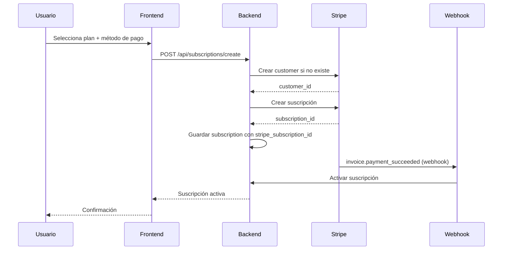
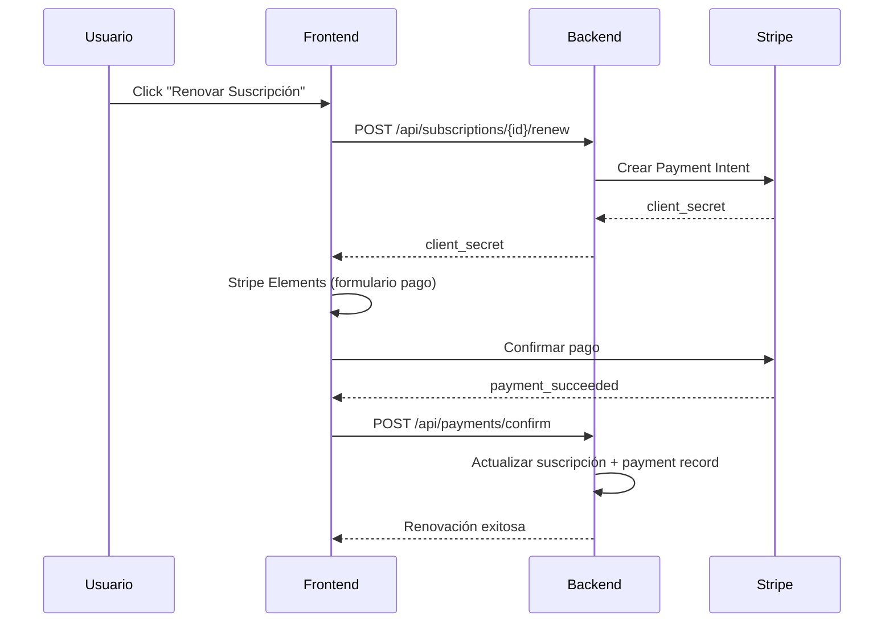
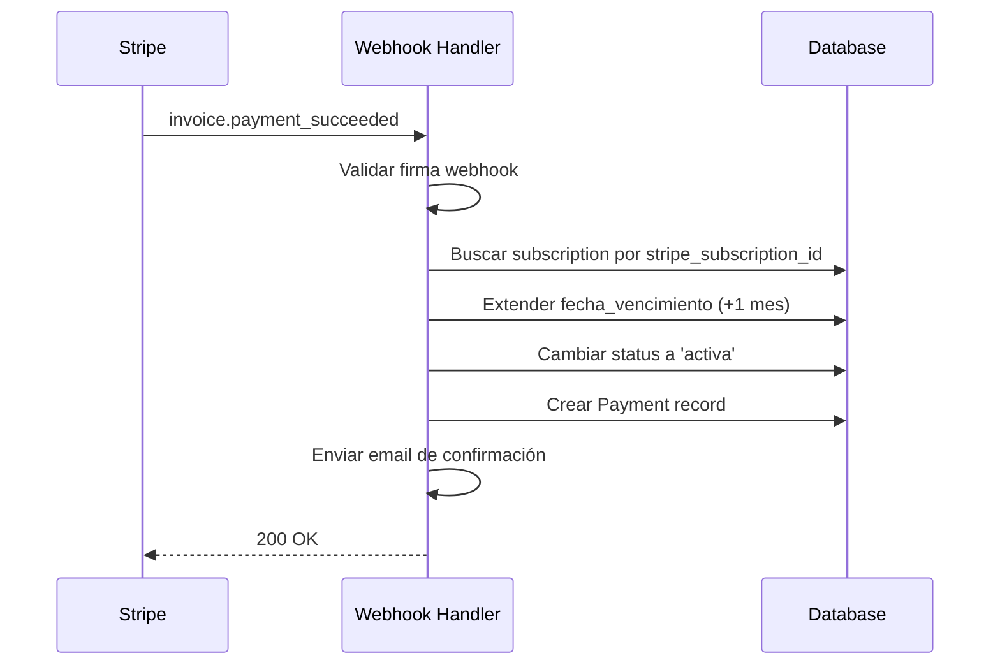

# 💳 INTEGRACIÓN DE PASARELAS DE PAGO

**Versión:** 1.0  
**Fecha:** 12 de Febrero, 2026  
**Estado:** 📋 EN PLANIFICACIÓN  

---

## 🎯 OBJETIVO

Integrar pasarelas de pago (Stripe y/o PayPal) para automatizar el cobro de suscripciones y gestionar pagos recurrentes en Atinet Compliance Hub.

---

## 🏗️ ARQUITECTURA PROPUESTA

### Pasarelas de Pago a Integrar

#### 1. **Stripe** (Recomendado como principal)
- ✅ Amplio soporte en Laravel vía [Cashier](https://laravel.com/docs/12.x/billing)
- ✅ Pagos recurrentes nativos
- ✅ Webhooks robustos
- ✅ Múltiples métodos de pago (tarjetas, SEPA, etc.)
- ✅ Gestión de suscripciones avanzada
- ✅ Pruebas sencillas con Stripe Test Mode

#### 2. **PayPal** (Alternativa/Complemento)
- ✅ Popular en México
- ✅ No requiere tarjeta de crédito
- ✅ API REST bien documentada
- ⚠️ Webhooks menos confiables que Stripe

---

## 📦 PAQUETES REQUERIDOS

### Laravel Cashier (Stripe)

```bash
composer require laravel/cashier
php artisan migrate
```

### Configuración Inicial

```php
// config/cashier.php
return [
    'key' => env('STRIPE_KEY'),
    'secret' => env('STRIPE_SECRET'),
    'webhook' => [
        'secret' => env('STRIPE_WEBHOOK_SECRET'),
        'tolerance' => env('STRIPE_WEBHOOK_TOLERANCE', 300),
    ],
];
```

---

## 🗄️ CAMBIOS EN BASE DE DATOS

### Nuevas Migraciones

#### 1. Tabla `payments` - Registro de pagos

```php
Schema::create('payments', function (Blueprint $table) {
    $table->id();
    $table->foreignId('subscription_id')->constrained()->onDelete('cascade');
    $table->foreignId('notaria_id')->constrained()->onDelete('cascade');
    $table->string('payment_gateway'); // stripe, paypal
    $table->string('payment_gateway_id'); // ID del pago en la pasarela
    $table->string('payment_method'); // card, paypal, bank_transfer
    $table->string('status'); // pending, completed, failed, refunded
    $table->decimal('amount', 10, 2);
    $table->string('currency', 3)->default('MXN');
    $table->text('description')->nullable();
    $table->json('metadata')->nullable(); // Info adicional de la pasarela
    $table->timestamp('paid_at')->nullable();
    $table->timestamp('failed_at')->nullable();
    $table->text('failure_reason')->nullable();
    $table->timestamps();
    
    $table->index(['notaria_id', 'status']);
    $table->index(['subscription_id', 'status']);
    $table->index('payment_gateway_id');
});
```

#### 2. Agregar columnas a `subscriptions`

```php
Schema::table('subscriptions', function (Blueprint $table) {
    $table->boolean('auto_renewal')->default(false)->after('precio_mensual');
    $table->string('stripe_subscription_id')->nullable()->after('auto_renewal');
    $table->string('stripe_customer_id')->nullable()->after('stripe_subscription_id');
    $table->timestamp('next_billing_date')->nullable()->after('fecha_vencimiento');
});
```

#### 3. Agregar columnas a `notarias`

```php
Schema::table('notarias', function (Blueprint $table) {
    $table->string('stripe_customer_id')->nullable()->after('activa');
    $table->string('preferred_payment_method')->nullable()->after('stripe_customer_id');
});
```

---

## 🔄 FLUJOS DE PAGO

### 1. Flujo de Suscripción Nueva con Auto-Renovación



### 2. Flujo de Renovación Manual (Pago Único)



### 3. Flujo de Auto-Renovación (Webhooks)



---

## 💻 IMPLEMENTACIÓN EN CÓDIGO

### 1. Modelo `Payment`

```php
<?php

namespace App\Models;

use Illuminate\Database\Eloquent\Model;
use Illuminate\Database\Eloquent\Relations\BelongsTo;

class Payment extends Model
{
    const STATUS_PENDING = 'pending';
    const STATUS_COMPLETED = 'completed';
    const STATUS_FAILED = 'failed';
    const STATUS_REFUNDED = 'refunded';

    protected $fillable = [
        'subscription_id',
        'notaria_id',
        'payment_gateway',
        'payment_gateway_id',
        'payment_method',
        'status',
        'amount',
        'currency',
        'description',
        'metadata',
        'paid_at',
        'failed_at',
        'failure_reason',
    ];

    protected $casts = [
        'metadata' => 'array',
        'paid_at' => 'datetime',
        'failed_at' => 'datetime',
        'amount' => 'decimal:2',
    ];

    public function subscription(): BelongsTo
    {
        return $this->belongsTo(Subscription::class);
    }

    public function notaria(): BelongsTo
    {
        return $this->belongsTo(Notaria::class);
    }
}
```

### 2. Servicio `PaymentService`

```php
<?php

namespace App\Services;

use App\Models\Notaria;
use App\Models\Payment;
use App\Models\Subscription;
use Stripe\Stripe;
use Stripe\Customer;
use Stripe\PaymentIntent;
use Stripe\Subscription as StripeSubscription;

class PaymentService
{
    public function __construct()
    {
        Stripe::setApiKey(config('cashier.secret'));
    }

    /**
     * Crear cliente de Stripe para una notaría
     */
    public function createCustomer(Notaria $notaria): string
    {
        if ($notaria->stripe_customer_id) {
            return $notaria->stripe_customer_id;
        }

        $customer = Customer::create([
            'name' => $notaria->nombre,
            'email' => $notaria->email ?? $notaria->users()->first()?->email,
            'metadata' => [
                'notaria_id' => $notaria->id,
                'numero_notaria' => $notaria->numero_notaria,
            ],
        ]);

        $notaria->update(['stripe_customer_id' => $customer->id]);

        return $customer->id;
    }

    /**
     * Crear intención de pago para renovación manual
     */
    public function createPaymentIntent(Subscription $subscription, float $amount): PaymentIntent
    {
        $customerId = $this->createCustomer($subscription->notaria);

        return PaymentIntent::create([
            'customer' => $customerId,
            'amount' => $amount * 100, // Stripe usa centavos
            'currency' => 'mxn',
            'description' => "Renovación suscripción - {$subscription->plan->name}",
            'metadata' => [
                'subscription_id' => $subscription->id,
                'notaria_id' => $subscription->notaria_id,
                'plan_id' => $subscription->plan_id,
            ],
        ]);
    }

    /**
     * Crear suscripción recurrente en Stripe
     */
    public function createRecurringSubscription(Subscription $subscription, string $paymentMethodId): StripeSubscription
    {
        $customerId = $this->createCustomer($subscription->notaria);

        // Adjuntar método de pago al cliente
        $paymentMethod = \Stripe\PaymentMethod::retrieve($paymentMethodId);
        $paymentMethod->attach(['customer' => $customerId]);

        // Establecer como método de pago predeterminado
        Customer::update($customerId, [
            'invoice_settings' => [
                'default_payment_method' => $paymentMethodId,
            ],
        ]);

        // Crear suscripción en Stripe
        $stripeSubscription = StripeSubscription::create([
            'customer' => $customerId,
            'items' => [
                ['price' => $subscription->plan->stripe_price_id], // ID del precio en Stripe
            ],
            'metadata' => [
                'subscription_id' => $subscription->id,
                'notaria_id' => $subscription->notaria_id,
                'plan_id' => $subscription->plan_id,
            ],
        ]);

        // Actualizar suscripción local
        $subscription->update([
            'stripe_subscription_id' => $stripeSubscription->id,
            'stripe_customer_id' => $customerId,
            'auto_renewal' => true,
        ]);

        return $stripeSubscription;
    }

    /**
     * Registrar un pago completado
     */
    public function recordPayment(Subscription $subscription, array $paymentData): Payment
    {
        return Payment::create([
            'subscription_id' => $subscription->id,
            'notaria_id' => $subscription->notaria_id,
            'payment_gateway' => $paymentData['gateway'] ?? 'stripe',
            'payment_gateway_id' => $paymentData['gateway_id'],
            'payment_method' => $paymentData['method'] ?? 'card',
            'status' => Payment::STATUS_COMPLETED,
            'amount' => $paymentData['amount'],
            'currency' => $paymentData['currency'] ?? 'MXN',
            'description' => $paymentData['description'] ?? null,
            'metadata' => $paymentData['metadata'] ?? null,
            'paid_at' => now(),
        ]);
    }
}
```

### 3. Controlador `PaymentController`

```php
<?php

namespace App\Http\Controllers\Admin;

use App\Http\Controllers\Controller;
use App\Models\Subscription;
use App\Services\PaymentService;
use Illuminate\Http\Request;
use Inertia\Inertia;

class PaymentController extends Controller
{
    public function __construct(
        protected PaymentService $paymentService
    ) {}

    /**
     * Iniciar pago manual
     */
    public function initiatePayment(Request $request, Subscription $subscription)
    {
        $request->validate([
            'amount' => 'required|numeric|min:0',
        ]);

        $paymentIntent = $this->paymentService->createPaymentIntent(
            $subscription,
            $request->amount
        );

        return Inertia::render('Admin/Payments/Checkout', [
            'subscription' => $subscription->load('plan', 'notaria'),
            'clientSecret' => $paymentIntent->client_secret,
            'amount' => $request->amount,
        ]);
    }

    /**
     * Configurar auto-renovación
     */
    public function setupRecurring(Request $request, Subscription $subscription)
    {
        $request->validate([
            'payment_method_id' => 'required|string',
        ]);

        $stripeSubscription = $this->paymentService->createRecurringSubscription(
            $subscription,
            $request->payment_method_id
        );

        return response()->json([
            'success' => true,
            'message' => 'Auto-renovación configurada exitosamente',
            'stripe_subscription_id' => $stripeSubscription->id,
        ]);
    }
}
```

### 4. Webhook Handler

```php
<?php

namespace App\Http\Controllers\Api;

use App\Http\Controllers\Controller;
use App\Models\Subscription;
use App\Services\PaymentService;
use Illuminate\Http\Request;
use Stripe\Webhook;
use Stripe\Exception\SignatureVerificationException;

class StripeWebhookController extends Controller
{
    public function __construct(
        protected PaymentService $paymentService
    ) {}

    public function handleWebhook(Request $request)
    {
        $payload = $request->getContent();
        $sigHeader = $request->header('Stripe-Signature');
        $webhookSecret = config('cashier.webhook.secret');

        try {
            $event = Webhook::constructEvent($payload, $sigHeader, $webhookSecret);
        } catch (SignatureVerificationException $e) {
            return response()->json(['error' => 'Invalid signature'], 400);
        }

        // Manejar evento
        switch ($event->type) {
            case 'invoice.payment_succeeded':
                $this->handleInvoicePaymentSucceeded($event->data->object);
                break;

            case 'invoice.payment_failed':
                $this->handleInvoicePaymentFailed($event->data->object);
                break;

            case 'customer.subscription.deleted':
                $this->handleSubscriptionDeleted($event->data->object);
                break;
        }

        return response()->json(['success' => true]);
    }

    protected function handleInvoicePaymentSucceeded($invoice)
    {
        $subscription = Subscription::where('stripe_subscription_id', $invoice->subscription)->first();

        if (!$subscription) {
            return;
        }

        // Registrar pago
        $this->paymentService->recordPayment($subscription, [
            'gateway' => 'stripe',
            'gateway_id' => $invoice->payment_intent,
            'method' => 'card',
            'amount' => $invoice->amount_paid / 100,
            'currency' => strtoupper($invoice->currency),
            'description' => "Pago automático - {$subscription->plan->name}",
            'metadata' => [
                'invoice_id' => $invoice->id,
                'period_end' => $invoice->period_end,
            ],
        ]);

        // Extender suscripción
        $subscription->update([
            'status' => Subscription::STATUS_ACTIVA,
            'fecha_vencimiento' => now()->addMonth(),
            'next_billing_date' => now()->addMonth(),
        ]);

        // Activar notaría si estaba desactivada
        $subscription->notaria->update(['activa' => true]);
    }

    protected function handleInvoicePaymentFailed($invoice)
    {
        $subscription = Subscription::where('stripe_subscription_id', $invoice->subscription)->first();

        if (!$subscription) {
            return;
        }

        // Registrar pago fallido
        Payment::create([
            'subscription_id' => $subscription->id,
            'notaria_id' => $subscription->notaria_id,
            'payment_gateway' => 'stripe',
            'payment_gateway_id' => $invoice->payment_intent,
            'payment_method' => 'card',
            'status' => Payment::STATUS_FAILED,
            'amount' => $invoice->amount_due / 100,
            'currency' => strtoupper($invoice->currency),
            'failed_at' => now(),
            'failure_reason' => $invoice->last_payment_error?->message ?? 'Pago rechazado',
        ]);

        // Notificar al administrador
        // TODO: Enviar email/notificación
    }

    protected function handleSubscriptionDeleted($stripeSubscription)
    {
        $subscription = Subscription::where('stripe_subscription_id', $stripeSubscription->id)->first();

        if (!$subscription) {
            return;
        }

        $subscription->update([
            'status' => Subscription::STATUS_CANCELADA,
            'auto_renewal' => false,
            'razon_cancelacion' => 'Cancelada desde Stripe',
            'fecha_cancelacion' => now(),
        ]);
    }
}
```

---

## 🧪 TESTING

### Test de Creación de Cliente

```php
public function test_create_stripe_customer_for_notaria()
{
    $notaria = Notaria::factory()->create();
    $paymentService = new PaymentService();

    $customerId = $paymentService->createCustomer($notaria);

    $this->assertNotNull($customerId);
    $this->assertStringStartsWith('cus_', $customerId);
    $this->assertEquals($customerId, $notaria->fresh()->stripe_customer_id);
}
```

### Test de Payment Intent

```php
public function test_create_payment_intent_for_subscription_renewal()
{
    $subscription = Subscription::factory()->create();
    $paymentService = new PaymentService();

    $paymentIntent = $paymentService->createPaymentIntent($subscription, 500.00);

    $this->assertInstanceOf(\Stripe\PaymentIntent::class, $paymentIntent);
    $this->assertEquals(50000, $paymentIntent->amount); // 500 * 100
    $this->assertEquals('mxn', $paymentIntent->currency);
}
```

---

## 🔐 SEGURIDAD

1. **Validación de Webhooks**: Siempre verificar firma de Stripe
2. **Manejo de errores**: Capturar y registrar todos los errores de pago
3. **Logs de auditoría**: Registrar todos los eventos de pago
4. **PCI Compliance**: Nunca almacenar datos de tarjetas (Stripe Elements maneja esto)
5. **Rate Limiting**: Limitar intentos de pago fallidos

---

## 📅 PLAN DE IMPLEMENTACIÓN

### Fase 1: Setup Básico (1-2 días)
- [ ] Instalar Laravel Cashier
- [ ] Crear migraciones (payments, columnas stripe)
- [ ] Crear modelo Payment
- [ ] Configurar Stripe Test Mode

### Fase 2: Pagos Manuales (2-3 días)
- [ ] Implementar PaymentService
- [ ] Crear PaymentController
- [ ] Vista de checkout con Stripe Elements
- [ ] Flujo de renovación manual

### Fase 3: Auto-Renovación (2-3 días)
- [ ] Crear suscripciones recurrentes
- [ ] Implementar Webhook Handler
- [ ] Tests de webhooks
- [ ] Manejo de pagos fallidos

### Fase 4: UI/UX (2 días)
- [ ] Dashboard de pagos para admin
- [ ] Historial de pagos por notaría
- [ ] Formularios de pago con Stripe Elements
- [ ] Notificaciones de pago

### Fase 5: Testing y Deploy (1-2 días)
- [ ] Tests completos E2E
- [ ] Test en Stripe Test Mode
- [ ] Documentación para administradores
- [ ] Deploy a producción con claves reales

**Total estimado: 8-12 días**

---

## 💡 MEJORES PRÁCTICAS

1. **Usar Stripe Test Mode** durante todo el desarrollo
2. **Webhooks confiables**: Usar ngrok o similar para testing local
3. **Idempotencia**: Manejar webhooks duplicados correctamente
4. **Retry Logic**: Implementar reintentos en pagos fallidos
5. **Customer Portal**: Considerar Stripe Customer Portal para auto-gestión

---

**Preparado por:** GitHub Copilot  
**Fecha:** 12 de Febrero, 2026  
**Estado:** Pendiente de aprobación para implementación
